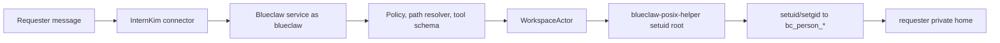
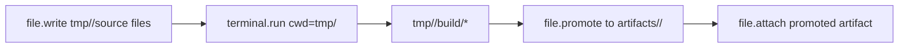

# Intern Kim

Jetson Orin Nano Super에 Blueclaw 런타임과 InternKim capability layer를 올리고, Cloudflare Tunnel로 어디서든 접속 가능한 edge AI appliance입니다.

전원과 네트워크만 연결하면 기기가 독립적으로 동작합니다. 사용자 컴퓨터는 companion을 통한 로컬 브라우저, 파일 선택, 승인 입력이 필요할 때만 연결됩니다.

## 아키텍처

```
사용자 / 관리자 브라우저
    │
    ├─ Cloudflare Pages API
    │    └─ device register / Access policy / OTA / companion release
    │
    └─ Cloudflare Access
         └─ Cloudflare Tunnel
              └─ Jetson Orin Nano Super
                   ├─ Mattermost :8065
                   │    └─ platform event → internkim-capabilityd
                   ├─ internkim-admind
                   │    ├─ admin UI reverse proxy
                   │    ├─ backup / restore / device status
                   │    └─ companion broker
                   ├─ internkim-capabilityd
                   │    ├─ LLM routing: OpenRouter / local model / companion
                   │    ├─ platform I/O: Mattermost
                   │    ├─ browser routing: companion-first / Lightpanda fallback
                   │    └─ local capability API for Blueclaw
                   ├─ graphiti-memoryd :7791
                   ├─ Firecracker Blueclaw guest
                   │    ├─ blueclaw.service :8080
                   │    │    ├─ policy / task / ACL / prompt
                   │    │    └─ requester workspace actors
                   │    └─ /workspace mounted from host /root/.blueclaw/workspace
                   ├─ gws / gws-bot / Apps Script bridge
                   ├─ Lightpanda device browser fallback
                   └─ /root/.internkim
                        ├─ secrets/
                        ├─ config/
                        ├─ state/
                        └─ models/

Optional external channels
    ├─ Slack workspace ── Socket Mode ──▶ internkim-capabilityd ──▶ Blueclaw
    └─ Signal account ── JSON-RPC poll ─▶ internkim-capabilityd ──▶ Blueclaw

사용자 컴퓨터
    └─ internkim-companion
         ├─ long-poll internkim-admind companion broker
         ├─ user.confirm / user.input / file.pick
         ├─ headed browser via bundled agent-browser
         └─ future local-only model capability
```

## 보안 설계

크리덴셜은 `/root/.internkim/secrets/`와 `/root/.internkim/config/`에 집중 관리합니다. Blueclaw는 provider token, 브라우저 쿠키, 사용자 로컬 파일 경로, 로컬 모델 경로를 직접 보지 않고 `internkim-capabilityd` 또는 `internkim-admind`의 typed capability 경계를 통해서만 사용합니다.

### Blueclaw Workspace 권한 경계

Blueclaw workspace 보안의 canonical boundary는 Linux user/group/POSIX 권한입니다. Blueclaw service는 `blueclaw` 사용자로 orchestration, policy, event log, LLM flow만 처리하고, requester-visible side effect는 `WorkspaceActor`를 통해 requester POSIX identity로 실행합니다.

- 사람은 안정적인 `bc_person_<shortID>` Linux user로 실행됩니다.
- circle은 `bc_circle_<circleID>` group으로 투영됩니다.
- 모든 `terminal.run`, terminal session, `file.write`, `file.read`, `file.promote`, `file.attach`, 사용자 작성 skill/tool, dependency install script, package lifecycle script는 requester 또는 task actor의 unprivileged UID/GID/supplementary groups로 실행됩니다.
- admin 사용자도 raw terminal에서는 기본 task actor scope만 갖습니다. admin-only 파일 접근, 임시 grant, 특정 파일 허용, 외부 전송은 built-in capability/tool 경계에서만 처리합니다.
- Blueclaw service는 requester workspace 파일을 직접 `os.ReadFile`/`os.WriteFile`로 만지지 않습니다. 모든 workspace 파일 I/O와 process 실행은 `WorkspaceActorFactory -> WorkspaceActor -> blueclaw-posix-helper` 경로를 탑니다.
- `blueclaw-posix-helper`는 `root:root 4755` setuid bridge입니다. helper 파일 실행 가능 여부는 authorization boundary가 아니며, helper 내부에서 real UID가 root 또는 `blueclaw`인지 확인한 뒤 requester UID/GID로 전환합니다.
- `/workspace/private`, `/workspace/private/people`, `/workspace/circles`는 service-owned traversal parent입니다. requester leaf는 requester group과 setgid directory mode를 사용합니다.
- `/workspace/private/people/<personID>`와 `/workspace/circles/<circleID>`는 POSIX ownership/mode가 최종 접근 경계입니다. `/workspace/.blueclaw/*`는 service-owned internal path이며 일반 task user가 직접 읽지 못합니다.
- dependency cache는 `/workspace/shared/cache/dependencies`로 고정합니다. private/source 파일은 cache에 넣지 않고, language-level dependency tool만 이 cache를 공유합니다.
- raw terminal에서 OS package manager와 system modification executable guardrail은 계속 유지합니다. `bwrap`는 v1 필수 경계가 아니며, 필요하면 미래의 추가 narrowing으로만 사용합니다.

Built-in `file.*` tools도 service-user fallback 없이 requester actor로 실행됩니다. Built-in tool이 grant로 읽은 민감 파일은 raw terminal이 볼 수 있는 위치에 그대로 열어두지 않고, 필요한 경우 sanitized task artifact로 복사하고 task event에 기록해야 합니다.



Artifact 생성은 durable output을 명시적으로 승격하는 흐름을 씁니다.



| Guest 경로 | 권한 모델 | 용도 |
|------|------|------|
| `home/<path>` | requester actor only, durable virtual path | 편집 가능한 개인 소스 작업 |
| `/workspace/private/people/<personID>/tmp/<task>` | requester actor only, ephemeral | 작업 초안과 build 중간 산출물 |
| `/workspace/private/people/<personID>/artifacts/<slug>` | requester actor only, durable | 개인 최종 산출물 |
| `/workspace/circles/<circleID>` | circle group `2770` | 명시적 팀 공유 산출물 |
| `/workspace/shared/public` | shared policy | 명시적 공개 공유 산출물 |
| `/workspace/shared/cache/dependencies` | shared cache group | package cache only |
| `/workspace/skills` | read/execute only | built-in skill source |
| `/workspace/.blueclaw` | service-owned | DB, logs, internal state |

| 경로 | 주 소비자 | 용도 |
|------|----------|------|
| `/root/.internkim/secrets/openrouter-api-key` | `internkim-capabilityd` | remote LLM provider |
| `/root/.internkim/models/*` | `internkim-capabilityd`, local model wrapper | local model runtime |
| `/root/.internkim/secrets/google-sa.json` | `gws`, `gws-bot`, Apps Script helper | Google Workspace 연동 |
| `/root/.internkim/secrets/gas-webhook-url` | GAS bridge helper | Apps Script bridge 호출 |
| `/root/.internkim/secrets/slack-*` | `internkim-capabilityd` | optional Slack Socket Mode와 reply |
| `/root/.internkim/config/signal-*` | `internkim-capabilityd` | optional Signal JSON-RPC poll/reply |
| `/root/.internkim/state/companion-jobs.json` | `internkim-admind` | companion broker restart recovery |

Graphiti는 memory sidecar로만 동작하고 secrets 디렉토리를 직접 읽지 않습니다. Companion signing private key는 device state JSON에 저장하지 않고 사용자 컴퓨터의 secure storage에 둡니다.

### LLM Gateway Secret 경계

운영자 머신, Cloudflare Worker, cloud-shared tenant, Jetson은 같은 `.env`를 공유하지 않습니다. 한 위치의 탈취가 fleet 전체 탈취로 번지지 않도록 키를 아래 경계로 나눕니다.

| 위치 | 보유 가능 키 | 금지 키 |
|------|-------------|---------|
| 운영자 머신 / CI | `OPENROUTER_MANAGEMENT_KEY`, Cloudflare deploy/API token | tenant runtime 전용 `.env` 재사용 |
| Cloudflare Worker LLM Gateway | tenant token hash/state, tenant별 upstream OpenRouter key, quota ledger binding | Jetson 또는 tenant local admin password |
| cloud-shared tenant container | `LLM_DEVICE_TOKEN`, tenant-local admin/bot secret | `OPENROUTER_MANAGEMENT_KEY`, upstream OpenRouter key, 다른 tenant key |
| Jetson edge appliance | device-scoped `LLM_DEVICE_TOKEN`, device-local admin/bot/tunnel secret | `OPENROUTER_MANAGEMENT_KEY`, fleet-wide provider key, 다른 Jetson/tenant key |

`OPENROUTER_MANAGEMENT_KEY`는 OpenRouter API key를 생성/회수하는 운영 키이며 운영자 머신 또는 제한된 CI secret에만 둡니다. `tenant create-fleet --openrouter-management-key <path>`는 이 키로 tenant별 upstream OpenRouter key를 발급하고, 발급된 upstream key는 gateway token store에만 저장합니다.

tenant와 Jetson에는 OpenRouter 원본 키를 넣지 않습니다. 각 runtime은 InternKim이 발급한 OpenRouter-compatible `LLM_DEVICE_TOKEN`만 사용하고, Worker/LLM Gateway가 token revoke, request-per-minute, hard cap, usage ledger를 provider 호출 전에 강제합니다.

LLM Gateway Worker는 `/health`만 public으로 둡니다. LLM 호출과 admin seed endpoint는 `X-InternKim-Gateway-Secret` shared header를 먼저 확인하고, 그 다음 `Authorization: Bearer <LLM_DEVICE_TOKEN>` 또는 `GATEWAY_ADMIN_TOKEN`을 검증합니다. shared header는 무작위 인터넷 요청을 먼저 거르는 coarse gate이며, device 탈취까지 막는 강한 경계는 아닙니다. 강한 네트워크 경계가 필요하면 Cloudflare Access service token을 추가합니다.

운영자가 로컬에서 준비하는 secret 파일은 `.local/secrets/` 아래에 두고 git에 올리지 않습니다.

```bash
mkdir -p .local/secrets
awk 'BEGIN{FS="="} $1=="OPENROUTER_MANAGEMENT_KEY"{sub(/^[^=]*=/,""); print}' .env > .local/secrets/openrouter-management-key
awk 'BEGIN{FS="="} $1=="CF_API_TOKEN"{sub(/^[^=]*=/,""); print}' .env > .local/secrets/cloudflare-api-token
chmod 600 .local/secrets/openrouter-management-key .local/secrets/cloudflare-api-token
```

Cloudflare Worker LLM Gateway에는 배포 secret과 state binding만 둡니다. tenant별 upstream OpenRouter key는 `tenant create-fleet --openrouter-management-key .local/secrets/openrouter-management-key`가 발급하고, Worker state에는 raw gateway token 대신 `tokenHash`를 저장합니다.

Worker 배포는 account ID를 함께 넘깁니다. `CF_API_TOKEN`만 있으면 Wrangler가 `/memberships` 조회에서 인증 실패할 수 있습니다.

```bash
cd workers/llm-gateway
CLOUDFLARE_API_TOKEN="$(awk 'BEGIN{FS="="} $1=="CF_API_TOKEN"{sub(/^[^=]*=/,""); print}' ../../.env)" \
CLOUDFLARE_ACCOUNT_ID="$(awk 'BEGIN{FS="="} $1=="CF_ACCOUNT_ID"{sub(/^[^=]*=/,""); print}' ../../.env)" \
../../web/node_modules/.bin/wrangler deploy --keep-vars
```

맥스튜디오 한 대에서 PoC 테넌트를 추가·제거·운영하는 전체 절차(`internkim host init/add-team/remove-team/console`)는 [docs/poc-host.md](docs/poc-host.md)에 정리되어 있습니다. 아래 명령들은 그 절차가 내부에서 사용하는 저수준 단계입니다.

cloud-shared bootstrap은 runtime model을 명시해서 배포합니다. PoC Worker 경로에서는 `google/gemini-3.5-flash`가 provider region policy로 거절될 수 있으므로, 현재 smoke 통과 모델인 `x-ai/grok-4.3`을 `tenant bootstrap --model x-ai/grok-4.3` 또는 `tenant install-host-runtime --model x-ai/grok-4.3`으로 지정합니다. chat, web tool, embedding 요청은 모두 gateway를 통해야 합니다. 임베딩 자동 fallback은 로컬과 OpenRouter 모델 ID가 같을 때만 허용되며, 둘 다 실패하면 BM25 검색을 사용합니다.

cloud-shared Mattermost admin password의 운영 기준은 실제 인스턴스가 읽는 credentials 파일입니다. 이미 VM 안에서 Mattermost 인스턴스를 만든 뒤에는 로컬 `.local/tenants/*` bundle 값을 고객에게 안내하지 말고, VM의 `/srv/internkim-mattermost-instances/credentials.json` 또는 동일한 배포 source of truth에서 다시 읽어야 합니다.

Mattermost fleet는 admin 계정 생성만으로 완료된 것으로 보지 않습니다. 배포 후 아래 자동 보정 명령을 실행해 tenant별 team, `internkim` bot, `업무`, `일정`, `근태` 기본 채널, managed resource paths, bot token을 idempotent하게 보장합니다.

```bash
internkim tenant bootstrap-mattermost \
  --credentials /srv/internkim-mattermost-instances/credentials.json \
  --base-url-template 'http://127.0.0.1:{port}' \
  --port-start 18065 \
  --public-url-template 'https://{tenant}.example.test' \
  --token-output-root /srv/internkim/tenants
```

`bootstrap-mattermost`는 bot을 기본 채널 멤버로 넣고 channel scheme role까지 보정해야 합니다. `업무`와 `일정`은 read-only moderation scheme이 걸릴 수 있어서 membership만으로는 bot reply가 403으로 실패합니다.

pilot public URL은 named tunnel 설정까지 맞아야 합니다. manifest의 기존 `publicURL`이 `pilot-01.mattermost.example.test`처럼 stale일 수 있으므로 pilot 배포에는 hostname template을 명시합니다.

```bash
internkim tenant sync-cloudflare-tunnel \
  --base .local/tenants \
  --tenants pilot-01 \
  --hostname-template '{tenant}.example.test' \
  --account-id "$CF_ACCOUNT_ID" \
  --tunnel-id "$PILOT_TUNNEL_ID" \
  --api-token-path .local/secrets/cloudflare-api-token

sudo systemctl restart internkim-pilot-tunnel.service
```

`cloudflared.service`와 `internkim-pilot-tunnel.service`는 다른 tunnel일 수 있습니다. pilot route 변경 후에는 pilot tunnel service를 재시작하고 `/flow`, `/calendar`, `/attendance`, `/_app/version.json`, `/admin/api/health`가 tenant admind로 가는지 확인합니다.

`bootstrap-mattermost`는 Mattermost 리소스만 보정합니다. 고객에게 pilot URL을 열기 전에는 각 tenant의 admin 계정이 `internkim` team member인지, `/flow`, `/calendar`, `/attendance`, `/_app` 라우트가 해당 tenant의 admind로 가는지, 해당 tenant의 Blueclaw/capabilityd가 같은 tenant Mattermost bot token과 `LLM_DEVICE_TOKEN`으로 기동 중인지 확인해야 합니다. 실제 smoke는 `@internkim` 테스트 post를 만들고 reply를 확인한 뒤 원문과 reply를 삭제합니다. 기존 단일 `internkim-admind`, `internkim-capabilityd`, `blueclaw.service`를 pilot 여러 개에 공유하면 웹/메모리/워크스페이스/비밀값이 섞이므로 customer-ready 상태로 보지 않습니다. 코드와 binary는 공유하되 runtime state, workspace, bot token, admin secret, LLM device token은 tenant별로 분리합니다.

## 구성 요소

| 구성 | 설명 |
|------|------|
| **Go CLI** (`cmd/internkim/main.go`) | 운영 CLI: `setup`, `deploy`/`release`/`update`, `recover`, `verify`, `reset`, `lab`/`dev fleet`, `ops`, `tenant`/`host`, `llm`, `users`/`task`/`invite`. `sim`은 Local Fleet의 legacy alias |
| **internkim-admind** | 기기 관리자 API. admin UI reverse proxy, companion pairing/broker, backup/restore, 상태 조회 담당 |
| **internkim-capabilityd** | OpenRouter, local model, Mattermost, companion credential을 보유하고 capability API만 노출. Slack Socket Mode와 Signal JSON-RPC sidecar도 같은 경계에서 선택적으로 기동 |
| **local model** | 생성·임베딩 모두 상주 `llama-server`(llama.cpp): 생성 gemma-4-E2B QAT + MTP(`--chat-template gemma`), 임베딩 BGE-M3 Q8(CPU `-ngl 0`, CLS pooling). `internkim-local-llm-runner`(LiteRT)는 optional legacy fallback이며 기본 생성/임베딩 경로가 아님 |
| **Blueclaw** | Firecracker guest 안의 agent runtime. host는 `blueclaw-supervisor`로 guest를 띄우고, guest는 `/workspace/.blueclaw/config/*.json`와 `/workspace/.blueclaw/runtime/current/bin/blueclaw` 계약을 사용 |
| **Graphiti memoryd** | Blueclaw memory sidecar. `graphiti-core[kuzu]`로 episode ingestion, temporal graph extraction, hybrid graph search 수행 |
| **internkim-companion** | 사용자 컴퓨터의 cross-platform trusted runtime. 브라우저 human-in-the-loop와 향후 local-only LLM capability 제공 |
| **gws** | Google Workspace CLI. Drive/Docs/Gmail/Sheets 조작. MCP 서버 모드 지원 |
| **Mattermost** | 온보드 채팅 서버. 셀프호스팅 가능한 사내 메신저로 기기 협업 채널, 모바일 알림, AI 업무 진입점에 사용 |
| **Slack/Signal connector** | 선택적 외부 채널. Slack Socket Mode와 Signal JSON-RPC sidecar는 구현되어 있으며, 해당 credential/config 파일이 있으면 capabilityd가 기동해 이벤트를 정규화하고 Blueclaw 작업으로 전달. Mattermost가 여전히 기본 surface |
| **SvelteKit 웹앱** (`web/`) | Cloudflare Pages 기기 등록 API / Access policy 동기화 / OTA와, 기기에서 same-origin으로 서빙되는 운영 surface(`/admin`, `/flow`, `/memory`, `/calendar`, `/mail`, `/attendance`, `/files`, `/ops`) |
| **Blueclaw workspace assets** (`assets/blueclaw-workspace/`) | 설치 시 host `/root/.blueclaw/workspace`에 배치되고 guest `/workspace`로 mount되는 AGENTS.md, skills, helpers, GAS source |
| **기기 바이너리** (`build/board-bin/`) | ARM64 기기용 바이너리 [gitignored] |
| **맥 유틸** (`bin/`) | get-ssid + sshpass, macOS universal binary |

## 셋업

### 사전 준비

- macOS (Apple Silicon 또는 Intel)
- NVIDIA Jetson Orin Nano Super Developer Kit
- JetPack / Jetson Linux로 부팅된 Jetson
- SSH 접속 가능한 네트워크와 기기 IP
- NVMe 저장장치 권장
- [OpenRouter API 키](https://openrouter.ai/keys)
- Google Cloud 프로젝트 (Google Workspace 연동 시)

Radxa/RPi 계열 SD provisioning 코드는 legacy/test path로 남아 있습니다. 새 제품 기본 경로는 Jetson을 SSH target으로 보고 provision합니다.

### Go CLI 빌드 & 실행

```bash
make build
./internkim setup --board jetson-orin-nano --host <jetson-ip> --user <ssh-user>
```

터널 설정이 한 번 끝난 기기는 LAN 밖에서도 setup할 수 있습니다. 로컬에 `cloudflared`가 설치되어 있으면 CLI가 LAN SSH를 먼저 찾고, 보드가 로컬 네트워크에 없을 때 `ssh.<deviceID>.example.test` 경로의 Cloudflare Access SSH로 자동 전환합니다. Setup의 디렉터리 업로드는 tar-over-ssh를 사용하고, sparse runtime artifact는 rsync를 사용합니다. SSH 명령은 재시도와 per-attempt timeout을 갖습니다.

```bash
./internkim setup --only web --force
```

LAN 탐색을 건너뛰고 Cloudflare SSH를 바로 쓰려면 `--cloudflare-ssh`를 붙입니다.

직접 shell을 열 때도 같은 라우팅을 씁니다.

```bash
./internkim ssh
./internkim ssh -- uptime -p
```

여러 회사 또는 고객 기기를 한 개발 머신에서 관리할 때는 `--profile`로 회사 단위 state를 분리하고, `--node`로 그 회사 안의 숫자 기기를 고릅니다. 같은 `--profile/--node` 조합은 setup, update, status, verify, ssh에서 같은 target state를 사용합니다.

```bash
./internkim setup --profile acme --node 1 --host <jetson-ip>
./internkim setup --profile acme --node 1 --only blueclaw-payload-direct --force
./internkim status --profile acme --node 1

./internkim setup --profile dawn --node 1 --host <jetson-ip>
./internkim update --profile dawn --node 1 --web
```

Go 코드나 provisioning/runtime config를 바꾼 뒤에는 setup 전에 반드시 `make build`를 다시 실행하세요. `./internkim`은 로컬 바이너리라 자동 재빌드되지 않으며, 오래된 바이너리로 setup을 실행하면 장비의 Blueclaw runtime config가 이전 schema로 되돌아갈 수 있습니다. `services`와 `health` 단계는 실제 `/root/.blueclaw/config/runtime.json` contract를 검사해 stale config를 실패 처리합니다.

Blueclaw submodule은 기본 setup에서 local change가 있으면 멈추고 `origin/main`으로 fast-forward 합니다. 커밋 전 `.dependency/blueclaw` 워킹디렉토리를 그대로 빌드해야 할 때는 setup 실행에 `INTERNKIM_BLUECLAW_USE_LOCAL=1`을 붙이세요.

```bash
INTERNKIM_BLUECLAW_USE_LOCAL=1 ./internkim setup --only binaries,blueclaw-payload,services --force
```

Firecracker runtime payload에 Blueclaw Go 소스 변경을 확실히 포함해야 할 때는 setup 전에 `make prepare-blueclaw-payload`를 실행하고, 이어지는 setup에는 `INTERNKIM_BLUECLAW_USE_LOCAL=1`을 유지하세요. Skill/script만 바꾸는 경우에도 payload 또는 workspace skill 배포가 필요합니다. Lab setup은 이 로컬 Blueclaw 모드를 기본으로 켭니다.

### OTA Release Deploy

일상 배포는 SSH 직접 복사 대신 OTA release apply 엔진을 사용합니다. `internkim deploy`는 로컬 빌드 산출물로 release manifest와 component bundle을 만들고, Admin HTTPS에 signed direct upload로 올린 뒤 기기 안의 기존 OTA apply engine을 실행합니다. SSH는 초기 설치, admind direct-upload route가 없는 구버전 bootstrap, systemd deep repair 용도로 남깁니다.

```bash
make build
./internkim deploy --components capabilityd
./internkim deploy --components admind,capabilityd
```

`--components`를 생략하면 전체 release set을 만듭니다. 전체 release에는 board UI와 Blueclaw payload 산출물이 필요합니다.

```bash
cd web && bun run build:board
cd ..
make prepare-blueclaw-payload
./internkim deploy
```

기기는 component별 latest를 따로 적용하지 않고 하나의 manifest를 current release로 기록합니다. direct upload release도 R2 release와 같은 `releaseset.Manifest`, component checksum 검증, staging, install, service restart, current manifest 기록 흐름을 사용합니다.

R2는 여러 기기가 가져갈 stable release channel을 publish할 때 사용합니다.

Release bucket은 `internkim-releases`, public base URL은 `https://updates.example.test`을 사용합니다. `updates.example.test`은 R2 직접 공개가 아니라 `internkim-release-registry` Worker를 통해서만 읽히며, Worker는 `X-InternKim-Release-Token`이 맞는 요청만 R2에서 내려줍니다. token 없는 다운로드는 401이어야 합니다.

운영자 로컬 secret:

```bash
openssl rand -base64 32 > .local/secrets/release-download-token
chmod 600 .local/secrets/release-download-token
```

같은 값을 Worker secret으로 넣습니다.

```bash
cd workers/release-registry
../../web/node_modules/.bin/wrangler secret put RELEASE_DOWNLOAD_TOKEN
../../web/node_modules/.bin/wrangler deploy
```

개발 머신에서 Wrangler OAuth 세션으로 publish할 때 필요한 환경 변수. `INTERNKIM_RELEASE_R2_ACCOUNT_ID`는 이미 `.env`에 `CF_ACCOUNT_ID`가 있으면 자동으로 그 값을 쓰고, `INTERNKIM_RELEASE_DOWNLOAD_TOKEN`도 `.local/secrets/release-download-token`이 있으면 자동으로 읽으므로 둘 다 생략 가능합니다:

```bash
export INTERNKIM_RELEASE_R2_BUCKET=internkim-releases
export INTERNKIM_RELEASE_R2_PUBLISHER=wrangler
export INTERNKIM_RELEASE_PUBLIC_BASE_URL=https://updates.example.test
export INTERNKIM_RELEASE_SIGNING_KEY=<optional-shared-signing-key>
```

CI나 장기 자동화에서 Wrangler OAuth 세션을 쓰지 않을 때는 R2 S3 credential 방식으로 publish합니다.

```bash
export INTERNKIM_RELEASE_R2_ACCOUNT_ID=<cloudflare-account-id>
export INTERNKIM_RELEASE_R2_BUCKET=internkim-releases
export INTERNKIM_RELEASE_R2_ACCESS_KEY_ID=<access-key-id>
export INTERNKIM_RELEASE_R2_SECRET_ACCESS_KEY=<secret-access-key>
export INTERNKIM_RELEASE_PUBLIC_BASE_URL=https://updates.example.test
export INTERNKIM_RELEASE_DOWNLOAD_TOKEN=<release-download-token>
export INTERNKIM_RELEASE_SIGNING_KEY=<optional-shared-signing-key>
```

Release set publish 전에 board UI와 Blueclaw payload를 최신으로 준비합니다.

```bash
cd web && bun run build:board
cd ..
make prepare-blueclaw-payload
./internkim release publish
```

R2 stable channel 상태와 적용은 CLI에서도 같은 release set API를 사용합니다.

```bash
./internkim update check --profile dawn --node 1
./internkim update apply --profile dawn --node 1
```

`setup --only admind --force`는 direct upload route가 아직 없는 기기를 첫 1회 bootstrap하거나 Admin HTTPS가 죽었을 때 복구하는 경로입니다. `blueclaw-payload-direct`와 `deploy --legacy-ssh`는 복구와 디버그용 fallback입니다.

주요 setup 단계:
1. SSH로 Jetson 연결
2. 웹 앱 빌드 + Cloudflare Pages 배포
3. Jetson Linux 패키지와 런타임 준비
4. Blueclaw + cloudflared 설치, 시스템 유저 생성
5. OpenRouter API 키 → `/root/.internkim/secrets/openrouter-api-key`
6. Local model runtime 준비
7. 기기 등록 + Cloudflare 터널 시작
8. Google Workspace credential은 사용자가 직접 만들거나 Companion으로 전달한 것만 설치
9. Mattermost 설정 (URL / admin token / bot token / channel ID, 건너뛰기 가능)
10. Users sync 구성. Slack/Signal은 선택적 채널로, credential이 있을 때 sidecar로 기동 (`INTERNKIM_SLACK_BOT_TOKEN`, `INTERNKIM_SIGNAL_JSONRPC_URL`, `INTERNKIM_SIGNAL_ACCOUNT` 등)
11. `blueclaw.service` 시작 + 최종 health check

Mattermost self-hosted는 기본적으로 한 team의 총 멤버 수에 제한이 있습니다. 기본값은 `TeamSettings.MaxUsersPerTeam = 50`이며, 활성/비활성 사용자를 포함합니다. 반복 검증에서 테스트 사용자를 지우지 않으면 이 제한에 걸려 team/channel join API가 실패할 수 있습니다. 필요하면 운영 환경에서 이 값을 늘릴 수 있지만, 테스트 코드는 생성한 Mattermost 테스트 사용자를 정리해야 합니다.

### Local Fleet Verification

실제 보드에 올리기 전에 macOS + apple/container ARM Linux VM에서 현재 checkout을 실제 서비스 경계로 검증합니다. canonical 흐름은 disposable Local Fleet입니다.

```bash
make deps-sim

# 최초 1회 컨테이너 이미지 준비
./internkim lab image-build

# predeploy 전체 게이트: 일회용 VM, 빌드, API/Mattermost, 브라우저 smoke
./internkim dev fleet run

# 특정 실제 서비스 경계 scenario
./internkim dev fleet run --scenario mattermost-bot-invited

# Mattermost 제외 Linux virtual-session
./internkim dev fleet run --without-mattermost --scenario dm_send_confirm_acceptance

# 산출물 품질 확인: prompt를 Mattermost로 보내고 첨부 파일을 /tmp에 내려받아 macOS open
./internkim test "저번 달 업무에 대한 보고서 워드 파일로 만들어줘"
./internkim test "저번 달 업무에 대한 보고서 워드 파일로 만들어줘" -o /tmp/internkim-report.docx
./internkim test "웹사이트 만들어줘"
./internkim test "슬라이드 만들어줘" --reuse

# "고쳤다" 검증: base 실패/current 성공을 강제
./internkim dev fleet verify-regression --base main --scenario regression-proof

# 공유 플릿 디버깅 뒤 Mattermost 테스트 사용자, 메시지, Blueclaw 테스트 상태 정리
./internkim dev fleet reset

# disposable fleet gate 성공 후 OTA로 실기기 배포
./internkim deploy

# Makefile wrapper
make fleet-gate
make deploy-after-fleet
```

실기기 배포 전에는 `./internkim dev fleet run`을 먼저 통과시키고, gate가 성공한 뒤 `internkim deploy`로 OTA release를 적용합니다. `./internkim sim gate`는 하위 호환을 위해 유지되지만 새 문서와 자동화는 Local Fleet 명령을 기준으로 작성합니다. gate가 실패하면 실기기 배포는 중단하고 실패한 단계의 로그를 먼저 확인해야 합니다.

Disposable Local Fleet는 `.local/local-fleet/runs/<run-id>` 상태만 사용하며 실기기, pilot, Jetson secret을 복사하지 않습니다. Cloudflare Pages 배포는 Local Fleet에서 건너뛰고, VM 내부 Admin/Web UI와 localhost smoke를 검증합니다. Jetson 전용 LiteRT/GPU smoke는 Local Fleet에서 `not applicable`입니다. 공유 VM을 직접 디버깅해야 할 때만 `./internkim dev fleet run --reuse ...`, `./internkim dev fleet up`, `./internkim dev fleet status`, `./internkim dev fleet reset`을 사용합니다.

`./internkim test "<prompt>"`는 disposable Local Fleet를 올리고 실제 Mattermost DM으로 prompt를 보낸 뒤 task 완료를 기다립니다. 산출물 품질 확인용 경로라 웹 UI 빌드는 건너뛰고 Mattermost, Blueclaw, runtime 의존성만 준비합니다. Local Fleet setup은 현재 checkout의 Blueclaw 변경을 `INTERNKIM_BLUECLAW_USE_LOCAL=1`로 반영하므로 별도 환경변수 없이 새 agent/runtime 코드를 확인할 수 있습니다. 최종 봇 메시지는 터미널에 출력하고, 첨부 파일이 있으면 기본적으로 `/tmp/internkim-test-<timestamp>/`에 저장한 뒤 macOS `open`으로 엽니다. `-o <file>`은 C 컴파일러의 `-o`처럼 단일 첨부 파일을 정확히 그 파일 경로에 저장합니다. 첨부가 여러 개면 `-o`는 실패하므로 기본 디렉터리 저장을 쓰거나 prompt가 단일 파일만 첨부하게 해야 합니다. URL 산출물은 별도 후처리하지 않고 Mattermost 메시지에 포함된 텍스트 그대로 확인합니다. 반복 확인에는 `--reuse`, 파일을 열지 않을 때는 `--no-open`을 사용합니다.

Mattermost gate는 초대된 테스트 사용자와 초대되지 않은 테스트 사용자를 만들고, 봇 응답과 초대 차단이 모두 동작하는지 확인한 뒤 테스트 메시지와 사용자를 정리합니다. self-hosted Mattermost의 비밀번호 정책이 강화되어도 통과하도록 검증 사용자는 충분히 긴 임시 비밀번호를 씁니다. cleanup 중 Mattermost system post 정리는 SSH 계정에 passwordless sudo가 없으면 건너뛰며, 사용자와 봇 reply 정리는 Mattermost API로 계속 수행합니다.

Ops 콘솔에서도 같은 Local Fleet engine을 실행할 수 있습니다:

```bash
./internkim ops serve
```

`http://127.0.0.1:8789/ops`에서 Local Fleet 카드의 `Up`, `Predeploy gate`, `Mattermost smoke`, `Verify regression`, `Reset`, `Down` 버튼을 사용할 수 있습니다. `Predeploy gate`는 `./internkim dev fleet run`과 같은 기본 게이트입니다. CLI와 Ops UI는 모두 `internal/localfleet`를 호출하므로 검증 순서가 갈라지지 않습니다.

실기기 배포 후 빠른 확인은 다음 순서로 합니다:

```bash
./internkim status
./internkim verify mattermost
./internkim verify api
```

`verify api`는 실기기에서 local model(llama.cpp `llama-server`)까지 포함합니다. 모델 런타임이 실패하면 Mattermost/Blueclaw 서비스가 정상이어도 `verify api`는 실패합니다. 이 경우 `journalctl`과 `internkim-llamacpp`(생성)·`internkim-llamacpp-embedding`(임베딩) 서비스 오류를 별도로 확인하고, 필요하면 local model runtime만 좁게 복구합니다.

공유 VM을 붙잡고 확인해야 할 때만 reusable Local Fleet를 직접 조작합니다:

```bash
./internkim dev fleet up
./internkim dev fleet status
./internkim dev fleet run --reuse --scenario mattermost-bot-invited
./internkim dev fleet reset
```

### 로컬 Graphiti Smoke

보드 없이 macOS 로컬에서 실제 `graphiti-core[kuzu]` sidecar, InternKim capabilityd, OpenRouter LLM, llama.cpp BGE-M3 경로를 함께 검증합니다. `.env` 또는 환경변수에 `OPENROUTER_API_KEY`가 필요합니다.

```bash
make verify-graphiti-local
```

### Blueclaw Live E2E

기본 테스트(`go test ./...`)에는 비용이 발생하는 live LLM e2e를 포함하지 않습니다. 실제 모델 호출이 필요한 가상 세션 e2e는 명시적으로 켤 때만 실행합니다.

```bash
cd .dependency/blueclaw

BLUECLAW_E2E_LIVE=1 \
BLUECLAW_E2E_LLM_UNIX_SOCKET=/run/internkim/capability.sock \
go test ./internal/e2e -run TestSlidesLocalMultiturnSuccessLive -count=1
```

산출물을 사람이 직접 확인해야 할 때는 `--live-llm`을 붙여 lab runner를 실행합니다.

```bash
cd .dependency/blueclaw
go run ./cmd/blueclaw-lab virtual-session \
  --live-llm \
  --scenario slides \
  --artifact-dir ../../.artifacts/blueclaw-e2e \
  --llm-unix-socket /run/internkim/capability.sock
```

### Companion Runtime

`internkim-companion`은 사용자 컴퓨터에서 실행되는 capability provider입니다. v1은 브라우저 작업 중 사용자 로그인, MFA, 파일 선택, 승인 입력처럼 사람이 필요한 단계를 처리하기 위한 데몬 골격을 제공합니다. 장기적으로는 같은 capability contract로 사용자 컴퓨터나 사내 워크스테이션의 더 강한 로컬 모델, embedding, 파일, desktop action도 처리합니다. 충분한 GPU/메모리/NPU가 있는 Companion host를 쓰면 외부 LLM provider 없이 내부망 local-only 운영으로 확장할 수 있습니다.

```bash
make build-companion
make build-companion-shell
./internkim-companion pair --device-url https://dc719d8e.example.test --code ABCD-1234
./internkim-companion run
./internkim-companion status
```

Primary flow는 Mattermost 어디서나 실행할 수 있는 `/connect`입니다. 일반 사용자는 Admin 권한 없이 자기 Mattermost identity에 묶인 10분짜리 one-time pairing code를 ephemeral 응답으로 받고 Companion 앱을 연결합니다. slash command가 아직 provision되지 않은 환경에서는 InternKim DM의 `connect` 또는 `컴패니언 연결` 텍스트 fallback도 동작합니다. Pages 관리자 화면은 다운로드, 상태 확인, revoke, 진단용으로 남깁니다. 연결된 companion은 inbound port를 열지 않고 device broker를 long-poll합니다.

관리자 화면은 `https://<deviceID>.example.test/admin`에서 엽니다. 이 주소는 Cloudflare Access 인증 뒤 기기 안의 관리자 UI를 same-origin으로 서빙하므로 초대, Companion 연결, 백업/복구가 브라우저에서 바로 동작합니다. `https://api.example.test/?device_id=<deviceID>`는 배포/진입용 Pages 주소이며, 실제 작업은 기기 주소의 `/admin`으로 이동합니다.

Flow, 일정, 근태 웹앱은 Admin/SSH와 같은 Cloudflare Access application으로 직접 막지 않습니다. 브라우저 요청은 Mattermost session, InternKim web session, Cloudflare Access email 중 하나로 신원을 확인한 뒤 현재 InternKim people/policy에서 active staff인지 다시 판정합니다. Mattermost 앱에서 이미 로그인되어 있으면 Mattermost session으로 통과하고, 없으면 Mattermost OAuth 또는 Cloudflare Access email OTP로 `internkim_session`을 발급합니다. Admin API는 일반 web session만으로 열지 않고 기존 admin 권한 경계를 유지합니다.

김인턴 내부 호출은 사용자 웹 인증에 의존하지 않습니다. admind와 capabilityd는 Mattermost API, Blueclaw API, Flow/일정/근태 내부 경로를 로컬 루프백 또는 내부 서비스 경계로 호출합니다. 사용자-facing 웹 API를 강화할 때도 local/internal 호출 예외는 유지해야 합니다.

Deep link를 직접 넘기는 CLI fallback도 지원합니다.

```bash
./internkim-companion pair 'internkim://pair?device_url=https%3A%2F%2Fdc719d8e.example.test&code=ABCD-1234'
```

현재 companion executor는 `user.confirm`, `user.input`, approval grant, `file.pick`, `browser.open`, `browser.snapshot`, `browser.screenshot`, `browser.handoff`, `browser.click`, `browser.fill`, `browser.select`, `browser.press`, `browser.wait`, 개발용 mock `llm.text`, 개발용 mock `llm.structured`를 처리합니다. requester identity가 있는 Companion LLM job은 같은 owner의 Companion만 claim할 수 있고, embedding은 기본적으로 Jetson 내부 embedding service를 계속 사용합니다. Tauri shell은 confirmation/input/approval/file picker UI를 띄우고, 승인된 작업 범위는 `Allowed for this task`에서 확인하거나 revoke할 수 있습니다. `--allow-stdin-prompts`는 shell 없이 디버깅할 때만 쓰는 CLI fallback입니다.

`file.pick`은 사용자 로컬 경로를 InternKim/Blueclaw에 넘기지 않습니다. companion이 선택된 파일을 signed broker upload로 device의 `/tmp/internkim-companion-files/{filename}`에 복사하고, 응답에는 device-local temporary path와 TTL만 포함합니다. 같은 이름은 덮어쓰며 metadata TTL이 지나면 `internkim-admind`가 자동 삭제합니다.

브라우저 capability는 Companion-first로 라우팅합니다. 발화자 소유 Companion이 available하면 headed mode와 InternKim 전용 persistent profile을 갖춘 Companion browser에서 실행합니다. Companion이 없을 때만 device Lightpanda fallback을 단순 공개 페이지 텍스트 탐색에 사용합니다. 로그인/MFA처럼 사용자가 직접 처리해야 하는 단계는 `browser.handoff`가 Chrome 위에 Companion OS overlay window로 `완료` 버튼을 띄우고, 사용자가 누르면 snapshot을 검증해 같은 세션에서 이어갑니다. Linux는 X11만 지원하며 Wayland에서는 browser handoff가 unavailable로 표시됩니다. snapshot 결과에는 URL, title, snapshot text, interactive refs만 담습니다. click/fill/select/press/wait는 snapshot에서 얻은 ref나 selector를 입력으로 받습니다. screenshot은 Companion browser에서만 허용하고, fallback에서는 Companion 연결 안내를 반환합니다. Browser download는 파일 이동 보안 정책을 별도로 닫은 뒤 추가합니다. Companion 앱 bundle에는 현재 OS/arch용 `agent-browser`가 포함되며, 첫 실행 때 managed browser install을 자동으로 시도합니다. 실패해도 user/file/mock LLM capability는 계속 동작하고 browser capability만 unavailable로 표시됩니다. 개발 환경에서는 `make deps-companion-browser`로 bundle source와 browser install smoke를 확인합니다.

Pairing signing key는 state file에 평문으로 저장하지 않습니다. state에는 key reference만 남기고 macOS에서는 Keychain을 사용합니다. secure storage를 쓸 수 없는 개발 환경에서만 `INTERNKIM_COMPANION_DEV_FILE_STORE=1`을 켜서 파일 기반 fallback을 허용합니다.

Device broker job은 `/root/.internkim/state/companion-jobs.json`에 저장됩니다. admind가 재시작되면 pending job은 다시 claim 가능하고, running job은 retryable pending으로 되돌아갑니다. Tauri shell bridge는 loopback HTTP만 사용하며, shell이 만든 per-run token이 있는 요청만 받습니다.

Tauri shell은 `companion/`에 있으며 Go daemon과 `agent-browser`를 sidecar로 bundle합니다. 개발 빌드 전에는 `make build-companion`으로 필요한 binaries를 `companion/src-tauri/binaries/`에 준비합니다.

macOS beta artifact는 `make package-companion-beta`로 만듭니다. 결과물 이름은 Pages 관리자 다운로드 CTA와 같은 `dist/companion/internkim-companion-beta-macos-aarch64.dmg`입니다. `APPLE_SIGNING_IDENTITY`가 있으면 dmg에 codesign을 시도하고, `APPLE_ID`, `APPLE_TEAM_ID`, `APPLE_APP_SPECIFIC_PASSWORD`가 모두 있으면 notarytool submit까지 실행합니다. Windows/Linux installer signing은 후속 release hardening 범위입니다.

개발용 mock LLM은 명시적으로만 켭니다.

```bash
./internkim-companion pair --device-url https://dc719d8e.example.test --code ABCD-1234 --dev-mock-llm
./internkim-companion run --dev-mock-llm --allow-stdin-prompts
```

InternKim `capabilityd`는 companion URL을 직접 호출하지 않고 local `internkim-admind` broker로 job을 생성합니다. companion이 online이고 capability를 advertise할 때만 `browser.*`, `user.*`, `file.pick`, companion LLM capability를 provider-neutral하게 라우팅합니다. Blueclaw는 provider 구현, 브라우저 바이너리, 로컬 모델 경로, 사용자 브라우저 쿠키를 보지 않습니다.

Terminal은 제품 기능에서도 쓰되 requester actor/POSIX boundary 안에서만 실행합니다. 외부 서비스, 로컬 브라우저, 파일 선택, 사용자 확인처럼 더 좁은 typed capability가 있는 작업은 terminal 대신 capability adapter를 우선 사용합니다.

### Blueclaw 기록/메모리 초기화

테스트 중 만든 Blueclaw task, conversation, raw event, legacy memory, Graphiti mirror, Kuzu memory files를 지우려면:

```bash
./internkim reset blueclaw-history --plan
./internkim reset blueclaw-history --confirm <deviceID>
./internkim reset blueclaw-history --keep-mattermost-posts --confirm <deviceID>
```

기본 reset은 Blueclaw task, raw event, conversation, legacy memory, Graphiti mirror, Kuzu memory files와 Mattermost 화면에 보이는 post/reaction/thread 기록을 함께 지웁니다. 초대 사용자, policy, platform account link, secrets, Mattermost 사용자, 팀, 채널은 유지합니다. 디버깅 때문에 Mattermost 화면 기록만 남겨야 할 때는 `--keep-mattermost-posts`를 명시합니다. Mattermost 검증에서 만든 테스트 메시지와 봇 답변은 검증 직후 삭제해야 하며, Slack/Signal 선택 채널을 검증할 때도 같은 정리 원칙을 적용합니다.

Slack과 Signal 선택 채널은 외부 플랫폼이므로, 해당 검증을 추가하더라도 이 reset이 원격 서비스의 전체 메시지 기록을 강제로 비우지는 않습니다. InternKim이 만든 테스트 메시지와 봇 답변은 가능한 범위에서 삭제하고, Blueclaw/Graphiti 쪽 기억과 작업 기록은 항상 reset 대상에 포함합니다.

### 웹앱 (Cloudflare Pages)

```bash
cd web
bun install
bun run dev
```

환경변수 (`.dev.vars`):
```
CF_API_TOKEN=...
CF_ACCOUNT_ID=...
CF_ZONE_ID=...
CF_DOMAIN=example.test
INTERNKIM_REGISTER_SECRET=...
```

Cloudflare Access OTP 메일을 쓰려면 Zero Trust > Integrations > Identity providers에 One-time PIN이 활성화되어 있어야 합니다. `CF_API_TOKEN`이 자동 구성까지 맡으려면 Access Applications/Policies 권한 외에 `Access: Organizations, Identity Providers, and Groups Write` 권한도 필요합니다.

## API 경로

| 메서드 | 경로 | 설명 |
|--------|------|------|
| POST | `/api/register` | 기기 등록, Cloudflare Tunnel, Access app/policy 생성 |
| GET/POST | `/api/users` | 허용 사용자 조회/추가 및 Access policy 동기화 |
| DELETE | `/api/users/{email}` | 허용 사용자 제거 및 Access policy 동기화 |
| GET/POST | `/api/ota/*` | Blueclaw / CLI OTA 확인과 보고 |

## 디렉토리 구조

```
internkim/
├── go.mod / go.sum
├── cmd/
│   ├── internkim/           Go CLI 엔트리포인트
│   ├── internkim-admind/    기기 관리자 API와 companion broker
│   ├── internkim-capabilityd/
│   │                         LLM, platform, browser capability daemon
│   ├── internkim-companion/  사용자 컴퓨터 trusted runtime 데몬
│   ├── internkim-llm-gateway/
│   │                         OpenRouter 호환 tenant LLM gateway (Cloudflare Worker용)
│   ├── internkim-local-llm-runner/
│   │                         LiteRT runner (optional legacy fallback; 기본 생성·임베딩은 llama.cpp)
│   └── download/            기기 헬퍼 바이너리
├── internal/
│   ├── admind/              admin UI proxy, backup/restore, companion broker
│   ├── browser/             agent-browser runtime adapter
│   ├── blueclawworkspace/   Blueclaw workspace 자산 경로와 로더
│   ├── capabilities/        typed capability protocol
│   ├── capabilityd/         LLM, platform, browser provider 구현
│   ├── cli/                 셋업, 배포, lab, reset, verify 명령 구현
│   ├── companion/           companion pairing, jobs, local executor
│   ├── google/browser/      Google 브라우저 자동화
│   ├── lab/                 apple/container 기반 실험실 구성과 시나리오
│   ├── llmgateway/          tenant LLM gateway 라우팅·토큰·쿼터·provider 로직
│   ├── localfleet/          Local Fleet 시나리오·recipe·regression 게이트
│   ├── provisioning/steps/  단계별 셋업 플로우
│   ├── releaseset/          release manifest/component 검증
│   └── runtime/blueclaw/    Blueclaw 런타임 계약과 설정 생성
├── assets/blueclaw-workspace/
│   ├── AGENTS.md            Blueclaw workspace instruction source
│   ├── BOT_PROFILE.yaml     runtime bot profile defaults
│   ├── IDENTITY.md          bot identity source
│   ├── SOUL.md              mutable bot soul seed
│   ├── .agents/skills/      agent-readable workspace skills
│   ├── gas/                 Apps Script bridge source
│   └── skills/              calendar, flow, gws, pdf, slides skills
├── companion/               Tauri shell for desktop companion
├── web/                     SvelteKit + Cloudflare Pages admin/API
├── docs/
│   ├── architecture.md      Blueclaw runtime 계약 상세
│   ├── capability-expansion-design.md
│   ├── skill-orchestration-design.md
│   ├── flows/              사용자 플로우 문서
│   └── schema/             task/staff schema 문서
├── lab/config.example.json   저수준 VM lab 설정 예시
├── lab/scripts/             VM provisioning / 시나리오 스크립트
├── tools/                   개발/준비용 helper script
├── build/                   기기 바이너리와 정적 웹 출력 [gitignored]
├── dist/                    배포 산출물 [gitignored]
├── bin/                     macOS 유틸 (get-ssid, sshpass)
├── .dependency/blueclaw/    Blueclaw git submodule
└── .env.example
```

## 비용

- 도메인: ~$10/년
- Cloudflare (Tunnel + Access + Pages + KV): 무료 tier
- OpenRouter API: 종량제 (무료 모델 사용 가능)
- LLM 운영 연속성/비용 대응: remote provider를 기본 활용하되 기기 local model 경로와 향후 고성능 Companion local model 경로로 fallback하도록 설계
- Google Cloud IAM: 무료

## 라이선스

TBD
