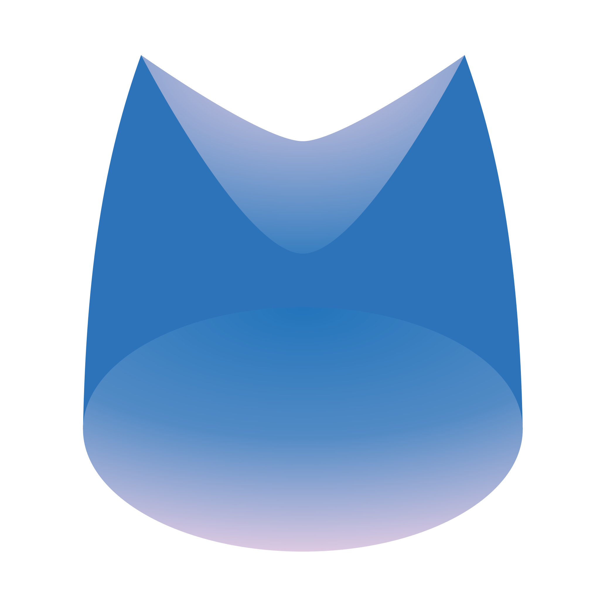

<p align="center">
  
</p>

<h1 align="center">Intern Kim</h1>

<p align="center">
  An AI-native workspace for teams: tasks, calendar and messenger,<br>
  with an AI coworker that runs on your own computer.
</p>

<p align="center">
  
  <a href="LICENSE"></a>
  
  
  
  
</p>

<p align="center">
  <a href="https://docs.intern.kim">Documentation</a> ·
  <a href="https://docs.intern.kim/quickstart">Quickstart</a> ·
  <a href="https://docs.intern.kim/self-hosting">Self-hosting</a>
</p>

Intern Kim is where a team keeps its tasks, calendar, attendance, files, customers
and conversations, and where it hands work to an AI coworker. People ask it for work
in the web app or the company messenger, and it does that work under the identity of
whoever asked, on a computer the company owns.

It is pre-alpha. We build it at Yeomyeonggeori and run our own workday on it;
setting it up anywhere else still takes some knowledge of how it is built.

Everyone signs in at [intern.kim](https://intern.kim). The company's records sit in
Supabase behind row level security, and the agent's computer opens no inbound port.
Every part is self-hostable, so a company can take all of it off `intern.kim`.

## Install

Create a company at [intern.kim](https://intern.kim/auth/claim?new-company=1),
download `internkim-host.json` from its setup page, then run these two commands on
the computer that will stay on:

```bash
curl -fsSL https://intern.kim/install.sh | sh -s -- host
sudo internkim install ~/Downloads/internkim-host.json
```

The first command installs `internkim` from the latest GitHub Release. It uses apt on
Debian 13 and Ubuntu 22.04 or 24.04, dnf on Fedora and on RHEL-compatible 10 (Rocky,
AlmaLinux), pacman on Arch Linux, and the Homebrew tap on macOS. Linux machines can
be arm64 or amd64. The second command asks for an
[OpenRouter API key](https://openrouter.ai/settings/keys) and registers the services.
On Linux the machine then signs in with a key it generated itself, so the
downloaded file is used once and never again.

## How it is built

```
browser or messenger app, any network
  │
  ├── Cloudflare Pages ── the web app and the public API (/api/v1)
  │
  └── Supabase ────────── Postgres, Auth, Realtime: the company's records
        │
        │  calls over an outbound connection the company's computer keeps open
        ▼
  the company's computer
    ├── relay ───────── answers the web app, carries messages to the agent
    ├── blueclaw ────── the agent: runs tools as the requester, approval, task ledger
    ├── chatd ───────── messenger adapter (Buzz)
    ├── capabilityd ─── holds provider keys: model calls, mail, web, browser
    └── Postgres ────── the agent's own store: conversations, runs, memory
```

The records a company would still need after replacing every computer live in
Supabase. What only makes sense on the machine stays there: the agent's memory, its
history and the workspace files. Each person is a Linux user on that machine, so file
permissions bound what the agent can touch for them.

The agent is two other repositories.
[blueclaw](https://github.com/yeomyeonggeori/blueclaw) hosts it and
[bluecollar](https://github.com/yeomyeonggeori/bluecollar) is its loop. Its skills
come from [internkim-plugin](https://github.com/yeomyeonggeori/internkim-plugin).
This repository puts them on a machine and operates them.

## Documentation

The pages live in `docs/` and are published at
[docs.intern.kim](https://docs.intern.kim), in English and Korean.

- [Architecture](https://docs.intern.kim/architecture) and
  [boundaries](https://docs.intern.kim/boundaries) show what talks to what and what
  decides who may do what.
- [Running the host](https://docs.intern.kim/running-the-host) covers the services,
  logs and settings of the company computer.
- The [API](https://docs.intern.kim/api) calls the tools the agent uses, with a
  token or from an MCP client at `https://api.intern.kim/v1/mcp`.
- [The record](https://docs.intern.kim/record/schema) explains the schema and its
  rules.

## Self-hosting

The host always runs on the company's own computer. The record can move to the
company's own Supabase project, hosted or self-hosted, and the web app and the
public API to its own Cloudflare account and domain. [Self-hosting
levels](https://docs.intern.kim/self-hosting) says what each level moves and how to
deploy the web app.

## Contributing

`supabase/migrations` is the schema of record and `web/` is the web app and the API.
`host/` holds the company computer's boot order and the relay, and `cmd/` and
`internal/` hold the Go programs. [CONTRIBUTING.md](CONTRIBUTING.md) says how to
build, check and send a change.

## License

Apache-2.0, see [LICENSE](LICENSE). The submodules blueclaw and internkim-plugin are
Apache-2.0 too.

<p align="center">
  <a href="https://dawn.kim"></a><br>
  <sub>Made by <a href="https://dawn.kim">Yeomyeonggeori</a></sub>
</p>
