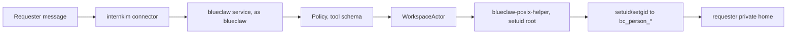
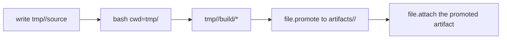

# Intern Kim

Intern Kim is an AI coworker a company runs itself. It reads the company's
messenger, does the work people ask of it under their own identity, and keeps
every file, task and memory on hardware the company owns.

The agent is two other repositories.
[blueclaw](https://github.com/yeomyeonggeori/blueclaw) is the agent host: it
runs tools as the person who asked, and owns approval and the task ledger.
[bluecollar](https://github.com/yeomyeonggeori/bluecollar) is the agent loop
that runs inside it. This repository is the layer that puts those two on a
machine and operates them.

The model's kernel is `read`, `write`, `edit`, `bash`, `plan` and
`equip`, and it speaks through a single `reply` that carries the words,
the attachments and any question it needs answered. Everything else a company
publishes reaches it as a shortlist settled once per plan step.

The agent reads `identity.json` and `soul.json` in its runtime workspace, and
each person's preferences from their own `user.json`. Administration publishes
agent documents to Blueclaw and checks its acknowledgment. Contributor details
are in [blueclaw's documentation](https://blueclaw.intern.kim).

## How it is put together

A company runs one computer that stays on. The hardware does not matter — a
laptop, a Mac Studio, a Jetson. People reach their messenger and their files
from any network, through the central plane. Nothing connects inward to that
computer, which opens no port and needs no tunnel or public hostname.

```
browser, any network
  │
  ├── Cloudflare Pages ────── the company web app and record API; one build serves every host
  │
  └── Supabase ───────────── Postgres, Auth, Realtime
        │
        │  a call on the member's own private channel
        ▼
  the company's computer, outbound connections only
    ├── relay ───────── answers calls, carries messenger arrivals
    ├── blueclaw ────── agent runtime, task ledger, approval, workspace
    ├── chatd ───────── Buzz messenger adapter
    ├── capabilityd ─── model calls, embeddings, mail, site, web and browser tools
    └── Postgres ────── the agent's own store
```

The relay connects to Supabase, the central plane and the company's messenger,
independent of blueclaw, chatd, capabilityd and Postgres. `host/entrypoint.sh`
starts it first, so the messenger screen stays available while the agent is
down. `host/README.md`
has what the box needs and which parts are optional;
[Architecture](https://docs.intern.kim/architecture/) has the design.

The schema of record is `supabase/migrations`, explained in
[What the tables mean](https://docs.intern.kim/record/schema/). Row level security is the access boundary. A read
on somebody's behalf uses their own token; the service key is for what security
cannot reach, and it never leaves a server route.

### The device path

Before the central plane there was one appliance per company: a Jetson Orin Nano
Super with a virtual-machine guest, the Buzz relay and an update engine on board.
That path still ships and works. Sections below marked `device` describe it.

```
operator on the same network ── Jetson Orin Nano Super
                                 ├── Buzz relay
                                 ├── internkim-admind (127.0.0.1:18080)
                                 ├── internkim-capabilityd
                                 ├── Cloud Hypervisor blueclaw guest
                                 └── /root/.internkim
                                       ├── secrets/
                                       ├── config/
                                       ├── state/
                                       └── models/

the user's own computer
  └── internkim-companion
        ├── long-polls the admind companion broker
        ├── user_confirm / user_input / picking a local file
        └── a headed browser through the bundled agent-browser
```

### Reaching a device from somewhere else

The product does not open a way in. `admind` listens on loopback, the agent's
connections are outbound, and nothing here creates a tunnel, a DNS record or an
access policy.

An operator on the same network needs nothing. From elsewhere, put whatever you
use in your own `~/.ssh/config` and every command follows it.

Over Cloudflare Access, use a service token. It lasts a year and needs no
browser:

```bash
tools/provision-cloudflare-ssh-service-token     # creates it, attaches the policy
```

It is kept in the `@production` vault profile, and the wrapper fetches it from
there on each connection:

```
Host device-*
  ProxyCommand /path/to/tools/cloudflared-access-ssh %h
```

Without the token the wrapper stops and names the missing key. It never falls
back to `cloudflared access login`, whose day-long browser sign-in cannot serve
anything unattended.

A Cloudflare Tunnel is one answer and a convenient one during development.
Tailscale, a jump host and WireGuard are others, and this repository cannot tell
which you picked. `--remote-ssh` skips the local-network probe when you know the
device is not on it.

## Security

### Every credential is its owner's

No account stands for somebody else. Each person's work on the messenger uses a
credential that person owns, and the browser puts it in the call as `actor`.
[Architecture](https://docs.intern.kim/architecture/#how-the-chat-screen-gets-answered)
says how a member registers one.

### The workspace boundary is POSIX

Linux users, groups and file modes are the boundary for the agent's workspace.
The blueclaw service runs as `blueclaw` and handles orchestration, policy, the
event log and the LLM flow. Everything a requester can see the effect of runs as
that requester.

- A person becomes a stable `bc_person_<shortID>` Linux user.
- A circle becomes a `bc_circle_<circleID>` group.
- `bash`, terminal sessions, file reads and writes, artifact delivery,
  user-authored skills and tools, dependency install scripts and package
  lifecycle scripts all run with the requester's unprivileged UID, GID and
  supplementary groups.
- An admin requester gets the same task-actor scope at a raw terminal.
  Admin-only file access, task-scoped grants and outbound transfer stay behind
  built-in tools.
- The service never touches a requester's workspace file with `os.ReadFile` or
  `os.WriteFile`. Workspace I/O and process execution go through
  `WorkspaceActorFactory → WorkspaceActor → blueclaw-posix-helper`.
- `blueclaw-posix-helper` is a `root:root 4755` setuid bridge. Being able to
  execute it is not authorization: the helper checks that its real UID is `root`
  or `blueclaw`, then drops to the requester.
- There is no executable allowlist or path filter. Ownership and mode bits
  decide, so a system-modifying command simply fails for an unprivileged actor.



Durable output is promoted explicitly.



| Guest path | Permission model | Holds |
|---|---|---|
| `home/<path>` | requester only, durable | editable personal source |
| `/workspace/private/people/<personID>/tmp/<task>` | requester only, ephemeral | drafts and build intermediates |
| `/workspace/private/people/<personID>/artifacts/<slug>` | requester only, durable | finished personal output |
| `/workspace/circles/<circleID>` | circle group `2770` | deliberate team sharing |
| `/workspace/shared/public` | shared policy | content safe to show outsiders |
| `/workspace/shared/cache/dependencies` | shared cache group | package caches only |
| `/workspace/skills` | read and execute | built-in skill source |
| `/workspace/.blueclaw` | service-owned | database, logs, internal state |

### Where secrets live — device

Credentials sit in `/root/.internkim/secrets/` and `/root/.internkim/config/`.
Blueclaw never sees a provider token, a browser cookie, a local file path or a
model path directly; it reaches them through the typed capability boundary.

| Path | Read by | For |
|---|---|---|
| `/root/.internkim/secrets/openrouter-api-key` | `internkim-capabilityd` | the remote LLM provider |
| `/root/.internkim/models/*` | `internkim-capabilityd`, the local model wrapper | the local model runtime |
| `/root/.internkim/state/companion-jobs.json` | `internkim-admind` | companion broker restart recovery |

### Where operator secrets live

Operator secrets live in the operating system's vault. `internkim`
re-executes itself through `monkeys run` to be handed them, so no file beside
the checkout holds one and nothing is exported by hand. Copying one into a
second file under `.local/` gave the value two homes, one of which nobody
remembers to rotate.

`.monkeys` is the list of names and `tools/environment.json` says what
each one is for, which `tools/verify-environment-declarations` keeps in step.
On a second machine `monkeys doctor` names what the vault still lacks, and a
human types each value into `monkeys remember <name>`. A value that is not
secret is a `NAME=value` line in `.monkeys` instead, because monkeys redacts a
remembered value wherever it appears in a command's output.

## The pieces

| Piece | What it is |
|---|---|
| **relay** (`host/relay/`) | The company computer's link to the central plane. Answers member calls over Realtime and forwards messenger arrivals. |
| **Go CLI** (`cmd/internkim/`) | The operator's command: `setup`, `deploy`/`release`/`update`, `recover`, `verify`, `reset`, `lab`/`dev fleet`, `ops`, `llm`, `users`/`task`/`invite`. |
| **internkim-admind** | The device administrator API: the admin UI reverse proxy, companion pairing and broker, backup and restore, status. |
| **internkim-capabilityd** | Holds the OpenRouter key, the local model, messenger and companion credentials, and exposes only a capability API. |
| **local model** | Generation and embedding both on a resident `llama-server`: gemma-4-E2B QAT with MTP drafting (`--chat-template gemma`) for generation, BGE-M3 Q8 on CPU (`-ngl 0`) for embedding. `internkim-local-llm-runner` (LiteRT) is a legacy fallback. |
| **blueclaw** | The agent runtime. On a device it runs as a Cloud Hypervisor guest under `blueclaw-supervisor`, reading `/workspace/.blueclaw/config/*.json`. |
| **chatd** | Per-person messenger operations through the company's messenger gateway. |
| **internkim-companion** | One binary on the user's own computer: their signed-in browser, their desktop through the Cua Driver, and later local-only inference. |
| **Buzz** | The company's messenger and the entry point for work, reached from the company app or a messenger client. |
| **SvelteKit web app** (`web/`) | The company app on Cloudflare Pages, and the operating surfaces served same-origin from a device: `/admin`, `/flow`, `/memory`, `/calendar`, `/mail`, `/attendance`, `/files`, `/ops`. |
| **workspace assets** (`assets/blueclaw-workspace/`) | AGENTS.md, skills and helpers, installed to the host workspace and mounted into the guest. |

Agent memory stays on the host with the agent, kept by
[bluememo](https://bluememo.intern.kim).

## Running it

### The central plane, locally

The local stack is the Supabase CLI's native runtime, with no Docker:
`[experimental] stack = true` in `config.toml`, on the API and database ports
that file pins. `tools/with-local-plane` starts it, holds it for one command at a
time, and stops it after fifteen idle minutes. It refuses a CLI older than the
version it names.

```bash
tools/with-local-plane supabase db reset                      # schema and fixtures
tools/with-local-plane supabase test db                       # pgTAP
tools/with-local-plane bun test ./supabase/tests/concurrency  # races between two sessions
cd web && ../tools/with-local-plane bun run dev
```

The reset alone gives a company to sign into, as `member1@example.com` with
`seed-password`. Fixtures live only in `supabase/seed.dev.sql`, wired through
`[db.seed]` in `config.toml`; a reset wipes anything that file does not carry.

Run `supabase test db` after every schema change and add a case for the
invariant just introduced. SQL function bodies resolve at call time, so a
rename in the same migration that created a function breaks it silently, and
pgTAP is what notices.

A migration that creates a table must also grant it. `anon`, `authenticated` and
`service_role` start with no privileges on a fresh or self-hosted database; see
`supabase/migrations/20260803000016_api_grants.sql`.

`supabase config push` sends the whole `config.toml`, so any setting the file
omits returns to the CLI default. There is no dry run. Read the diff it prints,
where `-` is the live state and `+` is what is about to be sent, before trusting
the exit code.

Settings that only the hosted project carries live under `[remotes.production]`:
the sign-in email templates, session limits and analytics buckets. A push to
that project merges them in and prints `Loading config override:
[remotes.production]`. A local stack started by the TypeScript CLI leaves them
out.

### The company web app

One build serves a device host and a company host, because which Supabase
project the app talks to is decided at runtime: `hooks.server.ts` injects it
into the `#central-plane` element, read through `$env/dynamic/private`. Keep it
that way.

```bash
cd web
bun install
bun run build
monkeys run @production bun run scripts/deploy-pages.ts --project internkim --output .svelte-kit/cloudflare --production
```

`deploy-pages.ts` names no project of its own, so the one that serves every
company cannot be replaced by a command that forgot to say which. It deploys a
preview unless `--production` is passed. Custom
domains always serve the production deployment, so a hostname can never point at
a preview, and each company hostname is attached explicitly through
`scripts/pages-domains.ts`.

`api.<zone>` is attached to this same project, because the API is these routes.

Store every Pages project variable as a secret, including values meant to stay
public. `wrangler pages deploy` rewrites plain-text variables from its own
config and keeps only secrets. A plain-text value can disappear on the deploy
that was meant to start using it.
`scripts/show-pages-env.ts` prints the type of each. `GATEWAY_URL` and
`GATEWAY_ADMIN_TOKEN` are what let an API call reach a company machine; without
them an invocation answers `503`, while the catalog and the tokens still work.

### A device

**device.** What the appliance path needs:

- macOS, Apple Silicon or Intel
- an NVIDIA Jetson Orin Nano Super Developer Kit booted on JetPack, NVMe
  storage recommended
- SSH reachability and the device IP
- an [OpenRouter API key](https://openrouter.ai/keys)

```bash
make build
./internkim setup --board jetson-orin-nano --host <jetson-ip> --user <ssh-user>
```

The `@production` vault profile names the device: `INTERNKIM_DEVICE_URL`,
`INTERNKIM_SSH_HOSTNAME` and `INTERNKIM_FLEET_ID` as the device's registration
answered them, and `INTERNKIM_FLEET_SECRET`, which signs release applies and
recovery requests. They live in the vault and not in `.monkeys` because they
describe one operator's device, so `monkeys pack --only @production` carries
everything another machine needs to deploy.

The CLI probes the local network first and otherwise reaches the device by that
ssh hostname; `--remote-ssh` skips the probe. How that hostname is reachable is
the operator's own `~/.ssh/config`, so a device outside your network needs a
`ProxyCommand` there and nothing here. `./internkim ssh` and
`./internkim ssh -- uptime -p` use the same routing.

Run `make build` again after changing Go, provisioning or runtime config.
`./internkim` is a local binary and does not rebuild itself, and a stale one can
write an older runtime schema onto the device. The `services` and `health` steps
check the real `/root/.blueclaw/config/runtime.json` contract and fail on stale
config.

Setup fast-forwards the blueclaw submodule to `origin/main` and stops if it has
local changes. To build the working tree as it stands, set
`INTERNKIM_BLUECLAW_USE_LOCAL=1`, and run `make prepare-blueclaw-payload` first
when the change has to reach the blueclaw payload.

```bash
INTERNKIM_BLUECLAW_USE_LOCAL=1 ./internkim setup --only binaries,blueclaw-payload,services --force
```

A full setup runs every step in `internal/provisioning/steps/`, in the order
that package declares: preflight and staging, the binaries and services,
blueclaw's runtime and config, the Buzz relay with its media store and `chatd`
adapter, the OpenRouter key and the local model, user sync, and a closing health
check. The step names and order live in `internal/provisioning/steps/`;
`--only` accepts those names.

### Deploying — device

Everyday device deployment uses the OTA release engine.
`internkim deploy` builds a release manifest and component bundles from local
artifacts, uploads them to Admin HTTPS, and runs the apply engine already on the
device. SSH stays for first installation, for a device too old to have the
direct-upload route, and for systemd repair.

```bash
make build
./internkim @production deploy --components capabilityd
./internkim @production deploy --components admind,capabilityd
```

Without `--components`, deploy rebuilds the blueclaw payload (and the board
UI when it is older than the last commit to `web/`), compares the device with
this tree, and ships every component that differs, with its protocol partner.
It refuses a component the device is ahead on, ships nothing when the device
already matches, and after the apply prints each shipped component's revision
on the device next to the tree's, failing on any difference.

```bash
./internkim @production deploy
```

A single manifest records a device's current release across its components.
Direct-upload releases use the same `releaseset.Manifest`,
checksum verification, staging, install, restart and record flow as R2 releases.

R2 publishes a stable channel for several devices to pull. The bucket is
`internkim-releases` and the public base URL is served by the
`internkim-release-registry` Worker, which hands out an object only for a request
carrying the right `X-INTERNKIM-RELEASE-TOKEN`. An untokened download must be a
401.

The same token goes in two places: `INTERNKIM_RELEASE_DOWNLOAD_TOKEN` in the
vault, and the Worker's secret.

```bash
openssl rand -base64 32

(cd workers/release-registry && ../../web/node_modules/.bin/wrangler secret put RELEASE_DOWNLOAD_TOKEN)
monkeys run @production bun run web/scripts/deploy-worker.ts workers/release-registry --route-subdomain updates
```

`deploy-worker.ts` renders the route as `<subdomain>.<zone>` from the zone
`CLOUDFLARE_DOMAIN` or `INTERNKIM_DOMAIN` names, falling back to
`fleetdomain.defaultZone`. No `wrangler.jsonc` writes the domain down, and
`web/tests/unit/scripts/worker-route.test.ts` fails when one starts to.
A route already pointing at this Worker is left alone, id and all; wrangler
adds what is missing and deletes nothing.

Publishing from a development machine with a Wrangler OAuth session needs the
bucket and base URL. `INTERNKIM_RELEASE_R2_ACCOUNT_ID` falls back to
`CLOUDFLARE_ACCOUNT_ID`. Everything the CLI reads comes from the vault, which
it hands itself through `monkeys run`, so nothing here needs exporting by hand.
None of these three is a secret, so they are plain lines in `.monkeys`:

```
INTERNKIM_RELEASE_R2_BUCKET=internkim-releases
INTERNKIM_RELEASE_R2_PUBLISHER=wrangler
INTERNKIM_RELEASE_PUBLIC_BASE_URL=https://updates.<zone>
```

CI, with no OAuth session, publishes with R2 S3 credentials instead:
`INTERNKIM_RELEASE_R2_ACCOUNT_ID`, `INTERNKIM_RELEASE_R2_ACCESS_KEY_ID`,
`INTERNKIM_RELEASE_R2_SECRET_ACCESS_KEY` and
`INTERNKIM_RELEASE_DOWNLOAD_TOKEN`. `INTERNKIM_RELEASE_SIGNING_KEY` is optional
either way.

```bash
cd web && bun run build:board && cd ..
make prepare-blueclaw-payload
./internkim release publish
./internkim release companion
./internkim release host

./internkim @production update check
./internkim @production update apply
```

`setup --only admind --force` bootstraps a device that has no direct-upload
route yet, and recovers one whose Admin HTTPS is down.
`blueclaw-payload-direct` and `deploy --legacy-ssh` are debugging fallbacks.

### Verification

The gate before any device deployment is the disposable Local Fleet: an
apple/container ARM Linux VM on macOS running the current checkout against real
service boundaries.

```bash
make deps-sim
./internkim lab image-build          # once

./internkim dev fleet run                                   # the full predeploy gate
./internkim dev fleet run --scenario buzz-attachment
./internkim dev fleet run --scenario buzz-direct-message
./internkim dev fleet run --scenario model-configuration-upgrade
./internkim dev fleet verify-regression --base main --scenario regression-proof
./internkim dev fleet reset
```

A run keeps state only under `.local/local-fleet/runs/<run-id>` and copies no
device, pilot or Jetson secret. Cloudflare Pages deployment is skipped; the VM's
own Admin and Web UI and localhost smoke are what get checked. Jetson GPU checks
report `not applicable`. `./internkim dev fleet up`, `status`, `run --reuse` and
`reset` are for holding a shared VM open to debug it.

Run the local verification suite with:

```bash
./internkim test cheap
```

The same engine drives the ops console at `http://127.0.0.1:8789/ops`, so the
CLI and the UI cannot diverge on ordering.

```bash
./internkim @production ops serve
```

`make fleet-gate` and `make deploy-after-fleet` wrap the gate and the deployment
that follows it.

After deploying to a real device:

```bash
./internkim status
./internkim verify api
```

`verify api` includes the local model, so it fails when the model runtime is
down even with healthy Buzz relay and blueclaw services. `journalctl` on
`internkim-llamacpp` and `internkim-llamacpp-embedding` says which one.

Live LLM end-to-end tests cost money and stay out of `go test ./...`:

`tools/verify` checks deterministic logic with controlled protocol responses.
Model and provider evaluations require the `llmeval` build tag as well as their
live environment flag. They assess model behavior separately from configuration,
state transitions, error propagation, and recorded effects; incidental answer
wording is not a pass condition.

```bash
cd .dependency/blueclaw
BLUECLAW_E2E_LIVE=1 \
BLUECLAW_E2E_LLM_UNIX_SOCKET=/run/internkim/capability.sock \
go test -tags appliance,llmeval ./internal/e2e -run TestPresentationLocalMultiturnSuccessLive -count=1
```

### Resetting agent history

```bash
./internkim reset blueclaw-history --plan
./internkim reset blueclaw-history --confirm <deviceID>
./internkim reset blueclaw-history --keep-mattermost-posts --confirm <deviceID>
```

The reset clears blueclaw tasks, raw events, conversations, legacy memory, the
memory episodes, facts, profiles and jobs, along with the posts, reactions and threads
visible in Mattermost. Invited users, policy, platform account links, secrets,
Mattermost users, teams and channels survive.

## Companion

`internkim-companion` is one binary that runs on the user's own computer and
provides what the device cannot: a headed browser signed in as that person,
control of their desktop, and later stronger local models. There is no desktop
app around it; an agent can install it on a person's computer without anyone
clicking through a wizard, and a desktop wrapper can come later.

```bash
curl -fsSL https://intern.kim/install.sh | sh -s -- companion
internkim-companion pair --device-url https://<deviceID>.<zone> --code ABCD-1234
internkim-companion service install
internkim-companion status
```

`web/static/install.sh` downloads the macOS or Linux build from
`updates.<zone>/companion/latest/` and verifies it against the published
`SHA256SUMS`. `companion/` and `host/` are the public prefixes of the release
registry; everything else there needs the download token.
`./internkim release companion` cross-compiles the four builds and publishes
them; `make build-companion` builds the host's own.

The same installer installs the company host package. Debian 13 arm64 and
amd64 machines use apt; Macs with Homebrew use the tap:

```bash
curl -fsSL https://intern.kim/install.sh | sh -s -- host
sudo internkim install ~/Downloads/internkim-host.json
```

The installer adds the package source and installs `internkim`. The second
command configures the host from the connection file and registers its native
services. The web app's setup page and the [quickstart](https://docs.intern.kim/quickstart)
show the same commands.

`make build-company-host` builds the same `internkim` command the package
installs, as `./internkim-host`.

`https://intern.kim/companion/install.sh` still answers: admind on a device that
has not been redeployed prints that address, and the file there forwards to
`install.sh` with `companion`. Deploy the web app before the admind release that
changes the printed address.
`./internkim verify install-addresses` checks that every address
`internal/capabilities` names answers 200, and `tools/deploy-main` refuses the
release when one does not. It separates an address the web app does not serve
from one nothing could reach after three tries, and says which it found, because
a stalled read is not evidence that a deploy is out of order.

Pairing starts in Settings → My computer of the web app: admind issues a
ten-minute one-time code bound to the signed-in member (`/companion/api` in
`internal/admind/companion_member_routes.go`) and the page shows the install,
`pair` and `service install` commands to run. The `pair` command carries the
code; an `internkim://pair?…` deep link is accepted as its
only argument too. A paired companion opens no inbound port and long-polls the
device broker.

`service install` registers a launchd agent on macOS and a systemd user unit
on Linux, so the companion starts at login and restarts when it dies. Run
flags after `--` are recorded in the service definition
(`service install -- --cua-driver /path/to/cua-driver`); `service restart`,
`service status` and `service uninstall` do what they say. `run` from a
terminal is the same process without the supervisor. `./internkim companion
upgrade` rebuilds the binary from the checkout into `~/.local/bin` and
restarts the service when one is installed.

The executor handles the `browser_*` family, `computer_task`, and mock
`llm_text` and `llm_structured` for development. A companion job carrying a
requester identity can be claimed only by that same owner's companion.

Browser capabilities route to the companion first. The companion drives the
user's Google Chrome with a persistent Intern Kim profile and an extension
embedded in the binary, unpacked next to that profile on first use; nothing
else needs installing. The device's own browser is Moli, a headless engine
that answers agent-browser over the Chrome DevTools Protocol; capabilityd
starts one per requester, each with its own profile, stops it when idle, and
runs at most four at once. It is used only for plain public page text when no
companion is available. Login, MFA, captcha and other steps only a person can
do are not done through the device browser; the agent says so and stops.
Snapshots carry the URL, title, text and interactive refs, and nothing else.
Screenshots are companion-only.

`computer_task` runs a goal on the user's computer through the Cua Driver
(`cua-driver`, found on `PATH` or in `~/.local/bin`, or named with
`--cua-driver`). Each step the companion observes the page, lists what it
could do, and asks the device to decide; the device asks the decision model
through capabilityd, so the companion never holds an inference key. `status`
reports `computerControlStatus` as `ready` or `driver_not_found`.

The pairing signing key stays out of the state file, which holds a reference to
it; macOS keeps the key in the Keychain. `INTERNKIM_COMPANION_DEV_FILE_STORE=1`
allows a file-based fallback in development.

Broker jobs live in `/root/.internkim/state/companion-jobs.json`. When admind
restarts, pending jobs stay claimable and running jobs return to pending.

capabilityd never calls a companion URL. It creates a job on the local admind
broker, and routes `browser.*`, `computer_task` and companion LLM capabilities
only while that companion is online and advertising them. Blueclaw sees no
provider implementation, browser binary, model path or user cookie.

## The API

Every tool Intern Kim uses inside a company is callable from outside it. A token
belongs to a person, and each call runs as that person, so a token can never do
more than its owner can. The reference lives at `docs.intern.kim/api`, in Korean
or English, and `/api-docs` on any host redirects there.

The API is the web app: `web/src/routes/api/v1/` answers it, so a company that
hosts the app hosts the API. `api.<zone>/v1` and `<company host>/api/v1` are the
same routes. The bearer is either a signed-in session or an issued token.

An MCP client connects to `https://api.intern.kim/v1/mcp` with no token at all.
The route answers `401` with RFC 9728 metadata that names the plane's Supabase
Auth OAuth 2.1 server; the client registers there, the person allows it at
`/oauth/consent`, and the grant shows up under connected apps in settings. The
[plugin](https://github.com/yeomyeonggeori/internkim-plugin) declares this
server in `mcp.json`.

```bash
curl https://<host>/api/v1/tools --header "Authorization: Bearer $INTERNKIM_TOKEN"

curl https://<host>/api/v1/tools/task_add/invoke \
  --header "Authorization: Bearer $INTERNKIM_TOKEN" \
  --header 'Content-Type: application/json' \
  --data '{"input":{"title":"draft the quarterly report","size":"M"}}'
```

`POST /api/v1/token` issues one, `GET /api/v1/tokens` lists them and
`DELETE /api/v1/token?name=` revokes one. A session makes the first; after that a
token makes its own successors, never above its own rung. The base tools in the
reference are read from
`pkg/capabilityprotocol/generated/capability-tools.json`, the same catalog the
agent runs on, and `GET /api/v1/tools` answers them without asking the company
machine. Tools that come and go with circumstance, such as the companion's, are
found with `?live=true`, which costs that round trip.

For work registration, the agent selects a company type and a fixed effort size
from Task > Definitions. `task_list` returns the company labels; the tool's size
description carries the shared rubric. Calendar events use the size thresholds automatically.
An unmatched type is stored as `null` and displayed as Other (`기타`). API
updates distinguish an omitted type (keep it) from an empty string (clear it to `null`).

## Pages API — device

| Method | Path | Does |
|---|---|---|
| POST | `/api/register` | records a device and its place in a fleet |
| GET/POST | `/api/ota/*` | OTA checks and reports for blueclaw and the CLI |

A browser request to a device proves identity through a Mattermost session or an
Intern Kim web session, and is then checked again against current policy for
active member. A Cloudflare Access email is accepted where somebody has put one
in front, which the product no longer sets up. Admin APIs keep their own
boundary on top of that, and internal calls between admind, capabilityd,
Mattermost and blueclaw go over loopback and stay exempt.

## Repository layout

`cmd/` holds the binaries, one directory each, and `internal/` the packages
behind them; `ls cmd internal` answers what exists today. The rest:

| | |
|---|---|
| `web/` | the SvelteKit app, which is also the public API (`src/routes/api/v1/`) |
| `supabase/` | `migrations/` is the schema of record, `seed.dev.sql` the only local fixtures, `tests/` the pgTAP suite |
| `host/` | `entrypoint.sh` is the boot order for the company computer's bundle, `relay/` its link to the plane |
| `assets/blueclaw-workspace/` | the agent's own AGENTS.md, skills and helpers |
| `workers/` | the Cloudflare workers |
| `docs/` | the pages docs.intern.kim publishes, and `docs/web/` the site that serves them |
| `lab/` | VM lab configuration and scripts |
| `tools/` | development helpers, `tools/verify` among them |
| `.dependency/blueclaw/` | the agent submodule |

## Cost

| | |
|---|---|
| domain | about $10 a year |
| Cloudflare Tunnel, Access, Pages, KV | free tier |
| Supabase | free tier to start |
| OpenRouter | metered, with free models available |

The remote provider is the default path for generation. The device's local model
and, later, a strong local model on a companion host are the fallbacks that keep
a company running when that path is unavailable or too expensive.

## License

TBD
