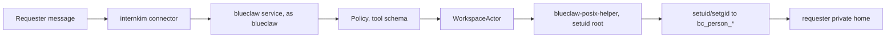
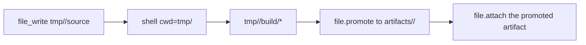

# Intern Kim

Intern Kim is an AI coworker a company runs itself. It reads the company's
messenger, does the work people ask of it under their own identity, and keeps
every file, task and memory on hardware the company owns.

The agent is two other repositories.
[blueclaw](https://github.com/yeomyeonggeori/blueclaw) is the agent host: it
runs tools as the person who asked, and owns approval and the task ledger.
[bluecollar](https://github.com/yeomyeonggeori/bluecollar) is the agent loop
that runs inside it. This repository is the layer that puts those two on a
machine and operates them.

The agent reads `identity.json` and `soul.json` in its runtime workspace, and
each person's preferences from their own `user.json`. Administration publishes
agent documents to Blueclaw and checks its acknowledgment. Contributor details
are in [persona delivery and recovery](docs/internal/persona-and-recovery.md).

## How it is put together

A company runs one computer that stays on. The hardware does not matter — a
laptop, a Mac Studio, a Jetson. People reach their messenger and their files
from any network, through the central plane. Nothing connects inward to that
computer, which opens no port and needs no tunnel or public hostname.

```
browser, any network
  │
  ├── Cloudflare Pages ────── the company web app; one build serves every host
  │
  └── Supabase ───────────── Postgres, Auth, Realtime
        │
        │  a call on the member's own private channel
        ▼
  the company's computer, outbound connections only
    ├── relay ───────── answers calls, carries messenger arrivals
    ├── blueclaw ────── agent runtime, task ledger, approval, workspace
    ├── chatd ───────── messenger adapters: Mattermost, Buzz
    ├── capabilityd ─── calendar, tasks, mail, the model path
    └── Postgres ────── the agent's own store
```

The relay depends on nothing else in the bundle. It speaks to Supabase, the
central plane and the company's messenger, and never to blueclaw, chatd,
capabilityd or Postgres. `host/entrypoint.sh` therefore starts it first:
the agent can be down while the messenger screen still answers. `host/README.md`
has what the box needs and which parts are optional; `docs/internal/saas-design.md`
§2 and §6 have the design.

The schema of record is `supabase/migrations`, explained in
`docs/internal/core-schema.md`. Row level security is the access boundary. A read
on somebody's behalf uses their own token; the service key is for what security
cannot reach, and it never leaves a server route.

### The device path

Before the central plane there was one appliance per company: a Jetson Orin Nano
Super with a virtual-machine guest, Mattermost and an update engine on board. That
path still ships and still works. Sections below marked **device** describe it.

```
operator on the same network ── Jetson Orin Nano Super
                                 ├── Mattermost :8065
                                 ├── internkim-admind (127.0.0.1:18080)
                                 ├── internkim-capabilityd
                                 ├── graphiti-memoryd :7791
                                 ├── Cloud Hypervisor blueclaw guest
                                 └── /root/.internkim
                                       ├── secrets/
                                       ├── config/
                                       ├── state/
                                       └── models/

the user's own computer
  └── internkim-companion
        ├── long-polls the admind companion broker
        ├── user_confirm / user_input / picking a local file
        └── a headed browser through the bundled agent-browser
```

### Reaching a device from somewhere else

The product does not open a way in. `admind` listens on loopback, the agent's
connections are outbound, and nothing here creates a tunnel, a DNS record or an
access policy.

An operator on the same network needs nothing. From elsewhere, put whatever you
use in your own `~/.ssh/config` and every command follows it:

```
Host device-*
  ProxyCommand cloudflared access ssh --hostname %h
```

`cloudflared access login` writes a token that lasts a day, so that line means
signing in again every morning and it cannot be used by anything unattended. A
Cloudflare Access **service token** lasts a year and needs no browser:

```bash
tools/provision-cloudflare-ssh-service-token     # creates it, attaches the policy
```

Then point the proxy at the wrapper, which reads the token from the file it was
written to rather than putting a secret in this config:

```
Host device-*
  ProxyCommand /path/to/tools/cloudflared-access-ssh %h
```

A Cloudflare Tunnel is one answer and a convenient one during development.
Tailscale, a jump host and WireGuard are others, and this repository cannot tell
which you picked. `--remote-ssh` skips the local-network probe when you know the
device is not on it.

## Security

### Every credential is its owner's

No account stands for somebody else. Each person's work on the messenger uses a
credential that person owns, and the browser puts it in the call as `actor`.
`docs/internal/every-credential-is-its-owners.md` has the rule, the places it is
still broken, and the order of change that closes them.

### The workspace boundary is POSIX

Linux users, groups and file modes are the boundary for the agent's workspace.
The blueclaw service runs as `blueclaw` and handles orchestration, policy, the
event log and the LLM flow. Everything a requester can see the effect of runs as
that requester.

- A person becomes a stable `bc_person_<shortID>` Linux user.
- A circle becomes a `bc_circle_<circleID>` group.
- `shell`, terminal sessions, file reads and writes, `file.promote`,
  `file.attach`, user-authored skills and tools, dependency install scripts and
  package lifecycle scripts all run with the requester's unprivileged UID, GID
  and supplementary groups.
- An admin requester gets the same task-actor scope at a raw terminal.
  Admin-only file access, task-scoped grants and outbound transfer stay behind
  built-in tools.
- The service never touches a requester's workspace file with `os.ReadFile` or
  `os.WriteFile`. Workspace I/O and process execution go through
  `WorkspaceActorFactory → WorkspaceActor → blueclaw-posix-helper`.
- `blueclaw-posix-helper` is a `root:root 4755` setuid bridge. Being able to
  execute it is not authorization: the helper checks that its real UID is `root`
  or `blueclaw`, then drops to the requester.
- There is no executable allowlist or path filter. Ownership and mode bits
  decide, so a system-modifying command simply fails for an unprivileged actor.



Durable output is promoted explicitly.



| Guest path | Permission model | Holds |
|---|---|---|
| `home/<path>` | requester only, durable | editable personal source |
| `/workspace/private/people/<personID>/tmp/<task>` | requester only, ephemeral | drafts and build intermediates |
| `/workspace/private/people/<personID>/artifacts/<slug>` | requester only, durable | finished personal output |
| `/workspace/circles/<circleID>` | circle group `2770` | deliberate team sharing |
| `/workspace/shared/public` | shared policy | content safe to show outsiders |
| `/workspace/shared/cache/dependencies` | shared cache group | package caches only |
| `/workspace/skills` | read and execute | built-in skill source |
| `/workspace/.blueclaw` | service-owned | database, logs, internal state |

### Where secrets live — device

Credentials sit in `/root/.internkim/secrets/` and `/root/.internkim/config/`.
Blueclaw never sees a provider token, a browser cookie, a local file path or a
model path directly; it reaches them through the typed capability boundary that
`internkim-capabilityd` and `internkim-admind` present.

| Path | Read by | For |
|---|---|---|
| `/root/.internkim/secrets/openrouter-api-key` | `internkim-capabilityd` | the remote LLM provider |
| `/root/.internkim/models/*` | `internkim-capabilityd`, the local model wrapper | the local model runtime |
| `/root/.internkim/state/companion-jobs.json` | `internkim-admind` | companion broker restart recovery |

Graphiti runs as a memory sidecar and reads none of these. A companion's signing
private key lives in the user's own secure storage, and the device state file
keeps only a reference to it.

### Where operator secrets live

Operator secrets are written in `.env`, which git ignores, and read from there.
Copying one into a second file under `.local/` gave the value two homes, one of
which nobody remembers to rotate.

`.env.example` is the list of names, with fake values. It is what to copy when
setting up a second machine, and where to add a name when the code starts
reading one.

## The pieces

| Piece | What it is |
|---|---|
| **relay** (`host/relay/`) | The company computer's link to the central plane. Answers member calls over Realtime and forwards messenger arrivals. |
| **Go CLI** (`cmd/internkim/`) | The operator's command: `setup`, `deploy`/`release`/`update`, `recover`, `verify`, `reset`, `lab`/`dev fleet`, `ops`, `llm`, `users`/`task`/`invite`. |
| **internkim-admind** | The device administrator API: the admin UI reverse proxy, companion pairing and broker, backup and restore, status. |
| **internkim-capabilityd** | Holds the OpenRouter key, the local model, messenger and companion credentials, and exposes only a capability API. |
| **local model** | Generation and embedding both on a resident `llama-server`: gemma-4-E2B QAT with MTP drafting (`--chat-template gemma`) for generation, BGE-M3 Q8 on CPU (`-ngl 0`) for embedding. `internkim-local-llm-runner` (LiteRT) is a legacy fallback. |
| **blueclaw** | The agent runtime. On a device it runs as a Cloud Hypervisor guest under `blueclaw-supervisor`, reading `/workspace/.blueclaw/config/*.json`. |
| **chatd** | Per-person messenger operations, with Mattermost and Buzz adapters behind one gateway. |
| **Graphiti memoryd** | The memory sidecar: episode ingestion, temporal graph extraction and hybrid graph search through `graphiti-core[kuzu]`. |
| **internkim-companion** | A trusted runtime on the user's own computer for browser handoff, confirmation, input and file picking, and later for local-only inference. |
| **Mattermost** | The self-hostable messenger used as the collaboration channel and the entry point for work. |
| **SvelteKit web app** (`web/`) | The company app on Cloudflare Pages, and the operating surfaces served same-origin from a device: `/admin`, `/flow`, `/memory`, `/calendar`, `/mail`, `/attendance`, `/files`, `/ops`. |
| **workspace assets** (`assets/blueclaw-workspace/`) | AGENTS.md, skills and helpers, installed to the host workspace and mounted into the guest. |

## Running it

### The central plane, locally

```bash
supabase db reset      # schema and fixtures
supabase test db       # pgTAP
cd web && bun run dev
```

The reset alone gives a company to sign into, as `member1@example.com` with
`seed-password`. Fixtures live only in `supabase/seed.dev.sql`, wired through
`[db.seed]` in `config.toml`; a reset wipes anything that file does not carry.

Run `supabase test db` after every schema change and add a case for the
invariant just introduced. SQL function bodies resolve at call time, so a
rename in the same migration that created a function breaks it silently, and
pgTAP is what notices.

A migration that creates a table must also grant it. `anon`, `authenticated` and
`service_role` start with no privileges on a fresh or self-hosted database; see
`supabase/migrations/20260803000016_api_grants.sql`.

`supabase config push` sends the whole `config.toml`, so any setting the file
omits returns to the CLI default. There is no dry run. Read the diff it prints,
where `-` is the live state and `+` is what is about to be sent, before trusting
the exit code.

### The company web app

One build serves a device host and a company host, because which Supabase
project the app talks to is decided at runtime: `hooks.server.ts` injects it
into the `#central-plane` element, read through `$env/dynamic/private`. Keep it
that way.

```bash
cd web
bun install
bun run build
bun run scripts/deploy-pages.ts --project internkim --output .svelte-kit/cloudflare --production
```

`deploy-pages.ts` names no project of its own, so the one that serves every
company cannot be replaced by a command that forgot to say which. It deploys a
preview unless `--production` is passed. Custom
domains always serve the production deployment, so a hostname can never point at
a preview, and each company hostname is attached explicitly through
`scripts/pages-domains.ts`.

`api.<zone>` is attached to this same project, because the API is these routes.

Every project variable has to be a **secret**, even the ones that are not
secret. `wrangler pages deploy` rewrites the plain-text variables from its own
config and keeps only the secrets, so a plain-text one survives until the next
deploy — which is usually the deploy that was supposed to start using it.
`scripts/show-pages-env.ts` prints the type of each. `GATEWAY_URL` and
`GATEWAY_ADMIN_TOKEN` are what let an API call reach a company machine; without
them an invocation answers `503`, while the catalog and the tokens still work.

### A device

**device.** What the appliance path needs:

- macOS, Apple Silicon or Intel
- an NVIDIA Jetson Orin Nano Super Developer Kit booted on JetPack, NVMe
  storage recommended
- SSH reachability and the device IP
- an [OpenRouter API key](https://openrouter.ai/keys)

```bash
make build
./internkim setup --board jetson-orin-nano --host <jetson-ip> --user <ssh-user>
```

The CLI probes the local network first and otherwise reaches the device by its
saved ssh hostname; `--remote-ssh` skips the probe. How that hostname is
reachable is the operator's own `~/.ssh/config`, so a device outside your
network needs a `ProxyCommand` there and nothing here. `./internkim ssh` and
`./internkim ssh -- uptime -p` use the same routing.

Managing several companies or devices from one machine, `--profile` separates
per-company state and `--node` picks a device inside it. The same pair resolves
to the same target for `setup`, `update`, `status`, `verify` and `ssh`.

```bash
./internkim setup --profile acme --node 1 --host <jetson-ip>
./internkim status --profile acme --node 1
./internkim update --profile dawn --node 1 --web
```

Run `make build` again after changing Go, provisioning or runtime config.
`./internkim` is a local binary and does not rebuild itself, and a stale one can
write an older runtime schema onto the device. The `services` and `health` steps
check the real `/root/.blueclaw/config/runtime.json` contract and fail on stale
config.

Setup fast-forwards the blueclaw submodule to `origin/main` and stops if it has
local changes. To build the working tree as it stands, set
`INTERNKIM_BLUECLAW_USE_LOCAL=1`, and run `make prepare-blueclaw-payload` first
when the change has to reach the blueclaw payload.

```bash
INTERNKIM_BLUECLAW_USE_LOCAL=1 ./internkim setup --only binaries,blueclaw-payload,services --force
```

A full setup runs every step in `internal/provisioning/steps/`, in the order
that package declares: preflight and staging, the binaries and services,
blueclaw's runtime and config, the Buzz relay with its media store and `chatd`
adapter, the OpenRouter key and the local model, user sync, and a closing health
check. Read the directory rather than a list here; `--only` takes the same
names.

### Deploying — device

Everyday deployment goes through the OTA release engine rather than SSH copies.
`internkim deploy` builds a release manifest and component bundles from local
artifacts, uploads them to Admin HTTPS, and runs the apply engine already on the
device. SSH stays for first installation, for a device too old to have the
direct-upload route, and for systemd repair.

```bash
make build
./internkim deploy --components capabilityd
./internkim deploy --components admind,capabilityd
```

Omitting `--components` builds the whole release set, which needs the board UI
and the blueclaw payload built first.

```bash
cd web && bun run build:board && cd ..
make prepare-blueclaw-payload
./internkim deploy
```

A device records one manifest as its current release instead of tracking each
component separately. Direct-upload releases use the same `releaseset.Manifest`,
checksum verification, staging, install, restart and record flow as R2 releases.

R2 publishes a stable channel for several devices to pull. The bucket is
`internkim-releases` and the public base URL is served by the
`internkim-release-registry` Worker, which hands out an object only for a request
carrying the right `X-INTERNKIM-RELEASE-TOKEN`. An untokened download must be a
401.

```bash
openssl rand -base64 32 > .local/secrets/release-download-token
chmod 600 .local/secrets/release-download-token

cd workers/release-registry
../../web/node_modules/.bin/wrangler secret put RELEASE_DOWNLOAD_TOKEN
../../web/node_modules/.bin/wrangler deploy
```

Publishing from a development machine with a Wrangler OAuth session needs the
bucket and base URL. `INTERNKIM_RELEASE_R2_ACCOUNT_ID` falls back to
`CLOUDFLARE_ACCOUNT_ID` in `.env`, and `INTERNKIM_RELEASE_DOWNLOAD_TOKEN` falls
back to `.local/secrets/release-download-token`.

```bash
export INTERNKIM_RELEASE_R2_BUCKET=internkim-releases
export INTERNKIM_RELEASE_R2_PUBLISHER=wrangler
export INTERNKIM_RELEASE_PUBLIC_BASE_URL=https://updates.<zone>
```

CI, with no OAuth session, publishes with R2 S3 credentials instead:
`INTERNKIM_RELEASE_R2_ACCOUNT_ID`, `INTERNKIM_RELEASE_R2_ACCESS_KEY_ID`,
`INTERNKIM_RELEASE_R2_SECRET_ACCESS_KEY` and
`INTERNKIM_RELEASE_DOWNLOAD_TOKEN`. `INTERNKIM_RELEASE_SIGNING_KEY` is optional
either way.

```bash
cd web && bun run build:board && cd ..
make prepare-blueclaw-payload
./internkim release publish

./internkim update check --profile dawn --node 1
./internkim update apply --profile dawn --node 1
```

`setup --only admind --force` bootstraps a device that has no direct-upload
route yet, and recovers one whose Admin HTTPS is down.
`blueclaw-payload-direct` and `deploy --legacy-ssh` are debugging fallbacks.

### Verification

The gate before any device deployment is the disposable Local Fleet: an
apple/container ARM Linux VM on macOS running the current checkout against real
service boundaries.

```bash
make deps-sim
./internkim lab image-build          # once

./internkim dev fleet run                                   # the full predeploy gate
./internkim dev fleet run --scenario buzz-attachment
./internkim dev fleet run --scenario buzz-direct-message
./internkim dev fleet run --scenario model-configuration-upgrade
./internkim dev fleet verify-regression --base main --scenario regression-proof
./internkim dev fleet reset
```

A run keeps state only under `.local/local-fleet/runs/<run-id>` and copies no
device, pilot or Jetson secret. Cloudflare Pages deployment is skipped; the VM's
own Admin and Web UI and localhost smoke are what get checked. Jetson GPU checks
report `not applicable`. `./internkim dev fleet up`, `status`, `run --reuse` and
`reset` are for holding a shared VM open to debug it.

`./internkim test "<prompt>"` raises a disposable fleet, sends the prompt to
the agent as a person would, and waits for the task to finish. It skips the web
UI build, prints the bot's final message, and saves attachments under
`/tmp/internkim-test-<timestamp>/`. Run it with no argument for the flags it
takes.

```bash
./internkim test "make me a report on last month's work as a Word file"
./internkim test expensive --scenario buzz-attachment
```

The same engine drives the ops console at `http://127.0.0.1:8789/ops`, so the
CLI and the UI cannot diverge on ordering.

```bash
./internkim ops serve
```

`make fleet-gate` and `make deploy-after-fleet` wrap the gate and the deployment
that follows it.

After deploying to a real device:

```bash
./internkim status
./internkim verify api
```

`verify api` includes the local model, so it fails when the model runtime is
down even with healthy Mattermost and blueclaw services. `journalctl` on
`internkim-llamacpp` and `internkim-llamacpp-embedding` says which one.

Two more checks stand on their own. `make verify-graphiti-local` exercises the
real `graphiti-core[kuzu]` sidecar, capabilityd, OpenRouter and the llama.cpp
BGE-M3 path from macOS without a board, and needs `OPENROUTER_API_KEY`. Live LLM
end-to-end tests cost money and stay out of `go test ./...`:

`tools/verify` checks deterministic logic with controlled protocol responses.
Model and provider evaluations require the `llmeval` build tag as well as their
live environment flag. They assess model behavior separately from configuration,
state transitions, error propagation, and recorded effects; incidental answer
wording is not a pass condition.

```bash
cd .dependency/blueclaw
BLUECLAW_E2E_LIVE=1 \
BLUECLAW_E2E_LLM_UNIX_SOCKET=/run/internkim/capability.sock \
go test -tags appliance,llmeval ./internal/e2e -run TestPresentationLocalMultiturnSuccessLive -count=1
```

### Resetting agent history

```bash
./internkim reset blueclaw-history --plan
./internkim reset blueclaw-history --confirm <deviceID>
./internkim reset blueclaw-history --keep-mattermost-posts --confirm <deviceID>
```

The reset clears blueclaw tasks, raw events, conversations, legacy memory, the
Graphiti mirror and Kuzu files, along with the posts, reactions and threads
visible in Mattermost. Invited users, policy, platform account links, secrets,
Mattermost users, teams and channels survive.

## Companion

`internkim-companion` runs on the user's own computer and provides the
capabilities that need a person: signing in during a browser task, MFA, picking
a file, approving an action. The same contract later carries stronger local
models, embedding and desktop actions, which is the path to running entirely
inside a company network.

```bash
make build-companion
make build-companion-shell
./internkim-companion pair --device-url https://<deviceID>.<zone> --code ABCD-1234
./internkim-companion run
./internkim-companion status
```

Pairing starts from `/connect`, runnable anywhere in Mattermost. A user with no
admin rights gets a ten-minute one-time code bound to their own Mattermost
identity, as an ephemeral reply. Where the slash command is not provisioned yet,
`connect` in a DM to the bot does the same. A paired companion opens no inbound
port and long-polls the device broker.

```bash
./internkim-companion pair 'internkim://pair?device_url=https%3A%2F%2Fexample&code=ABCD-1234'
```

The executor handles approval grants, the `browser_*` family, and mock
`llm_text` and `llm_structured` for development. A companion LLM job carrying a requester identity can be claimed
only by that same owner's companion. The Tauri shell raises the confirmation,
input, approval and file-picker windows, and lists what a task is currently
allowed to do so it can be revoked. `--allow-stdin-prompts` is a CLI fallback
for debugging without the shell.

A file the user picks never leaves their machine as a path. The companion
uploads it through the signed broker to `/tmp/internkim-companion-files/` on
the device, and the answer carries only that device-local path and a TTL.
Admind deletes the file when the TTL passes.

Browser capabilities route to the companion first, running headed with a
persistent Intern Kim profile. The device's Lightpanda fallback is used only for
plain public page text when no companion is available. `browser_handoff` raises
an overlay window over Chrome with a completion button, verifies a snapshot when
it is pressed, and continues in the same session; Linux support is X11 only.
Snapshots carry the URL, title, text and interactive refs, and nothing else.
Screenshots are companion-only. The bundle ships `agent-browser` for the current
OS and architecture and installs its managed browser on first run; when that
fails the user, file and mock LLM capabilities keep working and only the browser
capabilities report unavailable.

The pairing signing key stays out of the state file, which holds a reference to
it; macOS keeps the key in the Keychain. `INTERNKIM_COMPANION_DEV_FILE_STORE=1`
allows a file-based fallback in development.

Broker jobs live in `/root/.internkim/state/companion-jobs.json`. When admind
restarts, pending jobs stay claimable and running jobs return to pending. The
Tauri shell bridge accepts loopback HTTP carrying the per-run token the shell
minted.

`make package-companion-beta` builds
`dist/companion/internkim-companion-beta-macos-aarch64.dmg`, the artifact the
admin download links to. It codesigns when `APPLE_SIGNING_IDENTITY` is set and
submits to notarytool when `APPLE_ID`, `APPLE_TEAM_ID` and
`APPLE_APP_SPECIFIC_PASSWORD` are all present.

capabilityd never calls a companion URL. It creates a job on the local admind
broker, and routes `browser.*`, `user.*` and companion LLM capabilities only
while that companion is online and advertising them. Blueclaw
sees no provider implementation, browser binary, model path or user cookie.

## The API

Every tool Intern Kim uses inside a company is callable from outside it. A token
belongs to a person, and each call runs as that person, so a token can never do
more than its owner can. The reference lives at `docs.intern.kim/api`, in Korean
or English, and `/api-docs` on any host redirects there.

The API is the web app: `web/src/routes/api/v1/` answers it, so a company that
hosts the app hosts the API. `api.<zone>/v1` and `<company host>/api/v1` are the
same routes. The bearer is either a signed-in session or an issued token.

```bash
curl https://<host>/api/v1/tools --header "Authorization: Bearer $INTERNKIM_TOKEN"

curl https://<host>/api/v1/tools/task_add/invoke \
  --header "Authorization: Bearer $INTERNKIM_TOKEN" \
  --header 'Content-Type: application/json' \
  --data '{"input":{"title":"draft the quarterly report","size":"M"}}'
```

`POST /api/v1/token` issues one, `GET /api/v1/tokens` lists them and
`DELETE /api/v1/token?name=` revokes one. A session makes the first; after that a
token makes its own successors, never above its own rung. The base tools in the
reference are read from
`pkg/capabilityprotocol/generated/capability-tools.json`, the same catalog the
agent runs on, and `GET /api/v1/tools` answers them without asking the company
machine. Tools that come and go with circumstance, such as the companion's, are
found with `?live=true`, which costs that round trip.

For work registration, the agent selects a company type and a fixed effort size
from Task > Definitions. `task_list` returns the company labels; the tool's size
description carries the shared rubric. Calendar events use the size thresholds automatically.
An unmatched type is stored as `null` and displayed as Other (`기타`). API
updates distinguish an omitted type (keep it) from an empty string (clear it to `null`).

## Pages API — device

| Method | Path | Does |
|---|---|---|
| POST | `/api/register` | records a device and its place in a fleet |
| GET/POST | `/api/users` | lists and adds allowed users |
| DELETE | `/api/users/{email}` | removes an allowed user |
| GET/POST | `/api/ota/*` | OTA checks and reports for blueclaw and the CLI |

A browser request to a device proves identity through a Mattermost session or an
Intern Kim web session, and is then checked again against current policy for
active member. A Cloudflare Access email is accepted where somebody has put one
in front, which the product no longer sets up. Admin APIs keep their own
boundary on top of that, and internal calls between admind, capabilityd,
Mattermost and blueclaw go over loopback and stay exempt.

## Repository layout

`cmd/` holds the binaries, one directory each, and `internal/` the packages
behind them; `ls cmd internal` answers what exists today. The rest:

| | |
|---|---|
| `web/` | the SvelteKit app, which is also the public API (`src/routes/api/v1/`) |
| `supabase/` | `migrations/` is the schema of record, `seed.dev.sql` the only local fixtures, `tests/` the pgTAP suite |
| `host/` | `entrypoint.sh` is the boot order for the company computer's bundle, `relay/` its link to the plane |
| `assets/blueclaw-workspace/` | the agent's own AGENTS.md, skills and helpers |
| `companion/` | the Tauri desktop shell |
| `workers/` | the Cloudflare workers |
| `docs/` | the pages the docs site publishes; `docs/internal/` is what a contributor reads |
| `lab/` | VM lab configuration and scripts |
| `tools/` | development helpers, `tools/verify` among them |
| `.dependency/blueclaw/` | the agent submodule |

## Cost

| | |
|---|---|
| domain | about $10 a year |
| Cloudflare Tunnel, Access, Pages, KV | free tier |
| Supabase | free tier to start |
| OpenRouter | metered, with free models available |

The remote provider is the default path for generation. The device's local model
and, later, a strong local model on a companion host are the fallbacks that keep
a company running when that path is unavailable or too expensive.

## License

TBD
