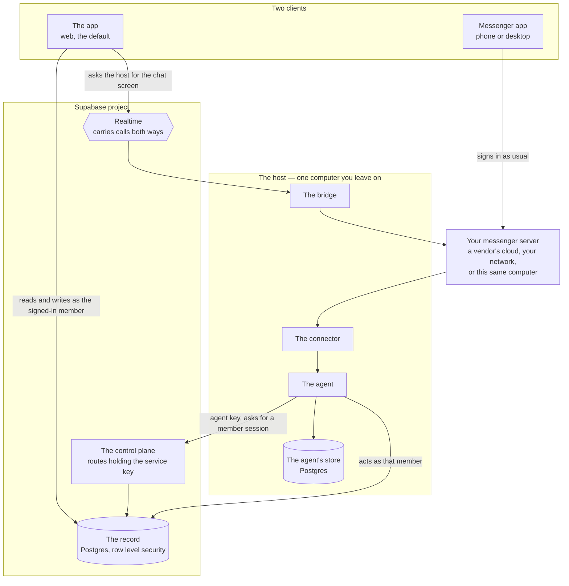

Two machines. One holds what must survive any computer, the other runs the
agent and holds what only makes sense on that machine.



Every arrow leaving the host points outward. None points in.

## The two clients

**The app** is where the work is. It reads and writes the records directly as
whoever signed in, so attendance, leave, the calendar, work and the org chart
never travel through the host at all. Its one exception is the chat screen:
messages live in the company's messenger, which the app cannot reach, so it
asks the bridge over a Realtime channel and draws what comes back.

**A messenger app** is your messenger's own client, signed in as usual. It
knows nothing about InternKim and needs to know nothing: the agent is a member
of the chat, so talking to it is talking to a colleague.

The diagram draws that app and the messenger server as separate boxes because
they are, and only one of them is a client. The server is the company's,
wherever it runs; the app is what a person opens.

## Where the messenger server runs

The diagram puts it outside the host, which is one of three places it can be.

| | Who can reach it directly |
|---|---|
| A vendor's cloud, such as Slack | anyone, from anywhere |
| Your own installation on your network | people on that network or its VPN |
| The host computer itself | people on that network, and nobody else |

The last row is ordinary. A company that runs its own Mattermost or Buzz relay
often runs it on the machine already kept awake for the agent, and the
connector reaches it over loopback.

## Why the chat screen goes through the bridge

Start from what each side can reach.

| | Supabase | The messenger server | The host |
|---|---|---|---|
| A browser | yes | sometimes | no |
| The host | yes | yes | — |

The browser cannot reach the host in any of the three cases, because the host
listens on nothing. That is why the two meet on a Realtime channel instead: the
host holds it open from its side, the browser sends a call along it, and the
bridge answers. This much is true whoever hosts the messenger.

What the messenger's location changes is the one uncertain cell: whether a
browser can reach the messenger. A Mattermost kept inside the office is
unreachable from a browser on a train, and Slack is reachable from anywhere.
Because the chat screen always goes through the bridge, that cell stops
deciding anything, and one screen works wherever the messenger lives.

A second reason holds even when the browser could reach the messenger: the
conversation stays out of the records. The bridge talks to the messenger from
wherever it runs and sends back only the answer to the call it was asked, so no
message text is ever written centrally.

The bridge holds one messenger account for the company, so the chat screen shows
what that account can see. Reaching the bridge at all means holding the
company's Realtime channel, which the record grants to that company's members.

## One conversation, two clients

A message written in the app's chat screen is delivered by the bridge into the
messenger, where a phone app sees it like any other. A message from a phone app
is drawn by the chat screen the next time it asks. The connector picks up both
without distinguishing them, so nothing about the agent's behaviour depends on
which client someone used.

## The three things on the Supabase side

They deploy together and behave differently, so this documentation keeps their
names apart.

**The record** is the Postgres database. Row level security is its access
boundary, so every read and write happens as some member rather than as an
administrator. Ten tables, listed in
[What lives where](/docs/what-lives-where).

**The control plane** is a small set of server routes holding the one key that
bypasses row level security. What it returns is a session, and it exists for
the things a member cannot do for themselves: prove an agent belongs to a
company, create a company, invite someone.

**The app** is a static page. It holds no secret. It reads the record as
whoever signed in, and it reaches the host over a Realtime channel.

Supabase also provides the sign-in itself, with a password, a passkey, or a
Google account.

## The four things on the host

**The agent** is the loop that reads a message, decides what to do, and does
it.

**The connector** attaches to your messenger and turns arriving messages into
work for the agent.

**The bridge** answers the chat screen in the app. It receives a call over the
Realtime channel and turns it into messenger operations, then answers the same
way.

**The agent's store** is a Postgres on your machine, holding conversations,
the record of what the agent did, and what it remembers.

## How someone in the messenger becomes someone in the record

A person who has never opened the app still has a row in the record. The agent
proves the company with its key, names the messenger identity that spoke, and
receives a session for that member.

```
POST /api/agent/session
Authorization: Bearer <the company's agent key>

{ "kind": "mattermost", "externalID": "…" }
```

The control plane refuses an identity nobody claims, and refuses a member whose
company is not the one that key belongs to. What comes back is an ordinary
member session, so everything the agent does next is bounded by that person's
own permissions.

## Why the host has no inbound port

Exposing a company's computer means a tunnel, a certificate, a hostname, and a
new way in. Instead both the browser and the host connect outward to Supabase,
and Realtime passes calls between them. Your firewall stays as it was.

The host proves this about itself with one command:

```bash
ss -ltnp | grep -v '127.0.0.1\|::1'    # prints nothing
```
