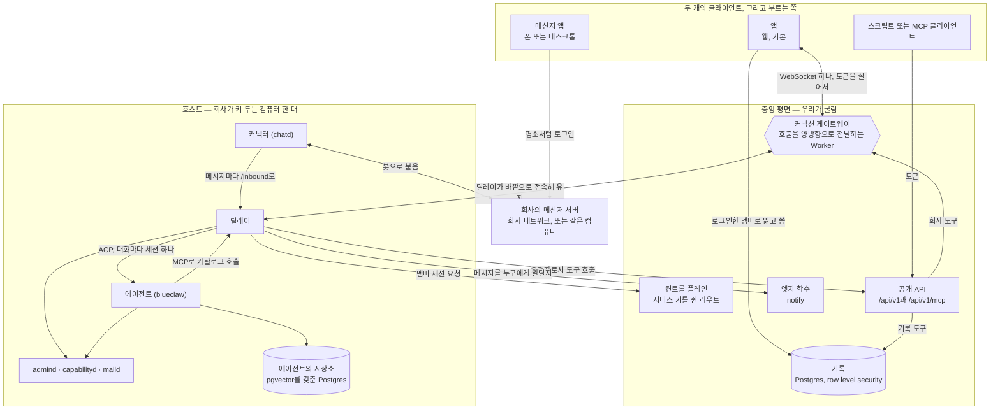
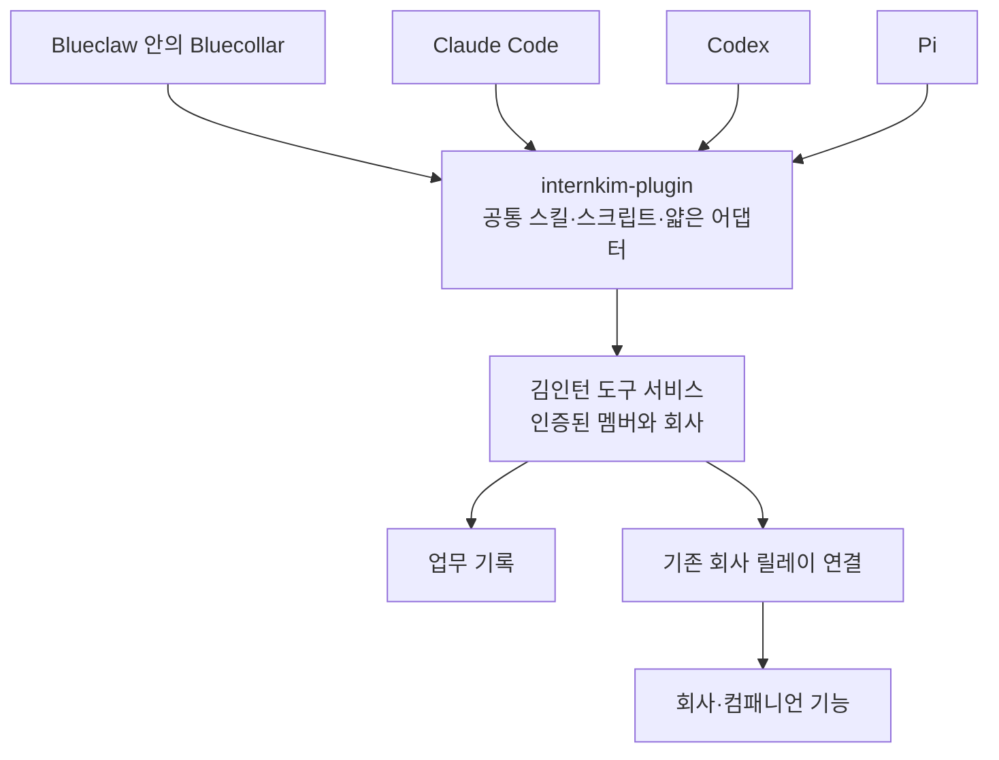

기계 두 대입니다. 한 대는 어떤 컴퓨터가 사라져도 살아남아야 하는 것을 담고,
다른 한 대는 에이전트를 돌리며 그 기계 위에서만 의미가 있는 것을 담습니다.



호스트를 떠나는 화살표는 전부 바깥을 향합니다. 안으로 향하는 것은 없습니다.

## 여러 하네스가 쓰는 하나의 플러그인 [#one-plugin-across-harnesses]

이 절은 공통 플러그인의 설계 계약을 정의합니다. 릴리스의 호환성은 아래
검증·공개 기준으로 확정하며, 위 다이어그램은 배포 구조를 설명합니다.

`internkim-plugin`은 Bluecollar, Claude Code, Codex, Pi가 함께 사용하는
클라이언트 패키지입니다. 김인턴 내부 에이전트도 외부 하네스에 설치하는 것과
같은 버전의 스킬·스크립트·에셋·서비스 계약을 사용합니다. 외부 하네스는
Bluecollar가 꺼져 있어도 서비스 기능을 사용할 수 있어야 합니다.



### 책임의 경계 [#ownership]

| 계층 | 책임 |
| --- | --- |
| 김인턴 서비스 | 도구 스키마 원본, 업무 동작, 권한, 영속 승인, 실행 상태와 변경 증거 |
| 플러그인 | 공통 스킬·스크립트·에셋, 연결 정보와 공통 클라이언트 |
| 하네스 어댑터 | 설치, 스킬 경로 연결, 자격증명 저장소 연동, 도구·결과 표현 |
| 하네스 | 모델 호출, 추론, 도구 선택, 문맥과 실행 루프의 판단 |
| Blueclaw 호스트 | 관리되는 호스트 안에서 실행하는 작업의 신원과 격리 |

업무 도구 계약은 서비스에서 한 번 정의합니다. 어댑터는 연결과 표현 차이를
변환하며 업무 로직이나 스킬 본문을 복제하지 않습니다. 하네스의 기본 MCP
연결과 확장 기능을 통한 클라이언트가 같은 계약을 사용합니다. MCP는 업무
도구 호출을 담당하고, ACP는 에이전트가 메신저에 참여할 때 쓰는 별도 세션
경계입니다. 플러그인만 사용하는 데 ACP 세션은 필요하지 않습니다.

같은 멤버·회사·플러그인 버전·실행 자원이라면 같은 업무 기능과 권한 동작을
제공해야 합니다. 모델 품질과 로컬 환경은 다를 수 있습니다. 플러그인 설치로
외부 에이전트에 Blueclaw의 비공개 워크스페이스나 터미널 권한이 생기지
않습니다. 독립적인 산출물 스킬은 외부 하네스의 로컬 환경에서 실행하고,
관리되는 호스트에서는 요청자의 POSIX 신원을 유지합니다. 필요한 의존성이나
컴패니언 기능이 없으면 그 상태를 명시합니다.

### 연결과 실행 [#connection-and-execution]

아래는 제안된 계약을 설명하는 의사코드입니다. 출시된 엔드포인트 정의나 모든
하네스가 턴 도중 도구 등록을 지원한다는 뜻이 아닙니다. 무엇이 출시됐고 어느
하네스 버전에서 확인했는지는 아래 "출시된 동작"에 있습니다.

```text
function attachPlugin(adapter, package, account):
    package.verifyRelease()
    session = connect(package.server, account.credentialReference)
    requireSupportedContract(session, package.supportedVersions)
    adapter.installSkills(package.skillRoot)
    adapter.exposeDiscovery(session.catalogSummaries())

function invoke(session, toolID, arguments, operationKey):
    descriptor = session.describeExact(toolID)
    validatedArguments = descriptor.inputSchema.validate(arguments)
    return session.call(descriptor.id, validatedArguments, operationKey)
```

모델이 간결한 카탈로그에서 관련 기능을 선택하고, 상세 스키마는 필요할 때
가져옵니다. 동적 등록이 없는 어댑터는 지원하는 갱신 시점이나 공통 클라이언트의
검증된 호출 경로를 사용합니다. 탐색 비용·스키마 크기·호출 오류도 이 선택의
측정 비용에 포함합니다.

서비스는 인증 정보로 실행자를 해석하고 현재 회사 소속을 확인합니다.
자격증명은 클라이언트의 자격증명 저장소에 둡니다. 모델이 만든 인자로 더 높은
권한의 실행 신원을 선택할 수 없습니다.

```text
function submit(connection, request):
    actor = authenticateAndResolveMember(connection)
    descriptor = catalog.resolveExact(request.toolID)
    arguments = descriptor.inputSchema.validate(request.arguments)
    authorize(actor, descriptor, arguments)
    operation = claimDurably(actor, request.operationKey, descriptor, arguments)
    if operation.alreadyExists:
        return operation.currentResult()
    if requiresApproval(actor, descriptor, arguments):
        return holdForAuthenticatedApproval(operation)
    return dispatchDurably(operation)
```

전송 재시도는 같은 실행 키를 사용하고, 다른 인자로 키를 재사용하면
거절합니다. 승인은 실행자·회사·실행·인자·만료 시점에 결합합니다. 재접속하면
기록된 실행을 이어가며 권한을 다시 확인합니다. 외부 변경 뒤 타임아웃이
발생하면 대상 서비스의 멱등성이나 실제 결과 대조를 통해 재실행 여부를
확정합니다. 취소 응답에는 이미 반영된 변경을 알립니다. 예약된 업무는
하네스 연결이 끊겨도 유지합니다.

결과에는 구조화된 기록·이미지·권한이 적용된 산출물 참조를 보존합니다.
서비스가 무엇이 변경됐는지 기록하고, 하네스가 그 증거를 사용자에게
설명합니다. 이미지나 산출물을 성공 문장 하나로 바꾸어 버리면 기능 동등성
검증을 통과할 수 없습니다.

### Bluecollar의 정체성과 Pi의 범용 구현 [#bluecollars-identity-and-pis-mechanics]

Bluecollar의 업무 이해, 후속 지시를 잇는 연속성, 결과 판단과 복구 동작은
보존합니다. 범용 도구 이름·인자 형태·파일 편집·셸 세션·실행 연결부는 Pi를
그대로 따라도 됩니다. 적절한 곳에서 Pi 구현을 재사용하거나 수정하며,
라이선스와 출처 표기를 유지합니다.

Pi의 특정 리비전을 기준으로 각 범용 구성 요소의 재사용·수정·유지 결정을
기록합니다. 다르게 만들 때는 제품 동작, 실행 경계, 호환성 또는 측정된 성능상
이유가 있어야 합니다. 기존 도구 이름, 액션 봉투, 프롬프트 상용구는 이미
Bluecollar에 있다는 이유만으로 제품의 정체성이 되지 않습니다.

### 검증과 공개 [#verification-and-publication]

플러그인 릴리스 하나로 Bluecollar·Claude Code·Codex·Pi에서 같은 업무
시나리오를 수행합니다. 설치·인증·승인·재접속·취소·회사 간 격리·산출물 전달을
포함하고, Bluecollar가 꺼진 상태의 외부 사용도 입증합니다. 지원되는 경우 같은
모델 설정으로 비교하고, 나머지 조합은 제품 간 비교라고 구분합니다.

채택하려면 기능을 보존하고 성공률·성공 업무당 비용·문맥 크기·완료 지연을
측정해야 합니다. 릴리스와 함께 지원 버전 표와 검증 증거를 공개합니다.
클라이언트 업데이트 전에 서비스 호환성을 배포하고, 명시된 호환 기간을
유지하며 실행 중인 버전을 확인합니다. 영어·한국어 문서 모두 출시된 동작과
아직 남은 설계를 구분해 갱신합니다.

### 출시된 동작 [#released-behavior]

위 절들은 목표입니다. internkim `b3b1406e3`(장비 릴리스
`20260918T165525Z-b3b1406e3656`, 플러그인 `c1e156b`, Blueclaw `f41ae448`)
기준으로 출시된 것은 다음과 같습니다.

- 플러그인은 Agent Plugins 1.0.0 규격 그대로의 체크아웃입니다. `plugin.json`,
  `https://api.intern.kim/v1/mcp`를 가리키는 `mcp.json`, `skills/`가 전부이고
  하네스별 어댑터는 없습니다. 각 클라이언트가 이 배치를 자기 방식으로 읽으며,
  그 방법은 플러그인 README에 있습니다.
- 예약 도구(`schedule_list`, `schedule_create`, `schedule_update`,
  `schedule_cancel`)는 카탈로그에 한 번 정의되고 회사 컴퓨터가 답합니다.
  Bluecollar에는 자체 사본이 없습니다. 공개 서버는 자기가 실행하는 웹
  배포본의 카탈로그를 내보내므로, 그 배포본이 `b3b1406e3`를 담은 뒤에야
  클라이언트가 이 네 도구를 봅니다.
- 턴 도중의 도구 등록, 지속되는 승인 봉투, "연결과 실행"의 서비스 영수증은
  계약 문안이지 출시된 엔드포인트가 아닙니다.
- 측정 계획과 그것이 결정하는 채택 여부는 아직 열려 있습니다(internkim#1832).

| 하네스 | 확인한 버전 | 플러그인을 읽는 경로 | 상태 |
| --- | --- | --- | --- |
| Bluecollar (Blueclaw 안) | `f41ae448` | capabilityd, 같은 카탈로그 | Local Fleet과 장비에서 확인(internkim#1819) |
| Claude Code | 2.1.276 | internkim 저장소의 마켓플레이스 항목 | 끝까지 확인(internkim#1823) |
| Codex | 0.154.0 | 루트 배치를 그대로 읽음 | 방법만 공개, 서비스 상대로는 미실행 |
| Pi | 0.83.0 | `pi-agent-plugins`와 `pi-mcp-adapter` | 방법만 공개, 서비스 상대로는 미실행 |

## 중앙 쪽 [#the-central-side]

우리가 배포하는 다섯 가지입니다.

| | 무엇인지 | 어디 사는지 |
|---|---|---|
| 기록 | row level security 뒤의 Postgres | `supabase/migrations` |
| 컨트롤 플레인 | 서비스 키를 쥔 서버 라우트 | `web/src/routes/api/agent/` |
| 앱 | Cloudflare Pages 위의 SvelteKit 빌드. 사람이 로그인하는 화면을 서빙 | `web/` |
| 공개 API | 같은 빌드 안의 서버 라우트. 토큰과 MCP 클라이언트에 답함 | `web/src/routes/api/v1/` |
| 커넥션 게이트웨이 | 회사마다 Durable Object 하나를 두는 Worker. 브라우저 호출과 API 호출을 함께 나름 | `workers/connection-gateway/` |

**기록**은 모든 읽기와 쓰기에 어떤 멤버로서 답하고, 관리자로서 답하는 일은
없습니다. 세션이 어떤 행을 보는지는 데이터베이스 자신이 정합니다. 테이블
목록은 [무엇이 어디 사는지](/ko/docs/what-lives-where)에 있습니다.

**컨트롤 플레인**은 멤버 혼자서는 할 수 없는 일을 위해 존재합니다. 호출자는
회사의 에이전트 키로 인증하고, 돌아오는 것은 세션입니다.
`POST /api/agent/session`은 회사가 아는 신원을 멤버 세션으로 바꾸고,
`POST /api/agent/host-session`은 회사 컴퓨터를 그 자신으로 로그인시킵니다.
같은 디렉토리의 이웃 라우트들은, 그렇게 로그인한 호스트가 호출마다 필요한
자격증명을 읽게 (`/api/agent/messenger-credential`,
`/api/agent/mail-account`) 해 줍니다. 서비스 키는 이 라우트들을 떠나지
않습니다. 알림은 프로젝트 자신의 엣지 함수(`supabase/functions/`)가 보내므로,
모든 멤버의 기기를 읽는 키는 그 회사의 Supabase 안에 머뭅니다.

**앱**이 어느 Supabase 프로젝트에 말을 거는지는 런타임에 정해집니다.
`hooks.server.ts`가 값을 `#central-plane` 엘리먼트에 주입하므로, 하나의 빌드가
모든 회사를 서빙합니다. 화면은 비밀을 쥐지 않습니다. `/api/` 아래 라우트는 쥐고,
그래서 서버에서 돕니다. 모두가 하나의 주소에서 로그인하고, 존의 다른 모든
호스트네임은 그리로 `308`을 답합니다. 예외는 `/api/`와 `/v1/` 아래 경로로, 교차
출처 리다이렉트가 호출자의 베어러 토큰을 떨어뜨리기 때문에 도착한 곳에서 그대로
답합니다. `api.<zone>/v1`과 회사 호스트의 `/api/v1`이 같은 API인 것은 이 예외
덕분입니다.

**공개 API**에 도구 카탈로그가 삽니다. 모든 도구는
`web/src/lib/server/public-api/catalog/`에서 한 번만 정의되고, 정의마다 누가
답하는지를 밝힙니다.

| `answeredBy` | 누가 실행하는지 | 예 |
|---|---|---|
| `record` | 앱이 직접, 부른 멤버로서 기록에 대고 | 업무, 캘린더, 사람, 연차, 근태, CRM |
| `company` | 게이트웨이로 닿는 회사의 컴퓨터 | 메시지, 메일, 사이트, 웹 검색, 문서 읽기 |
| `local` | 에이전트 자신의 기계에서만. API는 거절함 | 브라우저, 모델 호출, 임베딩 |

`/api/v1/mcp`는 같은 카탈로그를 어떤 MCP 클라이언트에게든 서빙하고, 아래
절들이 보여 주듯 에이전트 자신이 도구에 닿는 길도 이것입니다. 전체 도구는
[카탈로그](/ko/docs/tools/catalog)에 있습니다.

**커넥션 게이트웨이**는 서로 접속을 받지 않는 브라우저와 호스트가 닿는
방법입니다. 브라우저는 Supabase 세션 토큰을 실어 `/company/<id>/client`로
WebSocket을 열고, Worker는 그 토큰을 프로젝트의 JWKS로 검증해 어느 멤버가
부르는지 해석한 뒤, 소켓을 그 회사의 Durable Object
(`CompanyConnectionObject`)에 넘깁니다. 호스트의 릴레이는 자기 쪽에서
`/company/<id>/server`로 접속해 머무르며, Durable Object가 보관하는 서버 키로
인증합니다. 오브젝트는 호출을 한쪽으로, 응답을 반대쪽으로 전달하고, 릴레이가
새 메시지를 알리면 열린 채팅 화면에 `message.arrived`를 밀어 주고, 회사
컴퓨터가 지금 연결되어 있는지 자체를 브라우저에 알려 줍니다.

## 호스트 위의 프로세스들 [#the-processes-on-the-host]

`host/entrypoint.sh`가 이들을 띄우고, 순서는
[호스트 굴리기](/ko/docs/running-the-host)가 설명합니다.

| 프로세스 | 응답 위치 | 하는 일 | 코드 |
|---|---|---|---|
| 릴레이 (`internkim-relay`) | 바깥으로만; 커넥터를 위해 `127.0.0.1:18091` | 앱의 호출에 답하고, 메시지를 에이전트의 턴으로 바꾸고, 에이전트에게 도구를 서빙 | `host/relay/` |
| 커넥터 (`chatd`) | `127.0.0.1:18090` | 메신저 어댑터: Buzz 또는 Mattermost | `.dependency/blueclaw/chatd/` |
| 에이전트 (`blueclaw`) | `/run/internkim/blueclaw-acp.sock`; 관리 API는 `127.0.0.1:8080` | ACP 에이전트: 실행, 승인, 태스크 원장, 기억 | `.dependency/blueclaw/` |
| `internkim-capabilityd` | `/run/internkim/capability.sock` | 프로바이더 자격증명을 쥠: 모델 호출, 임베딩, 메일·사이트·웹·브라우저 도구 | `cmd/internkim-capabilityd/`, `internal/capabilityd/` |
| Moli (`moli serve`), 요청자마다 하나 | `127.0.0.1:9230`부터 | 컴패니언이 없을 때 공개 페이지의 단순한 텍스트를 탐색하는 디바이스 브라우저. capabilityd가 사람마다 처음 쓸 때 그 사람의 프로필로 띄우고, 쓰지 않으면 내립니다 | `internal/browser/device_browsers.go` |
| `internkim-admind` | `127.0.0.1:18080`, `/run/internkim/admind.sock` | 워크스페이스 화면, 명부, 그리고 평면이 호스트로 실어 오는 회사 도구 | `cmd/internkim-admind/`, `internal/admind/` |
| `internkim-maild` | `127.0.0.1:18092` | 호출이 실어 온 계정으로 메일에 답함 | `cmd/internkim-maild/` |
| 에이전트의 저장소 | `DATABASE_URL` | 대화, 실행, 기억, 폴리시를 담는 Postgres | — |

## 에이전트는 무엇으로 만들어졌는지 [#what-the-agent-is-made-of]

blueclaw는 프로세스 하나이고, 저마다 한 가지 일을 하는 별개의 저장소들로
짜여 있습니다.

| | 하는 일 | 어디 |
|---|---|---|
| [blueclaw](https://github.com/yeomyeonggeori/blueclaw) | 에이전트 호스트: 신원, 승인 게이트, 태스크 원장, 릴레이가 말을 거는 ACP 에이전트 | `.dependency/blueclaw/` |
| [bluecollar](https://github.com/yeomyeonggeori/bluecollar) | 같은 프로세스 안에서 도는 에이전트 루프와 모델 클라이언트 | `.dependency/blueclaw/.dependency/bluecollar/` |
| [bluememo](https://github.com/yeomyeonggeori/bluememo) | 장기 기억: 끝난 일에서 뽑아낸 사실, 주인과 서클로 범위가 정해짐 | `.dependency/blueclaw/.dependency/bluememo/` |
| internkim-plugin | 에이전트가 일의 종류마다 읽어들이는 스킬 | `.dependency/internkim-plugin/` |

**기억**은 Postgres 사실 저장소 하나입니다. 실행이 끝나면 bluememo가 모델을
시켜 거기서 원자적인 사실들을 뽑습니다. 새 사실은 옛 사실을 대체하고, 되풀이된
사실은 기존 사실을 강화하고, 사람은 에이전트에게 사실 하나를 잊으라고 할 수
있습니다. 사실마다 주인과 공유된 서클이 있고, 회상은 읽는 사람이 볼 수 있는
것만 돌려줍니다. 검색은 pgvector 유사도와 낱말 유사도를 섞는데, 호스트의
Postgres에 `vector` 확장이 있는 이유가 이것입니다. 확장이 없어도 저장소는
낱말만으로 답합니다.

**모델**의 이름은 `internal/modelladder` 한 곳에만 있습니다. 에이전트는 티어를
요청하고, 키를 쥔 capabilityd가 호출하므로 에이전트는 프로바이더 토큰을 보지
못합니다.

## 채팅 화면이 답을 받는 방법 [#how-the-chat-screen-gets-answered]

앱은 로그인한 사람 그대로 기록을 직접 읽고 쓰므로, 근태, 휴가, 캘린더, 업무,
조직도는 호스트를 전혀 거치지 않습니다. 호스트만 아는 것을 보여 주는 화면들,
즉 메신저, 메일, 에이전트의 실행과 그 실행이 기다리는 승인, 기억, 파일과
읽어들인 스킬은 게이트웨이를 거칩니다.

1. 브라우저가 자기 게이트웨이 소켓으로 `{ kind: "call", capability, body }`를
   보냅니다. 토큰은 소켓을 열 때 이미 검증되었고, 본문의 어떤 값도 누가
   부르는지를 말할 권한이 없습니다.
2. Durable Object가 호출에 호출한 멤버의 ID를 찍어 릴레이의 상시 연결로
   전달합니다.
3. 릴레이가 처리해 같은 소켓으로 답하고, 오브젝트가 그 답을 물어본 브라우저로
   되돌립니다.

"처리한다"가 무엇인지는 capability마다 다르고, 각 분기는
`host/relay/forward.ts`에 있습니다.

- **메신저 작업**은 커넥터의 `/v1/platform/<platform>/<capability>`로
  전달됩니다. 그 전에 릴레이가 그 멤버 자신의 메신저 자격증명을 컨트롤
  플레인에서 가져와 `actor`로 붙이므로, 메신저에는 그 멤버 자신의 계정이 그
  일을 하는 것으로 보입니다. 계정을 연결하지 않은 멤버는 `409`를 받고,
  `person.credential.issue`가 계정을 연결하는 호출입니다.
- **메일**(`person.mail.*`)은 멤버의 메일 계정을 호출마다 가져와
  `internkim-maild`로 갑니다. 메일 비밀번호가 그 컴퓨터에 저장된 채로 남는
  일은 없습니다.
- **워크스페이스 화면**(`person.memory.*`, `person.files.*`, `person.runs.*`,
  `person.skills.*`, `person.persona.*`와 그 이웃들)과 공개 API의 회사
  도구(`person.api.request`, `person.api.file`)는 `admind`의 unix 소켓으로
  전달됩니다.
- **링크 미리보기**(`asset.link`)는 릴레이가 직접 만들고, 미리보기 이미지는
  답이 작게 유지되도록 Supabase Storage에 넣습니다.

바이트 상한보다 큰 답은 크기를 명시한 `413`으로 거절됩니다. 그냥 보내면
전송로가 소리 없이 떨어뜨리기 때문입니다. 상한과 기본값은
[호스트 굴리기](/ko/docs/running-the-host#how-big-an-answer-may-be)에 있습니다.

## 메시지가 일이 되는 방법 [#how-a-message-becomes-work]

커넥터는 `MESSENGER_PLATFORM`에 맞는 어댑터
(`.dependency/blueclaw/chatd/src/adapters/`)로 회사의 봇 멤버로서 메신저에
붙고, 도착한 메시지를 정규화합니다. 거기서부터는 릴레이가 나릅니다.

1. chatd가 이벤트를 `127.0.0.1:18091`에 있는 릴레이의 `/inbound`로 보냅니다.
   릴레이는 그것을 `RELAY_STATE_DIR` 아래에 쓰고, 디스크에 남은 뒤에야
   `202`로 답합니다. chatd는 그 답을 받을 때까지 다시 보내므로, 어느 쪽
   프로세스가 재시작해도 메시지는 살아남습니다.
2. 릴레이는 `/run/internkim/blueclaw-acp.sock`으로 대화마다 ACP 세션 하나를
   열고 메시지를 프롬프트로 보냅니다. 세션은 누가 묻는지와 어디로 답할지를
   밝히고, 에이전트의 도구 서버로 릴레이 자신의 `/mcp/<ticket>`을 지목합니다.
3. blueclaw가 턴을 돌립니다. 그 주소로 오는 도구 호출을 릴레이는 요청자를
   위해 발급받은 멤버 세션을 붙여 앱의 `/api/v1/mcp`로 전달하므로, 에이전트는
   베어러 토큰을 쥐지 않습니다.
4. 답은 ACP로 돌아오고, 릴레이가 커넥터를 통해 대화에 올립니다.

**승인**도 같은 길로 갑니다. 게이트가 호출을 붙잡으면 blueclaw는 ACP로
릴레이에게 묻고, 릴레이는 그 질문을 대화에 올리고, 요청자가 그 대화에 쓰는
다음 메시지가 답입니다. 그 말이 무슨 뜻인지는 blueclaw가 정하고, 동의로 읽을
수 없는 답은 거절이 됩니다. 릴레이는 열린 질문을 inbound 큐 옆 디스크에 두므로,
어느 쪽이 재시작해도 두 번 묻지 않고 잃는 것도 없습니다.

사람이 어느 클라이언트에서 입력했든 에이전트는 똑같이 움직입니다.

별도로, 메신저 서버는 자신이 받아들인 모든 메시지를 같은 루프백 포트로
릴레이에 보고합니다. 릴레이는 수신자가 누구인지 해석해 `notify` 엣지 함수에
알려 달라고 부탁하고, 그 알림은 그 멤버들이 기기를 등록해 둔 곳으로 웹 푸시로
도착합니다. 게이트웨이에도 알리므로 열린 채팅 화면이 새 메시지를 가져옵니다.

## 메신저의 누군가가 기록의 누군가가 되는 방법 [#how-someone-in-the-messenger-becomes-someone-in-the-record]

앱을 한 번도 연 적 없는 사람도 기록에 행이 있습니다. 호스트에서 그 사람을
위해 움직이는 쪽은 자기 키로 회사를 증명하고, 말한 신원을 지목하고, 그 멤버의
세션을 받습니다.

```
POST /api/agent/session
Authorization: Bearer <회사의 에이전트 키>

{ "kind": "email", "externalID": "…" }
```

릴레이는 요청자를 위해 도구 서버를 열 때 이것을 요청하고, 세션이 끝나기 5분
전에 다시 요청합니다. 컨트롤 플레인은 아무도 주장하지 않는 신원을 거절하고,
그 키의 회사가 아닌 멤버를 거절합니다. 돌아오는 것은 평범한 멤버 세션이므로,
에이전트가 기록에서 하는 모든 일은 그 사람 자신의 권한 안에 갇힙니다.

## 메신저 서버는 어디서 도는지 [#where-the-messenger-server-runs]

다이어그램은 호스트 바깥에 그렸지만, 있을 수 있는 곳은 세 군데입니다.

| | 직접 닿을 수 있는 사람 |
|---|---|
| 벤더의 클라우드 | 어디서든, 누구든 |
| 회사 네트워크 위의 자체 설치 | 그 네트워크나 VPN 위의 사람들 |
| 호스트 컴퓨터 그 자체 | 그 네트워크 위의 사람들뿐 |

마지막 줄이 평범한 경우입니다. 자기 Buzz 릴레이를 굴리는 회사는
어차피 에이전트 때문에 켜 둔 그 기계에서 함께 굴리는 일이 많고, 커넥터는
루프백으로 닿습니다. `host/buzz/`가 정확히 그 자리에 Buzz 스택을 올리는
compose 파일입니다. 채팅 화면은 언제나 릴레이를 거치므로 메신저가 어디 있든
화면 하나가 똑같이 동작하고, 대화가 중앙에 기록되는 일은 없습니다. 릴레이는
물어본 호출에 대한 답만 되돌려 보냅니다.

## 호스트에 인바운드 포트가 없는 이유 [#why-the-host-has-no-inbound-port]

회사 컴퓨터를 노출한다는 것은 터널, 인증서, 호스트네임, 그리고 새로운 침입
경로 하나를 뜻합니다. 대신 브라우저와 호스트가 둘 다 게이트웨이로 바깥을 향해
접속하고, 게이트웨이가 그 사이에서 호출을 전달합니다. 회사의 방화벽은 그대로
남습니다.

호스트는 명령 하나로 이것을 스스로 증명합니다.

```bash
ss -ltnp | grep -v '127.0.0.1\|::1'    # 아무것도 출력되지 않음
```

기계를 관리하는 것은 별개의 질문이고 답도 별개입니다. 같은 네트워크에서는
`ssh`가 닿고 그 이상은 필요 없습니다. 다른 곳에서라면, 이미 쓰고 있는 것을
자신의 `~/.ssh/config`에 넣으면 됩니다.

```
Host my-company-host
  ProxyCommand cloudflared access ssh --hostname %h
```

Cloudflare Tunnel은 편리한 답 하나이고, 우리가 개발하며 쓰는 답입니다.
Tailscale, 점프 호스트, WireGuard도 답입니다. 김인턴은 그중 무엇도 설치하지
않고, 요구하지 않고, 무엇을 골랐는지 알 수도 없습니다. 선택은 회사의 것이고
제품 바깥에 머뭅니다.
