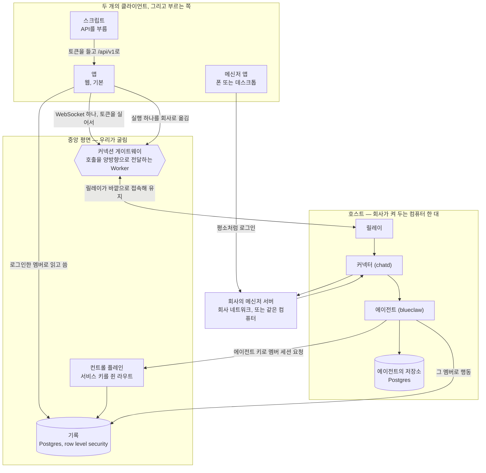

기계 두 대입니다. 한 대는 어떤 컴퓨터가 사라져도 살아남아야 하는 것을 담고,
다른 한 대는 에이전트를 돌리며 그 기계 위에서만 의미가 있는 것을 담습니다.



호스트를 떠나는 화살표는 전부 바깥을 향합니다. 안으로 향하는 것은 없습니다.

## 중앙 쪽 [#the-central-side]

우리가 배포하는 네 가지입니다. 앱은 하는 일이 둘이고, 나머지는 하나씩입니다.

| | 무엇인지 | 어디 사는지 |
|---|---|---|
| 기록 | row level security 뒤의 Postgres | `supabase/migrations` |
| 컨트롤 플레인 | 서비스 키를 쥔 서버 라우트 | `web/src/routes/api/agent/` |
| 앱 | Cloudflare Pages 위의 SvelteKit 빌드. 사람이 로그인하는 화면과 공개 API를 함께 서빙 | `web/` |
| 커넥션 게이트웨이 | 회사마다 Durable Object 하나를 두는 Worker. 브라우저 호출과 API 호출을 함께 나름 | `workers/connection-gateway/` |

**기록**은 모든 읽기와 쓰기에 어떤 멤버로서 답하고, 관리자로서 답하는 일은
없습니다. 세션이 어떤 행을 보는지는 데이터베이스 자신이 정합니다. 테이블
목록은 [무엇이 어디 사는지](/ko/docs/what-lives-where)에 있습니다.

**컨트롤 플레인**은 멤버 혼자서는 할 수 없는 일을 위해 존재합니다. 호출자는
회사의 에이전트 키로 인증하고, 돌아오는 것은 세션입니다.
`POST /api/agent/session`은 메신저 신원을 멤버 세션으로 바꾸고,
`POST /api/agent/host-session`은 회사 컴퓨터를 그 자신으로 로그인시킵니다.
알림은 프로젝트 자신의 엣지 함수가 보내므로, 모든 멤버의 기기를 읽는 키는 그
회사의 Supabase 안에 머뭅니다. 같은 디렉토리의 이웃 라우트들은, 그렇게 로그인한
호스트가 호출마다 필요한 자격증명을 읽게
(`/api/agent/messenger-credential`, `/api/agent/mail-account`) 해 줍니다.
서비스 키는 이 라우트들을 떠나지 않습니다.

**앱**이 어느 Supabase 프로젝트에 말을 거는지는 런타임에 정해집니다.
`hooks.server.ts`가 값을 `#central-plane` 엘리먼트에 주입하므로, 하나의 빌드가
모든 회사를 서빙합니다. 화면은 비밀을 쥐지 않습니다. `/api/` 아래 라우트는 쥐고,
그래서 서버에서 돕니다. 모두가 하나의 주소에서 로그인하고, 존의 다른 모든
호스트네임은 그리로 `308`을 답합니다. 예외는 `/api/`와 `/v1/` 아래 경로로, 교차
출처 리다이렉트가 호출자의 베어러 토큰을 떨어뜨리기 때문에 도착한 곳에서 그대로
답합니다. `api.<zone>/v1`과 회사 호스트의 `/api/v1`이 같은 API인 것은 이 예외
덕분입니다.

**커넥션 게이트웨이**는 서로 접속을 받지 않는 브라우저와 호스트가 닿는
방법입니다. 브라우저는 Supabase 세션 토큰을 실어 `/company/<id>/client`로
WebSocket을 열고, Worker는 그 토큰을 프로젝트의 JWKS로 검증해 어느 멤버가
부르는지 해석한 뒤, 소켓을 그 회사의 Durable Object
(`CompanyConnectionObject`)에 넘깁니다. 호스트의 릴레이는 자기 쪽에서
`/company/<id>/server`로 접속해 머무르며, Durable Object가 보관하는 서버 키로
인증합니다. 오브젝트는 호출을 한쪽으로, 응답을 반대쪽으로 전달하고, 회사
컴퓨터가 지금 연결되어 있는지 자체를 브라우저에 알려 줍니다.

## 호스트 위의 프로세스들 [#the-processes-on-the-host]

`host/entrypoint.sh`가 이들을 띄우고, 순서는
[호스트 굴리기](/ko/docs/running-the-host)가 설명합니다.

| 프로세스 | 응답 위치 | 하는 일 | 코드 |
|---|---|---|---|
| 릴레이 (`internkim-relay`) | 바깥으로만; 도착 통지는 `127.0.0.1:18091` | 앱의 호출에 답하고, 메신저 도착을 실어 나름 | `host/relay/` |
| 커넥터 (`chatd`) | `127.0.0.1:18090` | 메신저 어댑터: Buzz | `.dependency/blueclaw/chatd/` |
| 에이전트 (`blueclaw`) | `127.0.0.1:8080` | 루프, 태스크 원장, 승인, 워크스페이스 | `.dependency/blueclaw/` |
| `internkim-capabilityd` | `/run/internkim/capability.sock` | 타입 있는 능력 경계: 캘린더, 업무, 메일, 사이트 | `cmd/internkim-capabilityd/`, `internal/capabilityd/` |
| `internkim-admind` | `127.0.0.1:18080` | 워크스페이스 화면과, 평면이 스스로 못 도는 도구들 | `cmd/internkim-admind/`, `internal/admind/` |
| `internkim-maild` | `127.0.0.1:18092` | 호출이 실어 온 계정으로 메일에 답함 | `cmd/internkim-maild/` |
| 에이전트의 저장소 | `DATABASE_URL` | 대화, 실행, 기억, 폴리시를 담는 Postgres | — |

## 채팅 화면이 답을 받는 방법 [#how-the-chat-screen-gets-answered]

앱은 로그인한 사람 그대로 기록을 직접 읽고 쓰므로, 근태, 휴가, 캘린더, 업무,
조직도는 호스트를 전혀 거치지 않습니다. 호스트만 아는 것을 보여 주는 화면들,
즉 메신저, 메일, 에이전트의 실행과 그 실행이 기다리는 승인, 기억, 파일은
게이트웨이를 거칩니다.

1. 브라우저가 자기 게이트웨이 소켓으로 `{ kind: "call", capability, body }`를
   보냅니다. 토큰은 소켓을 열 때 이미 검증되었고, 본문의 어떤 값도 누가
   부르는지를 말할 권한이 없습니다.
2. Durable Object가 호출에 호출한 멤버의 ID를 찍어 릴레이의 상시 연결로
   전달합니다.
3. 릴레이가 처리해 같은 소켓으로 답하고, 오브젝트가 그 답을 물어본 브라우저로
   되돌립니다.

"처리한다"가 무엇인지는 capability마다 다르고, 각 분기는
`host/relay/forward.ts`에 있습니다.

- **메신저 작업**은 커넥터의 `/v1/platform/<platform>/<capability>`로
  전달됩니다. 그 전에 릴레이가 그 멤버 자신의 메신저 자격증명을 컨트롤
  플레인에서 가져와 `actor`로 붙이므로, 메신저에는 그 멤버 자신의 계정이 그
  일을 하는 것으로 보입니다. 계정을 연결하지 않은 멤버는 `409`를 받고,
  `person.credential.issue`가 계정을 연결하는 호출입니다.
- **메일**(`person.mail.*`)은 멤버의 메일 계정을 호출마다 가져와
  `internkim-maild`로 갑니다. 메일 비밀번호가 그 컴퓨터에 저장된 채로 남는
  일은 없습니다.
- **워크스페이스 화면**(`person.memory.*`, `person.files.*`,
  `person.tasks.*`)과 공개 API 자신의 호출(`person.api.request`,
  `person.api.file`)은 번들이 띄우는 `admind`의 unix 소켓으로 전달됩니다.
- **링크 미리보기**(`asset.link`)는 릴레이가 직접 만들고, 미리보기 이미지는
  답이 작게 유지되도록 Supabase Storage에 넣습니다.

바이트 상한보다 큰 답은 크기를 명시한 `413`으로 거절됩니다. 그냥 보내면
전송로가 소리 없이 떨어뜨리기 때문입니다. 상한과 기본값은
[호스트 굴리기](/ko/docs/running-the-host#how-big-an-answer-may-be)에 있습니다.

## 메시지가 일이 되는 방법 [#how-a-message-becomes-work]

커넥터는 `MESSENGER_PLATFORM`에 맞는 어댑터
(`.dependency/blueclaw/chatd/src/adapters/`)로 회사의 봇 멤버로서 메신저에
붙습니다. 도착한 메시지는 정규화되어 `127.0.0.1:8080`의 에이전트에게 넘겨지고,
에이전트의 답장은 같은 커넥터를 통해 나갑니다. 사람이 어느 클라이언트에서
입력했든 에이전트는 똑같이 움직입니다.

별도로, 메신저 서버는 자신이 받아들인 모든 메시지를 릴레이의
`127.0.0.1:18091`에 보고합니다. 그 포트는 이 컴퓨터 바깥에서 닿을 수
없습니다. 릴레이는 수신자가 누구인지 해석해 컨트롤 플레인에 알림을 부탁하고, 그 알림은 그
멤버들이 기기를 등록해 둔 곳으로 웹 푸시로 도착합니다.

## 메신저의 누군가가 기록의 누군가가 되는 방법 [#how-someone-in-the-messenger-becomes-someone-in-the-record]

앱을 한 번도 연 적 없는 사람도 기록에 행이 있습니다. 에이전트는 자기 키로
회사를 증명하고, 말한 메신저 신원을 지목하고, 그 멤버의 세션을 받습니다.

```
POST /api/agent/session
Authorization: Bearer <회사의 에이전트 키>

{ "kind": "buzz", "externalID": "…" }
```

컨트롤 플레인은 아무도 주장하지 않는 신원을 거절하고, 그 키의 회사가 아닌
멤버를 거절합니다. 돌아오는 것은 평범한 멤버 세션이므로, 이후 에이전트가 하는
모든 일은 그 사람 자신의 권한 안에 갇힙니다.

## 메신저 서버는 어디서 도는지 [#where-the-messenger-server-runs]

다이어그램은 호스트 바깥에 그렸지만, 있을 수 있는 곳은 세 군데입니다.

| | 직접 닿을 수 있는 사람 |
|---|---|
| 벤더의 클라우드 | 어디서든, 누구든 |
| 회사 네트워크 위의 자체 설치 | 그 네트워크나 VPN 위의 사람들 |
| 호스트 컴퓨터 그 자체 | 그 네트워크 위의 사람들뿐 |

마지막 줄이 평범한 경우입니다. 자기 Buzz 릴레이를 굴리는 회사는
어차피 에이전트 때문에 켜 둔 그 기계에서 함께 굴리는 일이 많고, 커넥터는
루프백으로 닿습니다. `host/buzz/`가 정확히 그 자리에 Buzz 스택을 올리는
compose 파일입니다. 채팅 화면은 언제나 릴레이를 거치므로 메신저가 어디 있든
화면 하나가 똑같이 동작하고, 대화가 중앙에 기록되는 일은 없습니다. 릴레이는
물어본 호출에 대한 답만 되돌려 보냅니다.

## 호스트에 인바운드 포트가 없는 이유 [#why-the-host-has-no-inbound-port]

회사 컴퓨터를 노출한다는 것은 터널, 인증서, 호스트네임, 그리고 새로운 침입
경로 하나를 뜻합니다. 대신 브라우저와 호스트가 둘 다 게이트웨이로 바깥을 향해
접속하고, 게이트웨이가 그 사이에서 호출을 전달합니다. 회사의 방화벽은 그대로
남습니다.

호스트는 명령 하나로 이것을 스스로 증명합니다.

```bash
ss -ltnp | grep -v '127.0.0.1\|::1'    # 아무것도 출력되지 않음
```

기계를 관리하는 것은 별개의 질문이고 답도 별개입니다. 같은 네트워크에서는
`ssh`가 닿고 그 이상은 필요 없습니다. 다른 곳에서라면, 이미 쓰고 있는 것을
자신의 `~/.ssh/config`에 넣으면 됩니다.

```
Host my-company-host
  ProxyCommand cloudflared access ssh --hostname %h
```

Cloudflare Tunnel은 편리한 답 하나이고, 우리가 개발하며 쓰는 답입니다.
Tailscale, 점프 호스트, WireGuard도 답입니다. 김인턴은 그중 무엇도 설치하지
않고, 요구하지 않고, 무엇을 골랐는지 알 수도 없습니다. 선택은 회사의 것이고
제품 바깥에 머뭅니다.
