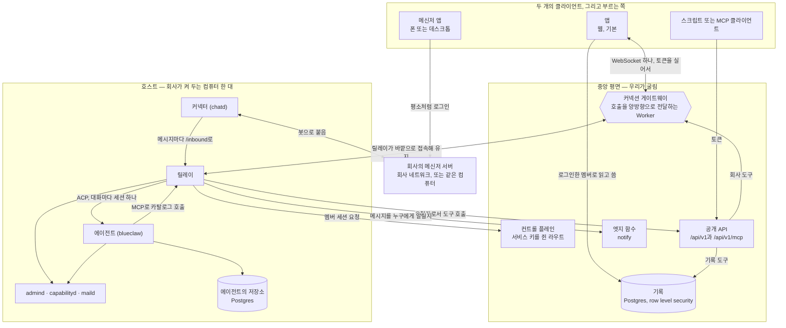
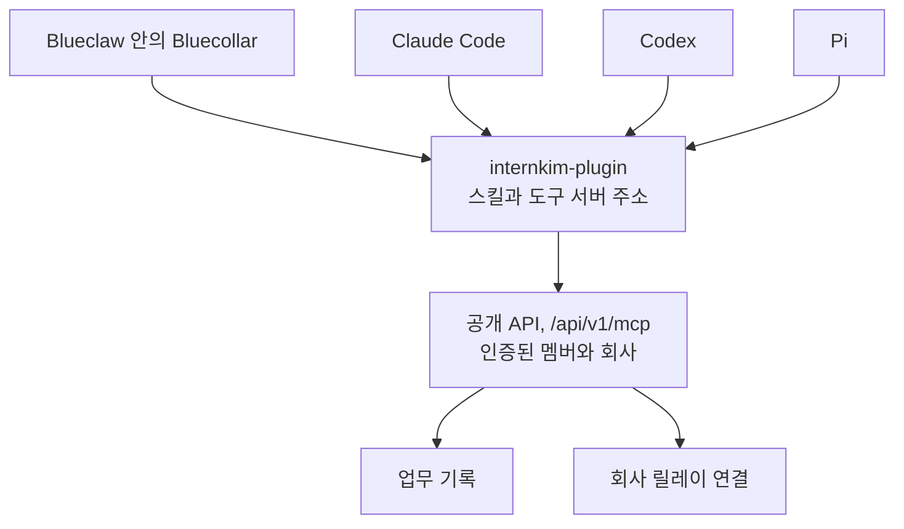

기계 두 대입니다. 한 대는 어떤 컴퓨터가 사라져도 살아남아야 하는 것을 담고,
다른 한 대는 에이전트를 돌리며 그 기계 위에서만 의미가 있는 것을 담습니다.



호스트를 떠나는 화살표는 전부 바깥을 향합니다. 안으로 향하는 것은 없습니다.

## 앱 조회 순서와 최신성

웹과 네이티브 앱의 공통 웹 화면은 같은 조회 경로를 씁니다. 화면이 계정별
데이터를 받아들이기 전에 인증과 회사 소속을 확인합니다. 로그인 멤버 조회는
현재 계정 세션에서 공유하며, 포커스 재검증과 계정 변경 시 무효화합니다.

업무 보드는 `task_list`와 `person_list`를 동시에 시작합니다. 업무 응답이 오면
실제 카드를 먼저 표시하고, 사람 목록이 도착하면 멤버 정보가 필요한 편집을
사용할 수 있습니다. 주차 변경은 같은 상태에서 화면을 파생하므로 전체 이력을
다시 읽지 않습니다. 저장된 업무 스냅샷은 프로젝트·회사·멤버·역할별로 분리하고
24시간 뒤 만료하며 재검증합니다. 쓰기, 로그아웃, 접근 거부는 스냅샷을
무효화하며, 무효화 전에 시작한 응답이 오래된 스냅샷을 복원할 수 없습니다.
저장된 보드는 앱 셸을 만든 뒤 적용합니다. 부가 업무 탭은 처음 열 때 만들고
계정 범위 안에서 편집 상태를 유지합니다. 그라데이션 아바타는 관찰자가 제공하는
크기를 사용하며 보일 때 그립니다. 초기 진입에 모든 카드의 레이아웃을 읽고
캔버스를 그리지 않습니다.

앱 셸은 화면마다 근태 작업 공간을 미리 읽지 않습니다. 계정 메뉴와 명령
팔레트가 열릴 때 기존 인증된 조회 경로로 근태를 읽습니다. 근태 화면은 월간
요약을 유지하고 부가 관리 화면은 필요할 때 읽습니다. 지난날의 미종료 출근
구간과 서버의 출퇴근 쓰기 검증을 유지하며, 브라우저의 오늘 필터로 대신하지
않습니다.

기록 도구는 도구 정의, 입력, 호출자 권한을 검증한 뒤 호출자의 RLS 적용
클라이언트로 DB를 읽습니다. 회사 설정과 사람 목록은 서로 독립이므로 요청
안에서 병렬로 읽습니다. 인증된 요청 사이에서 문맥을 캐시하지 않습니다.
이 조회 순서 변경에는 새 RPC, 엣지 함수, 범용 배치 계약이나 DB 마이그레이션이
필요하지 않습니다.

측정은 빈 열이나 응답 헤더가 아니라 실제 테스트 카드와 최신 응답 표식을
기다립니다. 브라우저 재시작 검증은 같은 프로필로 브라우저를 종료하고 다시
실행하며, 스냅샷 표시와 최신 데이터 완료를 따로 측정합니다. 이 검증으로 실제
네이티브 기기 성능이나 SQL 실행 시간을 단정하지 않습니다.

저장소의 `web/scripts/measure-navigation.ts`와
`web/scripts/measure-task-restart.ts`는 같은 폐기 가능한 로컬 기록에 연결한
프로덕션 Worker를 비교합니다. 원격 주소를 거부하고 자기 fixture만 생성·정리합니다.
버전 순서를 교대하고 준비 실행을 제외하며, 두 빌드를 고정한 채 브라우저 작업은
한 번에 하나만 실행합니다. 빌드 지문, 런타임, 브라우저, 화면 크기, CPU 배율,
백엔드 식별 정보와 호스트 부하를 기록합니다. 표본 수·중앙값·관측 범위를
보고하고 측정 프로토콜 버전은 섞지 않습니다. 12개 표본으로 모집단 p95를
단정하지 않습니다. 390px 터치 화면과 CPU 제한은 실제 폰이 아닌 시뮬레이션입니다.
모바일 언어 변경은 먼저 더보기 메뉴를 열고 측정합니다. 메뉴를 여는 준비 시간은
해당 시나리오 타이머에 포함하지 않습니다.

업무 재방문과 앞으로 이동의 준비 완료는 저장된 스냅샷 표시를 기준으로 삼을 수
있으며, 백그라운드 재검증 완료를 뜻하지 않습니다. 갱신 검증은 타이머 시작 전에
자기 fixture의 제목을 바꾸고 새 DOM 표식을 기다립니다. 일반 실시간 알림을
유지하므로 갱신 요청에는 예약된 읽기와 수동 읽기가 함께 포함될 수 있습니다.
의도 기반 미리 읽기의 500ms 준비 시간은 클릭 완료 시간과 따로 보고합니다.
API 본문 완료 시간에는 HTTP·인증·앱 작업이 포함됩니다. SQL문 실행 횟수는
같은 격리 DB에서 별도의 읽기 전용 관찰로 확인합니다.

## 여러 하네스가 쓰는 하나의 플러그인 [#one-plugin-across-harnesses]

`internkim-plugin`은 공통 클라이언트 패키지입니다. 김인턴의 에이전트가 여기서 스킬을 불러오고,
Claude Code, Codex, Pi도 같은 패키지를 설치해 자기 루프에서 회사의 도구를 쓸 수 있습니다.



플러그인은 평범한 Agent Plugins 체크아웃입니다. `plugin.json`, `https://api.intern.kim/v1/mcp`를
가리키는 `mcp.json`, `skills/`로 이루어지고, 하네스 어댑터는 없습니다. 각 클라이언트가 이 구조를
자기 방식으로 불러오며, 방법은 플러그인의 README에 있습니다.

서비스는 도구 계약을 한 번만 작성하고, 호출자의 인증에서 행위자를 정하며 현재 회사 멤버십을
확인합니다. 그래서 모델이 넘긴 인자로 더 높은 권한의 신원을 고를 수 없습니다. MCP는 도구 호출을
나르고, ACP는 릴레이가 메신저 대화를 에이전트에게 넘기는 별도의 경계입니다. 플러그인만 쓸 때는
ACP 세션이 필요 없습니다. 플러그인을 설치해도 외부 에이전트에게 blueclaw의 워크스페이스나
터미널이 열리지는 않습니다.

blueclaw 안에서 모델의 커널은 `read`, `write`, `edit`, `bash`, `plan`, `equip`입니다.
`plan`은 목표와 단계, 실행 규모를 정하는 수준을 기록합니다. `equip`은 필요를 설명한 문장을 받아
그에 맞는 도구를 돌려주고, 나머지 회사 카탈로그는 계획 단계마다 한 번 정해지는 후보 목록으로
모델에 전달됩니다. 모델은 말과 파일을 담은 하나의 `reply`로 말하며, 이 `reply`는 누군가 답할
때까지 실행을 멈추게 하거나 선택지를 버튼으로 제시할 수 있습니다.

## 중앙 쪽 [#the-central-side]

우리가 배포하는 다섯 가지입니다.

| | 무엇인지 | 어디 사는지 |
|---|---|---|
| 기록 | row level security 뒤의 Postgres | `supabase/migrations` |
| 컨트롤 플레인 | 서비스 키를 쥔 서버 라우트 | `web/src/routes/api/agent/` |
| 앱 | Cloudflare Pages 위의 SvelteKit 빌드. 사람이 로그인하는 화면을 서빙 | `web/` |
| 공개 API | 같은 빌드 안의 서버 라우트. 토큰과 MCP 클라이언트에 답함 | `web/src/routes/api/v1/` |
| 커넥션 게이트웨이 | 회사마다 Durable Object 하나를 두는 Worker. 브라우저 호출과 API 호출을 함께 나름 | `workers/connection-gateway/` |

기록은 모든 읽기와 쓰기에 어떤 멤버로서 답하고, 관리자로서 답하는 일은
없습니다. 세션이 어떤 행을 보는지는 데이터베이스 자신이 정합니다. 테이블
목록은 [무엇이 어디 사는지](/ko/docs/what-lives-where)에 있습니다.

컨트롤 플레인은 멤버 혼자서는 할 수 없는 일을 위해 존재합니다. 호출자는
회사의 에이전트 키로 인증하고, 돌아오는 것은 세션입니다.
`POST /api/agent/session`은 회사가 아는 신원을 멤버 세션으로 바꾸고,
`POST /api/agent/host-session`은 회사 컴퓨터를 그 자신으로 로그인시킵니다.
같은 디렉토리의 이웃 라우트들은, 그렇게 로그인한 호스트가 호출마다 필요한
자격증명을 읽게 (`/api/agent/messenger-credential`,
`/api/agent/mail-account`) 해 줍니다. 서비스 키는 이 라우트들을 떠나지
않습니다. 알림은 프로젝트 자신의 엣지 함수(`supabase/functions/`)가 보내므로,
모든 멤버의 기기를 읽는 키는 그 회사의 Supabase 안에 머뭅니다.

앱이 어느 Supabase 프로젝트에 말을 거는지는 런타임에 정해집니다.
`hooks.server.ts`가 값을 `#central-plane` 엘리먼트에 주입하므로, 하나의 빌드가
모든 회사를 서빙합니다. 화면은 비밀을 쥐지 않습니다. `/api/` 아래 라우트는 쥐고,
그래서 서버에서 돕니다. 모두가 하나의 주소에서 로그인하고, 존의 다른 모든
호스트네임은 그리로 `308`을 답합니다. 예외는 `/api/`와 `/v1/` 아래 경로로, 교차
출처 리다이렉트가 호출자의 베어러 토큰을 떨어뜨리기 때문에 도착한 곳에서 그대로
답합니다. `api.<zone>/v1`과 회사 호스트의 `/api/v1`이 같은 API인 것은 이 예외
덕분입니다.

공개 API에 도구 카탈로그가 삽니다. 모든 도구는
`web/src/lib/server/public-api/catalog/`에서 한 번만 정의되고, 정의마다 누가
답하는지를 밝힙니다.

| `answeredBy` | 누가 실행하는지 | 예 |
|---|---|---|
| `record` | 앱이 직접, 부른 멤버로서 기록에 대고 | 업무, 캘린더, 사람, 연차, 근태, CRM |
| `company` | 게이트웨이로 닿는 회사의 컴퓨터 | 메시지, 메일, 웹 검색, 문서 읽기 |
| `local` | 에이전트 자신의 기계에서만. API는 거절함 | 브라우저, 모델 호출, 임베딩 |

`/api/v1/mcp`는 같은 카탈로그를 어떤 MCP 클라이언트에게든 서빙하고, 아래
절들이 보여 주듯 에이전트 자신이 도구에 닿는 길도 이것입니다. 전체 도구는
[카탈로그](/ko/docs/tools/catalog)에 있습니다.

커넥션 게이트웨이는 서로 접속을 받지 않는 브라우저와 호스트가 닿는
방법입니다. 브라우저는 Supabase 세션 토큰을 실어 `/company/<id>/client`로
WebSocket을 열고, Worker는 그 토큰을 프로젝트의 JWKS로 검증해 어느 멤버가
부르는지 해석한 뒤, 소켓을 그 회사의 Durable Object
(`CompanyConnectionObject`)에 넘깁니다. 호스트의 릴레이는 자기 쪽에서
`/company/<id>/server`로 접속해 머무르며, Durable Object가 보관하는 서버 키로
인증합니다. 오브젝트는 호출을 한쪽으로, 응답을 반대쪽으로 전달하고, 릴레이가
새 메시지를 알리면 열린 채팅 화면에 `message.arrived`를 밀어 주고, 회사
컴퓨터가 지금 연결되어 있는지 자체를 브라우저에 알려 줍니다.

## 호스트 위의 프로세스들 [#the-processes-on-the-host]

패키지가 이들을 각각 systemd나 launchd 서비스로 등록하고, 확인하는 방법은
[호스트 굴리기](/ko/docs/running-the-host)가 설명합니다.

| 프로세스 | 응답 위치 | 하는 일 | 코드 |
|---|---|---|---|
| 릴레이 (`internkim-relay`) | 바깥으로만; 커넥터를 위해 `127.0.0.1:18091` | 앱의 호출에 답하고, 메시지를 에이전트의 턴으로 바꾸고, 에이전트에게 도구를 서빙 | `host/relay/` |
| 커넥터 (`chatd`) | `127.0.0.1:18090` | Buzz용 메신저 어댑터 | `.dependency/blueclaw/chatd/` |
| 에이전트 (`blueclaw`) | `/run/internkim/acp/blueclaw-acp.sock`; 관리 API는 `127.0.0.1:8080` | ACP 에이전트: 실행, 승인, 태스크 원장, 기억 | `.dependency/blueclaw/` |
| `internkim-capabilityd` | `/run/internkim/capability.sock` | 프로바이더 자격증명을 쥠: 모델 호출, 임베딩, 메일·웹·브라우저 도구 | `cmd/internkim-capabilityd/`, `internal/capabilityd/` |
| Moli (`moli serve`), 요청자마다 하나 | `127.0.0.1:9230`부터 | 공개 페이지의 단순한 텍스트를 탐색하는 디바이스 브라우저. capabilityd가 사람마다 처음 쓸 때 그 사람의 프로필로 띄우고, 쓰지 않으면 내립니다 | `internal/browser/device_browsers.go` |
| `internkim-admind` | `127.0.0.1:18080`, `/run/internkim/admind.sock` | 워크스페이스 화면, 명부, 그리고 평면이 호스트로 실어 오는 회사 도구 | `cmd/internkim-admind/`, `internal/admind/` |
| `internkim-maild` | `127.0.0.1:18092` | 호출이 실어 온 계정으로 메일에 답함 | `cmd/internkim-maild/` |
| 에이전트의 저장소 | `DATABASE_URL` | 대화, 실행, 기억, 폴리시를 담는 Postgres | — |

## 에이전트는 무엇으로 만들어졌는지 [#what-the-agent-is-made-of]

blueclaw는 프로세스 하나이고, 저마다 한 가지 일을 하는 별개의 저장소들로
짜여 있습니다.

| | 하는 일 | 어디 |
|---|---|---|
| [blueclaw](https://github.com/yeomyeonggeori/blueclaw) | 에이전트 호스트: 신원, 승인 게이트, 태스크 원장, 릴레이가 말을 거는 ACP 에이전트 | `.dependency/blueclaw/` |
| [bluecollar](https://github.com/yeomyeonggeori/bluecollar) | 같은 프로세스 안에서 도는 에이전트 루프와 모델 클라이언트 | `.dependency/blueclaw/.dependency/bluecollar/` |
| [bluememo](https://github.com/yeomyeonggeori/bluememo) | 장기 기억: 끝난 일에서 뽑아낸 사실, 주인과 서클로 범위가 정해짐 | `.dependency/blueclaw/.dependency/bluememo/` |
| internkim-plugin | 에이전트가 일의 종류마다 읽어들이는 스킬 | `.dependency/internkim-plugin/` |

기억은 주체마다 SQLite 파일 하나이고, 작업 공간의 `.blueclaw/memory` 아래에
있습니다. 실행이 끝나면 bluememo가 모델을 시켜 거기서 그 자체로 뜻이 통하는
문장들을 뽑습니다. 새 문장은 옛 문장을 대체하고, 사람은 에이전트에게 하나를
잊으라고 할 수 있습니다. 회상은 그 파일을 임베딩과 낱말로 검색하고, 모델을
부르지 않고 답합니다. 기억은 Postgres에 하나도 두지 않습니다.

모델의 이름은 `internal/modelladder` 한 곳에 있습니다. 에이전트는 티어를
요청하고, 키를 쥔 capabilityd가 호출하므로 에이전트는 프로바이더 토큰을 보지
못합니다.

## 채팅 화면이 답을 받는 방법 [#how-the-chat-screen-gets-answered]

앱은 로그인한 사람 그대로 기록을 직접 읽고 쓰므로, 근태, 휴가, 캘린더, 업무,
조직도는 호스트를 전혀 거치지 않습니다. 호스트만 아는 것을 보여 주는 화면들,
즉 메신저, 메일, 에이전트의 실행과 그 실행이 기다리는 승인, 기억, 파일과
읽어들인 스킬은 게이트웨이를 거칩니다.

1. 브라우저가 자기 게이트웨이 소켓으로 `{ kind: "call", capability, body }`를
   보냅니다. 토큰은 소켓을 열 때 이미 검증되었고, 본문의 어떤 값도 누가
   부르는지를 말할 권한이 없습니다.
2. Durable Object가 호출에 호출한 멤버의 ID를 찍어 릴레이의 상시 연결로
   전달합니다.
3. 릴레이가 처리해 같은 소켓으로 답하고, 오브젝트가 그 답을 물어본 브라우저로
   되돌립니다.

"처리한다"가 무엇인지는 capability마다 다르고, 각 분기는
`host/relay/forward.ts`에 있습니다.

- 메신저 작업은 커넥터의 `/v1/platform/<platform>/<capability>`로
  전달됩니다. 그 전에 릴레이가 그 멤버 자신의 메신저 자격증명을 컨트롤
  플레인에서 가져와 `actor`로 붙이므로, 메신저에는 그 멤버 자신의 계정이 그
  일을 하는 것으로 보입니다. 계정을 연결하지 않은 멤버는 `409`를 받고,
  `person.credential.issue`가 계정을 연결하는 호출입니다.
- `person.mail.*`은 멤버의 메일 계정을 호출마다 가져와
  `internkim-maild`로 갑니다. 메일 비밀번호가 그 컴퓨터에 저장된 채로 남는
  일은 없습니다. 웹 앱은 비밀번호를 저장할 때 회사, 멤버, 필드, 로그인할 서버에 묶어 상자의
  암호화 키로 하나씩 HPKE(RFC 9180) 봉인하고, maild가 `/var/lib/internkim/box`의 키로 엽니다.
  서버, 포트, 보안 방식, 로그인 계정을 바꾸면 비밀번호를 다시 입력해야 합니다.
  상자 키가 없는 회사는 읽을 수 있는 형태로 남고, 그렇게 저장할 때마다
  `mail_account.kept_unsealed`가 기록됩니다.
- 워크스페이스 화면(`person.memory.*`, `person.files.*`, `person.runs.*`,
  `person.skills.*`, `person.persona.*`와 그 이웃들)과 공개 API의 회사
  도구(`person.api.request`, `person.api.file`)는 `admind`의 unix 소켓으로
  전달됩니다. 파일을 옮기는 일은 아래에 있습니다.
- 링크 미리보기(`asset.link`)는 릴레이가 만들고, 미리보기 이미지는
  답이 작게 유지되도록 Supabase Storage에 넣습니다.

돌아가는 시스템 안의 어떤 계정도 다른 사람을 대신하지 않습니다. 메신저에서
구성원의 일은 모두 그 구성원이 직접 등록한 자격증명으로 이뤄지고, 누군가를
대신해 일하려고 관리자 세션을 쥐고 있는 곳은 없습니다. 릴레이도, 커넥터도,
회사의 연결 레코드도 자기 메신저 계정을 갖지 않습니다. 구성원은 앱에서, 다른
모든 호출에서 그 사람을 밝혀 주는 바로 그 게이트웨이 소켓으로 자격증명을
등록합니다. 무엇을 건네야 하는지는 메신저가 정합니다. `person.credential.requirement`가 로그인, 비밀 값, 리디렉션
중 무엇을 원하는지와 어떤 입력란을 그릴지 답하고, `person.credential.issue`가
그 답을 오래 쓰는 자격증명으로 바꾸며, 무엇이든 저장하기 전에 그것이
작동하는지 확인합니다.

바이트 상한보다 큰 답은 크기를 명시한 `413`으로 거절됩니다. 그냥 보내면
전송로가 소리 없이 떨어뜨리기 때문입니다. 상한과 기본값은
[호스트 굴리기](/ko/docs/running-the-host#how-big-an-answer-may-be)에 있습니다.

### 파일이 건너가는 방법 [#how-a-file-crosses]

파일은 소켓으로 오가지 않습니다. 호출은 파일의 이름만 대고, 바이트는 회사의
`asset` 버킷을 거칩니다. 버킷의 경로는
[무엇이 어디에 사는가](/ko/docs/what-lives-where#the-record)에 있습니다.

읽을 때 브라우저는 메신저 첨부면 `person.media.prepare`를, 워크스페이스
파일이면 `person.files.download`를 자기가 정한 `transferID`와 함께
호출합니다. 릴레이는 요청을 그 구성원으로서 확인합니다. 메신저는 구성원
자신의 키로 읽고, admind는 무엇이든 읽기 전에 그 구성원으로서 디렉터리를
나열합니다. 그런 다음 릴레이가 커넥터나 admind에 6 MiB 범위를 하나씩
요청해서, 이어 올리기 업로드로 버킷에 복사합니다. 이미 있는 사본은 바로
주소로 답합니다. 아니면 호출은 `pending`으로 답하고, 릴레이는 복사하는 동안
`transfer.progress` 이벤트를 보내다가 주소를 담은 `transfer.done`이나 이유를
담은 `transfer.failed`를 보냅니다. 브라우저는 자기 세션으로 주소에 서명하므로,
누가 열 수 있는지는 행 수준 보안이 정합니다.

보낼 때 브라우저는 파일을 자기 구성원의 `upload/` 경로에 직접 이어 올리기로
올리고, 그 객체를 지목해 `person.media.upload`나 `person.files.upload`를
호출합니다. 릴레이는 구성원의 세션으로 그것을 읽습니다. 메시지라면 커넥터가
잠깐만 유효한 서명 주소에서 파일을 가져와 해시를 계산하며 디스크에 받아
두었다가 메신저의 미디어 저장소에 넣고, 메시지는 돌아온 것을 가리키며
보내집니다. 파일 화면이라면 릴레이가 admind로 흘려 보내고, admind는 Blueclaw가
그 구성원의 POSIX 신원으로 쓰게 합니다. 어느 쪽이든 업로드는 가져간 뒤 지워집니다.

어떤 프로세스도 파일 전체를 쥐지 않습니다. Bun은 읽는 쪽이 무엇을 하든 HTTP
응답을 도착하는 대로 읽어 들이므로, 읽기는 하나하나가 정해진 크기의 범위입니다.

## 메시지가 일이 되는 방법 [#how-a-message-becomes-work]

커넥터는 `MESSENGER_PLATFORM`에 맞는 어댑터
(`.dependency/blueclaw/chatd/src/adapters/`)로 회사의 봇 멤버로서 메신저에
붙고, 도착한 메시지를 정규화합니다. 거기서부터는 릴레이가 나릅니다.

1. chatd가 이벤트를 `127.0.0.1:18091`에 있는 릴레이의 `/inbound`로 보냅니다.
   릴레이는 그것을 `RELAY_STATE_DIR` 아래에 쓰고, 디스크에 남은 뒤에야
   `202`로 답합니다. chatd는 그 답을 받을 때까지 다시 보내므로, 어느 쪽
   프로세스가 재시작해도 메시지는 살아남습니다.
2. 릴레이는 `/run/internkim/acp/blueclaw-acp.sock`으로 대화마다 ACP 세션 하나를
   열고 메시지를 프롬프트로 보냅니다. 세션은 누가 묻는지와 어디로 답할지를
   밝히고, 에이전트의 도구 서버로 릴레이 자신의 `/mcp/<ticket>`을 지목합니다.
3. blueclaw가 턴을 돌립니다. 그 주소로 오는 도구 호출을 릴레이는 요청자를
   위해 발급받은 멤버 세션을 붙여 앱의 `/api/v1/mcp`로 전달하므로, 에이전트는
   베어러 토큰을 쥐지 않습니다.
4. 답은 ACP로 돌아오고, 릴레이가 커넥터를 통해 대화에 올립니다.

승인도 같은 길로 갑니다. 게이트가 호출을 붙잡으면 blueclaw는 ACP로
릴레이에게 묻고, 릴레이는 그 질문을 대화에 올리고, 요청자가 그 대화에 쓰는
다음 메시지가 답입니다. 그 말이 무슨 뜻인지는 blueclaw가 정하고, 동의로 읽을
수 없는 답은 거절이 됩니다. 릴레이는 열린 질문을 inbound 큐 옆 디스크에 두므로,
어느 쪽이 재시작해도 두 번 묻지 않고 잃는 것도 없습니다.

사람이 어느 클라이언트에서 입력했든 에이전트는 똑같이 움직입니다.

별도로, 메신저 서버는 자신이 받아들인 모든 메시지를 같은 루프백 포트로
릴레이에 보고합니다. 릴레이는 수신자가 누구인지 해석해 `notify` 엣지 함수에
알려 달라고 부탁하고, 그 알림은 그 멤버들이 기기를 등록해 둔 곳으로 웹 푸시로
도착합니다. 게이트웨이에도 알리므로 열린 채팅 화면이 새 메시지를 가져옵니다.

## 메신저의 누군가가 기록의 누군가가 되는 방법 [#how-someone-in-the-messenger-becomes-someone-in-the-record]

앱을 한 번도 연 적 없는 사람도 기록에 행이 있습니다. 호스트에서 그 사람을
위해 움직이는 쪽은 자기 키로 회사를 증명하고, 말한 신원을 지목하고, 그 멤버의
세션을 받습니다.

```
POST /api/agent/session
Authorization: Bearer <회사의 에이전트 키>

{ "kind": "email", "externalID": "…" }
```

릴레이는 요청자를 위해 도구 서버를 열 때 이것을 요청하고, 세션이 끝나기 5분
전에 다시 요청합니다. 컨트롤 플레인은 아무도 주장하지 않는 신원을 거절하고,
그 키의 회사가 아닌 멤버를 거절합니다. 돌아오는 것은 평범한 멤버 세션이므로,
에이전트가 기록에서 하는 모든 일은 그 사람 자신의 권한 안에 갇힙니다.

## 메신저 서버는 어디서 도는지 [#where-the-messenger-server-runs]

다이어그램은 호스트 바깥에 그렸지만, 있을 수 있는 곳은 세 군데입니다.

| | 직접 닿을 수 있는 사람 |
|---|---|
| 벤더의 클라우드 | 어디서든, 누구든 |
| 회사 네트워크 위의 자체 설치 | 그 네트워크나 VPN 위의 사람들 |
| 호스트 컴퓨터 그 자체 | 그 네트워크 위의 사람들뿐 |

마지막 줄이 평범한 경우입니다. 자기 Buzz 릴레이를 굴리는 회사는
어차피 에이전트 때문에 켜 둔 그 기계에서 함께 굴리는 일이 많고, 커넥터는
루프백으로 닿습니다. 패키지가 정확히 그 자리에서 Buzz 스택을 `buzz-relay`와
`buzz-media`로 굴립니다. 채팅 화면은 언제나 릴레이를 거치므로 메신저가 어디 있든
화면 하나가 똑같이 동작하고, 대화가 중앙에 기록되는 일은 없습니다. 릴레이는
물어본 호출에 대한 답만 되돌려 보냅니다.

## 호스트에 인바운드 포트가 없는 이유 [#why-the-host-has-no-inbound-port]

회사 컴퓨터를 노출한다는 것은 터널, 인증서, 호스트네임, 그리고 새로운 침입
경로 하나를 뜻합니다. 대신 브라우저와 호스트가 둘 다 게이트웨이로 바깥을 향해
접속하고, 게이트웨이가 그 사이에서 호출을 전달합니다. 회사의 방화벽은 그대로
남습니다.

회사에 연결된 호스트는 명령 하나로 이것을 스스로 증명합니다.

```bash
ss -ltnp | grep -v '127.0.0.1\|::1'    # 아무것도 출력되지 않음
```

기계를 관리하는 것은 별개의 질문이고 답도 별개입니다. 같은 네트워크에서는
`ssh`가 닿고 그 이상은 필요 없습니다. 다른 곳에서라면, 이미 쓰고 있는 것을
자신의 `~/.ssh/config`에 넣으면 됩니다.

```
Host my-company-host
  ProxyCommand cloudflared access ssh --hostname %h
```

Cloudflare Tunnel은 편리한 답 하나이고, 우리가 개발하며 쓰는 답입니다.
Tailscale, 점프 호스트, WireGuard도 답입니다. 김인턴은 그중 무엇도 설치하지
않고, 요구하지 않고, 무엇을 골랐는지 알 수도 없습니다. 선택은 회사의 것이고
제품 바깥에 머뭅니다.
