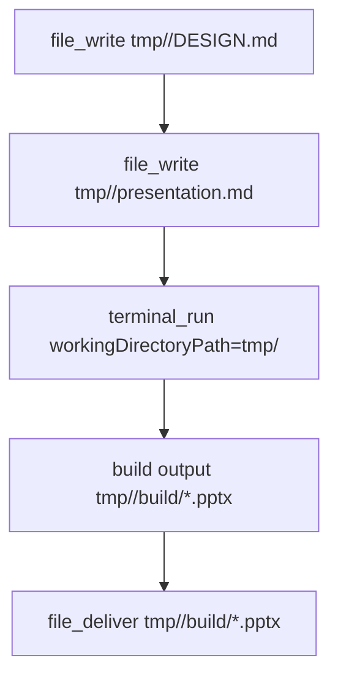
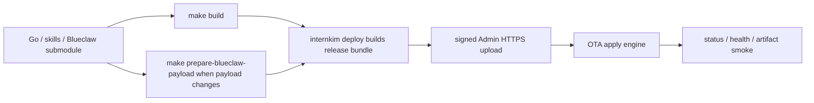

# Blueclaw 아키텍처

현재 `internkim`은 Jetson Orin Nano Super를 1차 하드웨어 타깃으로 보고 Blueclaw를 기기 런타임으로 사용합니다. 설치 경로, 서비스 이름, 설정 파일, 헬스체크는 모두 Blueclaw 기준으로 고정되어 있으며, Radxa/RPi SD provisioning은 legacy/test path로 남겨둡니다.

## 런타임 계약

| 항목 | 값 |
|------|----|
| 바이너리 | `/usr/local/bin/blueclaw` |
| 서비스 | `blueclaw.service` |
| 시스템 유저 | `blueclaw` |
| 홈 디렉토리 | `/home/blueclaw` |
| 런타임 루트 | `/root/.blueclaw` |
| 설정 파일 | `/root/.blueclaw/config/runtime.json`, `/root/.blueclaw/config/policy.json` |
| 호스트 워크스페이스 | `/root/.blueclaw/workspace` |
| 게스트 워크스페이스 | `/workspace` |
| 헬스체크 | `http://127.0.0.1:8080/admin/api/policy` |

## 전체 흐름

```
사용자
  └─ Cloudflare Access
       └─ Cloudflare Tunnel
            └─ Jetson Orin Nano Super
                 ├─ Mattermost :8065
                 │    └─ internkim-capabilityd
                 ├─ internkim-admind
                 │    └─ companion broker / admin UI / backup
                 ├─ internkim-capabilityd
                 │    ├─ OpenRouter / local model / companion LLM routing
                 │    ├─ Mattermost platform I/O
                 │    └─ browser capability adapter
                 ├─ graphiti-memoryd :7791
                 └─ Firecracker guest
                      └─ Blueclaw HTTP API :8080
                           ├─ managed DB
                           ├─ workspace actor boundary
                           └─ gws / gws-bot helper 경로

Optional external channels
  ├─ Slack workspace
  │    └─ Slack Socket Mode
  │         └─ internkim-capabilityd
  │              └─ Blueclaw
  └─ Signal account
       └─ JSON-RPC poll
            └─ internkim-capabilityd
                 └─ Blueclaw

사용자 컴퓨터
  └─ internkim-companion
       └─ internkim-admind companion broker
```

관리자 UI와 SSH는 Cloudflare Access 뒤의 운영 진입점이고, Flow, 일정, 근태 웹앱은 사용자 web session 경계로 보호합니다. 사용자 web session은 Mattermost session, Mattermost OAuth, Cloudflare Access email 중 하나로 신원을 확인한 뒤 InternKim people/policy에서 active staff인지 다시 판정합니다. Admin API는 일반 web session만으로 열리지 않고 admin 권한 경계를 따릅니다.

Mattermost API, Blueclaw API, 내부 업무 API 호출은 사용자 브라우저 인증에 의존하지 않습니다. admind와 capabilityd는 필요한 서버-서버 호출을 로컬 루프백 또는 내부 서비스 경계로 수행합니다. Blueclaw는 로컬 루프백에서만 응답합니다. Slack과 Signal은 선택적 connector surface이며, credential/config 파일이 있으면 `internkim-capabilityd`가 외부 이벤트를 받아 Blueclaw 작업으로 정규화합니다. Google, Mattermost, Cloudflare 설정은 host-side setup이 관리하고, Blueclaw는 이미 배치된 파일과 capability endpoint를 사용합니다.

## 디렉토리 구조

```text
/root/.blueclaw/
├── config/
│   ├── runtime.json
│   └── policy.json
└── workspace/
    ├── AGENTS.md
    ├── SOUL.md
    ├── IDENTITY.md
    ├── bin/
    ├── private/
    │   └── people/
    ├── circles/
    ├── shared/
    │   └── cache/
    └── skills/
```

## 보안 경계

민감 정보는 `/root/.internkim/secrets`, `/root/.internkim/config`, `/root/.internkim/state`에 두고, 필요한 프로세스만 읽을 수 있게 권한을 나눕니다. Blueclaw는 provider token, 브라우저 쿠키, 사용자 로컬 파일 경로, local model path를 직접 보지 않습니다.

| 파일 | 소비자 |
|------|--------|
| `/root/.internkim/secrets/openrouter-api-key` | internkim-capabilityd |
| `/root/.internkim/models/*` | internkim-capabilityd, local model wrapper |
| `/root/.internkim/secrets/google-sa.json` | gws / gws-bot |
| `/root/.internkim/secrets/gas-webhook-url` | GAS bridge helper |
| `/root/.internkim/secrets/slack-*` | internkim-capabilityd |
| `/root/.internkim/config/signal-*` | internkim-capabilityd |
| `/root/.internkim/state/companion-jobs.json` | internkim-admind |

## Workspace Actor와 POSIX 권한

Blueclaw service는 `blueclaw` 사용자로 실행됩니다. 이 프로세스는 task orchestration, tool schema validation, path resolution, policy check, event logging을 담당합니다. 요청자가 볼 수 있는 파일 시스템 변경과 process 실행은 service user로 직접 수행하지 않고 `WorkspaceActor`로 내려보냅니다.

```mermaid
sequenceDiagram
  participant Model as LLM action
  participant Service as Blueclaw service (blueclaw)
  participant Resolver as WorkspacePathResolver
  participant Actor as WorkspaceActor
  participant Helper as blueclaw-posix-helper
  participant Linux as Linux POSIX

  Model->>Service: file_write / terminal_run / file_deliver
  Service->>Resolver: virtual path validation
  Resolver-->>Service: typed workspace path
  Service->>Actor: requester operation
  Actor->>Helper: exec/fs request
  Helper->>Helper: authorize caller root or blueclaw
  Helper->>Linux: switch to requester UID/GID/groups
  Linux-->>Helper: POSIX allow/deny
  Helper-->>Actor: structured result
  Actor-->>Service: observation
```

`blueclaw-posix-helper`는 guest rootfs 안에 `root:root 4755`로 설치됩니다. 누구에게나 execute bit를 열어 두는 대신, helper 내부에서 caller real UID가 root 또는 `blueclaw`인지 확인합니다. helper는 workspace path policy를 판단하지 않습니다. path policy는 Blueclaw service layer가 맡고, 최종 read/write/execute 가능 여부는 requester identity로 전환된 뒤 Linux POSIX가 판단합니다.

| 경로 | 소유/권한 계약 | 설명 |
|------|------|------|
| `/workspace/private` | service-owned `0711` | traversal parent |
| `/workspace/private/people` | service-owned `0711` | traversal parent |
| `/workspace/private/people/<personID>` | requester group, `2770` | 개인 workspace root |
| `/workspace/private/people/<personID>/tmp` | requester group, `2770` | 개인 ephemeral draft base |
| `/workspace/private/people/<personID>/artifacts` | requester group, `2770` | 개인 durable artifact base |
| `/workspace/circles` | service-owned `0711` | circle traversal parent |
| `/workspace/circles/<circleID>` | `bc_circle_<circleID>`, `2770` | circle durable shared area |
| `/workspace/shared/cache/dependencies` | shared cache group | package cache only |
| `/workspace/.blueclaw` | service-owned | DB, logs, internal state |

`0711` parent는 다른 사람이 목록을 볼 수 없게 하면서 허가된 child path로 traversal만 허용합니다. `2770` directory는 owner/group에게 read/write/execute를 주고 setgid bit로 새 child가 같은 group을 물려받게 합니다.

## Artifact 생성 흐름

모델-facing path contract는 virtual path입니다. tool input에는 `/workspace/private/people/...` 같은 concrete path 대신 `tmp/<slug>`와 `artifacts/<slug>`를 사용합니다.



Required artifact task는 `file_deliver` completion evidence가 있어야 completed로 인정됩니다. `tmp/<slug>` 파일 생성, local path 문자열, markdown 링크, `/workspace/...` 경로 노출은 완료 증거가 아닙니다.

`simple-slides`는 `file_write -> terminal_run -> file_deliver` 흐름을 따릅니다. Marp runtime은 전역 PATH의 ambiguous `marp`를 잡지 않고 rootfs 선설치 entrypoint 또는 requester tmp의 skill-local install을 사용합니다. 실행 중 쓰기 경로는 `tmp/<slug>/build/.tmp` 아래로 고정합니다.

## 설정 생성

`internkim`은 Blueclaw 설정을 템플릿 문자열이 아니라 구조화된 JSON 문서로 생성합니다.

- `runtime.json`
  - loopback listen 주소
  - capabilityd provider endpoint
  - workspace root
  - 실행 허용/차단 명령
- `policy.json`
  - 관리자 identity
  - retention 정책

생성 로직은 `internal/runtime/blueclaw/`에 모여 있고, live setup과 SD firstboot가 같은 계약을 사용합니다.

## 서비스 기동

Host systemd는 Blueclaw 바이너리를 직접 실행하지 않고 Firecracker supervisor를 띄웁니다.

```ini
[Service]
User=root
Environment=RUST_LOG=...
ExecStart=/usr/local/bin/blueclaw-supervisor -runtime /root/.blueclaw/config/runtime.json
```

Guest init은 `/workspace` mount와 POSIX helper preflight를 마친 뒤 guest 내부에서 Blueclaw daemon을 `blueclaw` 사용자로 실행합니다.

```bash
su -s /bin/bash blueclaw -c \
  "/workspace/.blueclaw/runtime/current/bin/blueclaw \
    -runtime /workspace/.blueclaw/config/runtime.json \
    -policy /workspace/.blueclaw/config/policy.json"
```

헬스체크는 systemd active 상태와 `curl -fsS http://127.0.0.1:8080/admin/api/policy` 둘 다 통과해야 성공으로 봅니다.

## 배포 흐름

`make build`는 host-side CLI와 service binary를 갱신합니다. 일반 배포는 `internkim deploy`가 만든 release bundle을 Admin HTTPS로 direct upload하고, 기기 안의 OTA apply engine이 manifest 검증, component staging, install, restart, current manifest 기록을 수행합니다. Blueclaw guest payload에 submodule 변경을 넣으려면 `make prepare-blueclaw-payload`가 필요합니다. Runtime base helper, rootfs package, guest-init이 바뀌면 `make prepare-blueclaw-runtime-base`까지 필요합니다.



R2 release channel과 direct upload release는 같은 manifest/apply engine을 공유합니다. R2는 fleet-wide stable channel 배포에 쓰고, direct upload는 개발 머신에서 특정 기기에 바로 적용할 때 씁니다. SSH setup은 초기 설치와 Admin HTTPS 장애 복구 경로입니다. Directory upload는 legacy setup에서만 사용하며 `scp -r` 대신 tar-over-ssh를 사용합니다. Password sudo와 tar stream stdin이 충돌하지 않도록 `/tmp/internkim-upload-<pid>-<name>`에 unprivileged extract 후, 별도 sudo command로 최종 위치에 copy합니다. SSH command에는 timeout과 retry가 적용됩니다.

## Google Workspace 연동

Google 생성 플로우는 현재 예전 방식으로 유지되어 있습니다.

- 생성은 Apps Script bridge 또는 사용자 권한 경로
- 후속 편집은 `gws-bot`
- 기기 workspace skill은 host `/root/.blueclaw/workspace/skills/*`에 배치되고 guest에서는 `/workspace/skills/*`로 보입니다.

즉, Google 연동은 Blueclaw 내부 설정이 아니라 host-side provisioned helper 집합으로 붙습니다.
