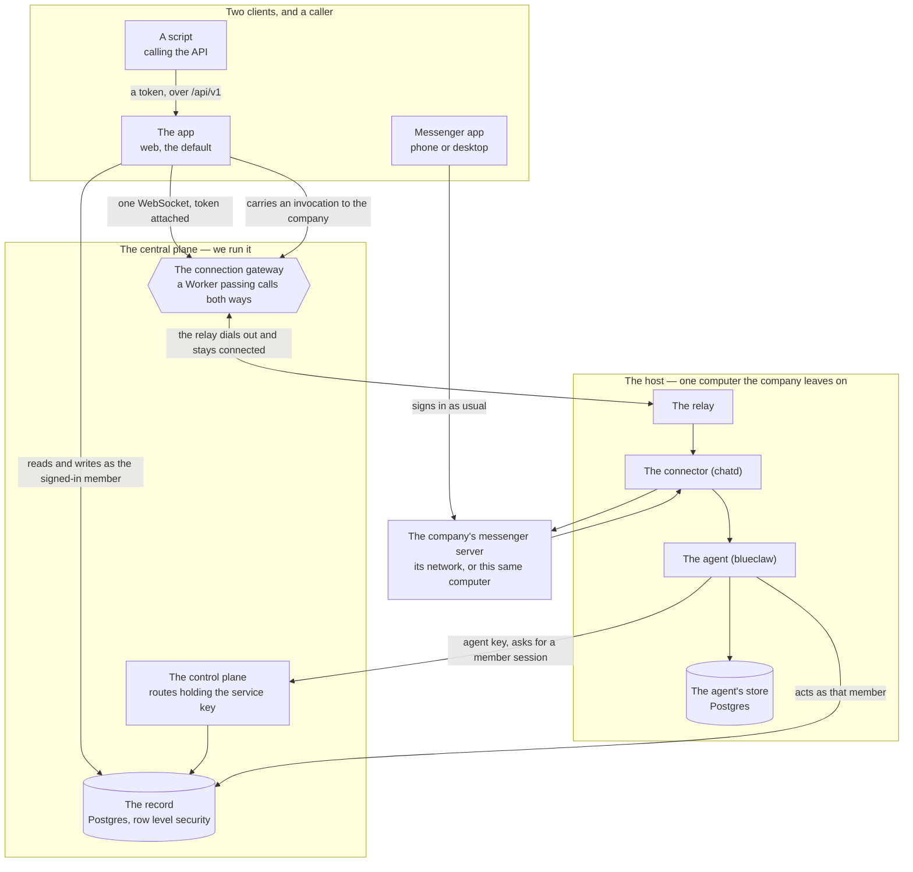

Two machines. One holds what must survive any computer, the other runs the
agent and holds what only makes sense on that machine.



Every arrow leaving the host points outward. None points in.

## The central side

Four things, deployed by us. The app has two jobs; the rest have one.

| | What it is | Where it lives |
|---|---|---|
| the record | Postgres behind row level security | `supabase/migrations` |
| the control plane | server routes holding the service key | `web/src/routes/api/agent/` |
| the app | a SvelteKit build on Cloudflare Pages, serving the pages people sign into and the public API | `web/` |
| the connection gateway | a Worker with one Durable Object per company, carrying browser calls and API calls alike | `workers/connection-gateway/` |

**The record** answers every read and write as some member, never as an
administrator. Which rows a session sees is decided by the database itself.
The tables are listed in [What lives where](/docs/what-lives-where).

**The control plane** exists for what a member cannot do alone. Its callers
authenticate with a company's agent key, and what it hands back is a session:
`POST /api/agent/session` turns a messenger identity into a member session,
`POST /api/agent/host-session` signs the company's computer in as itself.
Notifications are sent by the project's own edge functions, so the key that
reads every member's devices stays inside the company's Supabase. Sibling
routes under the same directory let that signed-in host read the
credentials it needs per call (`/api/agent/messenger-credential`,
`/api/agent/mail-account`). The service key never leaves these routes.

**The app** decides at runtime which Supabase project it talks to:
`hooks.server.ts` injects the values into the `#central-plane` element, so one
build serves every company. The pages hold no secret; the API routes under
`/api/` do, which is why they run on the server. Everyone signs in at one
address; every other hostname on the zone answers `308` to it, except paths
under `/api/` and `/v1/`, which are answered where they land because a
cross-origin redirect would drop the caller's bearer token. That exception is
what lets `api.<zone>/v1` and a company host's own `/api/v1` be the same API.

**The connection gateway** is how a browser and the host reach each other when
neither accepts a connection. The browser opens a WebSocket to
`/company/<id>/client` carrying its Supabase session token; the Worker
verifies the token against the project's JWKS, resolves which member is
calling, and hands the socket to that company's Durable Object
(`CompanyConnectionObject`). The host's relay dials `/company/<id>/server`
from its side and stays connected, authenticated by a server key the Durable
Object stores. The object forwards calls one way and answers the other, and
tells browsers whether the company's computer is currently connected at all.

## The processes on the host

`host/entrypoint.sh` starts these, in the order
[Running the host](/docs/running-the-host) explains.

| Process | Answers on | Job | Code |
|---|---|---|---|
| the relay (`internkim-relay`) | outbound only; arrivals on `127.0.0.1:18091` | answers the app's calls, carries messenger arrivals | `host/relay/` |
| the connector (`chatd`) | `127.0.0.1:18090` | the messenger adapter: Buzz | `.dependency/blueclaw/chatd/` |
| the agent (`blueclaw`) | `127.0.0.1:8080` | the loop, the task ledger, approval, the workspace | `.dependency/blueclaw/` |
| `internkim-capabilityd` | `/run/internkim/capability.sock` | the typed capability boundary: calendar, tasks, mail, sites | `cmd/internkim-capabilityd/`, `internal/capabilityd/` |
| `internkim-admind` | `127.0.0.1:18080` | the workspace screens, and the tools the plane cannot run itself | `cmd/internkim-admind/`, `internal/admind/` |
| `internkim-maild` | `127.0.0.1:18092` | answers mail for whichever account a call carries | `cmd/internkim-maild/` |
| the agent's store | `DATABASE_URL` | Postgres holding conversations, runs, memory, policy | — |

## How the chat screen gets answered

The app reads and writes the record directly as whoever signed in, so
attendance, leave, the calendar, work and the org chart never touch the host.
The screens that show what only the host knows — the messenger, mail, the
agent's runs and the approvals they wait on, its memory, its files, the
skills it loaded — go through the gateway instead:

1. The browser sends `{ kind: "call", capability, body }` down its gateway
   socket. The token was verified when the socket opened; nothing in the body
   is trusted to say who is asking.
2. The Durable Object forwards the call to the relay's standing connection,
   stamped with the calling member's ID.
3. The relay serves it and answers on the same socket, and the object routes
   the answer back to the browser that asked.

What "serves it" means depends on the capability, and each branch is in
`host/relay/forward.ts`:

- **Messenger operations** are forwarded to the connector at
  `/v1/platform/<platform>/<capability>`. First the relay fetches that
  member's own messenger credential from the control plane and attaches it as
  the `actor`, so the messenger sees the member's own account doing the thing.
  A member who has connected no account gets a `409`, and
  `person.credential.issue` is the call that connects one.
- **Mail** (`person.mail.*`) goes to `internkim-maild` with the member's mail
  account fetched per call, so no mail password is at rest on the box.
- **Workspace views** (`person.memory.*`, `person.files.*`, `person.tasks.*`)
  and the public API's own calls (`person.api.request`, `person.api.file`) are
  forwarded to `admind` over its unix socket, which the bundle starts.
- **Link previews** (`asset.link`) the relay builds itself, storing the
  preview image in Supabase Storage so the answer stays small.

An answer larger than the byte ceiling is refused with a `413` naming the
size, because the transport would otherwise drop it silently; the ceiling and
its default are in [Running the host](/docs/running-the-host#how-big-an-answer-may-be).

## How a message becomes work

The connector attaches to the messenger as the company's bot member, through
the adapter matching `MESSENGER_PLATFORM`
(`.dependency/blueclaw/chatd/src/adapters/`). Arriving messages are normalized
and handed to the agent on `127.0.0.1:8080`; the agent's replies leave through
the same connector. The agent behaves identically whichever client the person
typed in.

Separately, the messenger server reports every message it accepts to the
relay on `127.0.0.1:18091`, a port nothing outside the box can reach. The relay
resolves who was addressed and asks the control plane to notify them, which arrives as a web
push wherever those members registered a device.

## How someone in the messenger becomes someone in the record

A person who has never opened the app still has a row in the record. The
agent proves the company with its key, names the messenger identity that
spoke, and receives a session for that member.

```
POST /api/agent/session
Authorization: Bearer <the company's agent key>

{ "kind": "buzz", "externalID": "…" }
```

The control plane refuses an identity nobody claims, and refuses a member
whose company is not the one that key belongs to. What comes back is an
ordinary member session, so everything the agent does next is bounded by that
person's own permissions.

## Where the messenger server runs

The diagram puts it outside the host, which is one of three places it can be.

| | Who can reach it directly |
|---|---|
| A vendor's cloud | anyone, from anywhere |
| Your own installation on your network | people on that network or its VPN |
| The host computer itself | people on that network, and nobody else |

The last row is ordinary. A company that runs its own Buzz relay
often runs it on the machine already kept awake for the agent, and the
connector reaches it over loopback; `host/buzz/` is a compose file that brings
the Buzz stack up exactly there. Because the chat screen always goes through
the relay, one screen works wherever the messenger lives, and the
conversation is never written centrally: the relay sends back only the answer
to the call it was asked.

## Why the host has no inbound port

Exposing a company's computer means a tunnel, a certificate, a hostname, and
a new way in. Instead both the browser and the host connect outward to the
gateway, which passes calls between them. Your firewall stays as it was.

The host proves this about itself with one command:

```bash
ss -ltnp | grep -v '127.0.0.1\|::1'    # prints nothing
```

Administering the machine is a separate question with a separate answer. On
the same network, `ssh` reaches it and nothing else is needed. From
elsewhere, put whatever you already use in your own `~/.ssh/config`:

```
Host my-company-host
  ProxyCommand cloudflared access ssh --hostname %h
```

A Cloudflare Tunnel is one convenient answer, and the one we use while
developing. Tailscale, a jump host and WireGuard are others. internkim
installs none of them, asks for none of them, and cannot tell which you
chose: the choice is yours and it stays outside the product.
