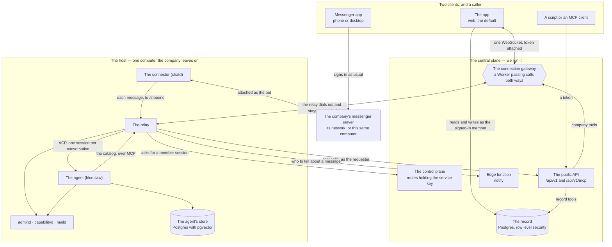
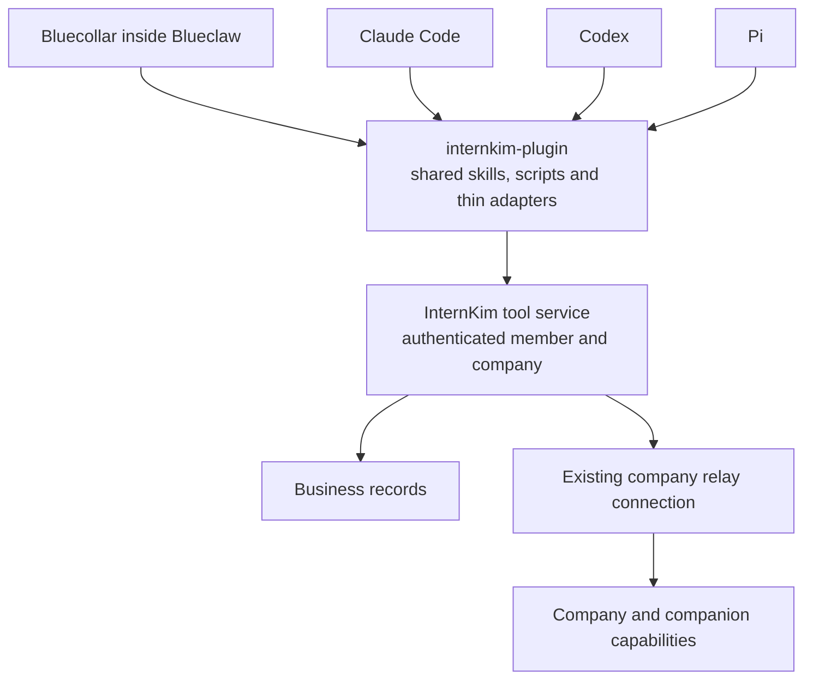

Two machines. One holds what must survive any computer, the other runs the
agent and holds what only makes sense on that machine.



Every arrow leaving the host points outward. None points in.

## One plugin across harnesses

This section defines the shared-plugin design contract. Release compatibility
is established by the verification and publication gates below; the diagram
above describes the deployed topology.

`internkim-plugin` is the shared client package for Bluecollar, Claude Code,
Codex, and Pi. InternKim's own agent consumes the same versioned skills,
scripts, assets, and service contracts that an external harness installs.
An external harness can use the service while Bluecollar is stopped.



### Ownership

| Layer | Responsibility |
| --- | --- |
| InternKim service | Canonical tool schemas, business behavior, authorization, durable approvals, operation state and effect receipts |
| Plugin | Shared skills, scripts, assets, connection metadata and a common client |
| Harness adapter | Installation, skill path binding, credential-store integration and tool/result presentation |
| Harness | Model calls, reasoning, tool selection, context and execution-loop decisions |
| Blueclaw host | Execution identity and isolation for work inside the managed host |

The service authors each business-tool contract once. Adapters translate
connection and presentation details without copying business logic or skill
bodies. Native MCP connections and extension-backed clients use the same
contract. MCP carries business-tool calls; ACP is the separate session
boundary for an agent joining the messenger. Using the plugin alone requires
no ACP session.

The same member, company, plugin version and available execution resources
must provide the same business capabilities and authorization behavior.
Model quality and local environments may differ. Installing the plugin does
not expose Blueclaw's private workspace or raw terminal to an external agent.
Standalone artifact skills use the external harness's local environment;
managed host execution keeps the requester's POSIX identity. Missing local
dependencies or companion capabilities are reported explicitly.

### Connection and execution

These examples are pseudocode for the proposed contract. They do not define
released endpoints or promise that every harness can register tools during
a turn. What is released, and on which harness versions, is in "Released
behavior" below.

```text
function attachPlugin(adapter, package, account):
    package.verifyRelease()
    session = connect(package.server, account.credentialReference)
    requireSupportedContract(session, package.supportedVersions)
    adapter.installSkills(package.skillRoot)
    adapter.exposeDiscovery(session.catalogSummaries())

function invoke(session, toolID, arguments, operationKey):
    descriptor = session.describeExact(toolID)
    validatedArguments = descriptor.inputSchema.validate(arguments)
    return session.call(descriptor.id, validatedArguments, operationKey)
```

The model selects relevant capabilities from a compact catalog. Detailed
schemas are loaded when needed. An adapter without dynamic registration uses
its supported refresh boundary or the shared client's validated invocation
path. Discovery, schema size and invocation errors count toward the measured
cost of that choice.

The service derives the actor from authentication and checks current company
membership. Credentials stay in the client's credential store. A model's
arguments cannot select a more privileged execution identity.

```text
function submit(connection, request):
    actor = authenticateAndResolveMember(connection)
    descriptor = catalog.resolveExact(request.toolID)
    arguments = descriptor.inputSchema.validate(request.arguments)
    authorize(actor, descriptor, arguments)
    operation = claimDurably(actor, request.operationKey, descriptor, arguments)
    if operation.alreadyExists:
        return operation.currentResult()
    if requiresApproval(actor, descriptor, arguments):
        return holdForAuthenticatedApproval(operation)
    return dispatchDurably(operation)
```

An operation key stays stable across transport retries; reuse with different
arguments is rejected. Approval binds to the actor, company, operation,
arguments and expiry. Reconnection resumes the recorded operation and checks
authorization again. A timeout after an external effect requires downstream
idempotency or reconciliation before retrying. Cancellation reports effects
already committed. Scheduled business work survives a harness disconnect.

Results retain structured records, images and authorized artifact references.
The service records what changed, and the harness explains those receipts to
the user. Flattening an image or artifact into a success sentence loses a
capability and fails parity.

### Bluecollar's identity and Pi's mechanics

Preserve Bluecollar's understanding of work, continuity across follow-ups,
outcome judgment and recovery behavior. Generic tool names, argument shapes,
file editing, shell sessions and execution plumbing can follow Pi directly.
Reuse or adapt Pi where appropriate, retaining its license and attribution.

Start from a pinned Pi revision and record a reuse, adaptation or retention
decision for each generic component. A divergence needs a product, execution
boundary, compatibility or measured performance reason. Existing tool
spellings, action envelopes and prompt boilerplate are not product identity
simply because Bluecollar already has them.

### Verification and publication

Run the same business scenarios through Bluecollar, Claude Code, Codex and
Pi using one plugin release. Include installation, authentication, approvals,
reconnects, cancellation, tenant isolation and artifact delivery. Prove
external use with Bluecollar stopped. Compare matched model configurations
where supported and label other combinations as product comparisons.

Adoption requires preserved capabilities and measured success rate, cost per
successful task, context size and completion latency. Publish the supported
version matrix and evidence with the release. Deploy service compatibility
before updating clients, retain a documented compatibility window, and
verify the running versions. Keep this English page and its Korean
counterpart aligned with the released behavior and remaining design work.

### Released behavior

The sections above are the target. This is what has shipped as of internkim
`b3b1406e3` (device release `20260918T165525Z-b3b1406e3656`, plugin
`c1e156b`, Blueclaw `f41ae448`).

- The plugin is a plain Agent Plugins 1.0.0 checkout: `plugin.json`,
  `mcp.json` naming `https://api.intern.kim/v1/mcp`, and `skills/`. There is
  no harness adapter; each client loads that layout its own way, and the
  recipes are in the plugin's README.
- The schedule tools (`schedule_list`, `schedule_create`, `schedule_update`,
  `schedule_cancel`) are defined once in the catalog and answered on the
  company machine; Bluecollar carries no native copies. The public server
  serves the catalog of the web deployment it runs, so a client sees these
  four once that deployment carries `b3b1406e3`.
- Registering tools during a turn, the durable approval envelope and the
  service receipts of "Connection and execution" are contract text, not
  released endpoints.
- The measurement program has a runner (`web/tests/pilot`, internkim#1842)
  and one pilot behind it (2026-09-19, ten record-answered tasks, three
  repetitions, every arm on `z-ai/glm-5.3-flash`, judged by reading the record
  afterwards). The Pi-shaped kernel (seven model-facing tools and the whole
  catalog delivered at once) kept the pass rate and cost 2.6 times the prompt
  tokens per call, because a turn then carries 112 tool definitions where the
  current shortlist carries 25, so the gate rejected it and the kernel keeps
  its eleven model-facing tools. The thirty-task program that would make the
  gate final is still open (internkim#1832).

| Arm | Passed | Median prompt tokens per call | Cost per passed task |
| --- | --- | --- | --- |
| Bluecollar, current kernel | 24/29 | 19,550 | $0.0058 |
| Bluecollar, Pi-shaped kernel | 14/15 | 50,845 | $0.0136 |
| Claude Code 2.1.277 with the plugin | 30/30 | 50,945 | $0.0140 |

Bluecollar's misses are the intake asking a question the other harness did
not need (three) and one event written in UTC because the box reads the
company time zone from its own workspace setting (internkim#1840). The
missing repetitions are runs the fleet's intake never started while a router
call waited on a stalled provider stream (internkim#1821).

| Harness | Version tested | Loads the plugin through | Status |
| --- | --- | --- | --- |
| Bluecollar (inside Blueclaw) | `f41ae448` | capabilityd, the same catalog | verified on Local Fleet and on the device (internkim#1819) |
| Claude Code | 2.1.276 | the marketplace entry in the internkim repository | verified end to end (internkim#1823) |
| Codex | 0.154.0 | reads the root layout natively | recipe published; not exercised against the service |
| Pi | 0.83.0 | `pi-agent-plugins` and `pi-mcp-adapter` | recipe published; not exercised against the service |

## The central side

Five things, deployed by us.

| | What it is | Where it lives |
|---|---|---|
| the record | Postgres behind row level security | `supabase/migrations` |
| the control plane | server routes holding the service key | `web/src/routes/api/agent/` |
| the app | a SvelteKit build on Cloudflare Pages, serving the pages people sign into | `web/` |
| the public API | server routes in the same build, answering tokens and MCP clients | `web/src/routes/api/v1/` |
| the connection gateway | a Worker with one Durable Object per company, carrying browser calls and API calls alike | `workers/connection-gateway/` |

**The record** answers every read and write as some member, never as an
administrator. Which rows a session sees is decided by the database itself.
The tables are listed in [What lives where](/docs/what-lives-where).

**The control plane** exists for what a member cannot do alone. Its callers
authenticate with a company's agent key, and what it hands back is a session:
`POST /api/agent/session` turns an identity the company knows into a member
session, `POST /api/agent/host-session` signs the company's computer in as
itself. Sibling routes under the same directory let that signed-in host read
the credentials it needs per call (`/api/agent/messenger-credential`,
`/api/agent/mail-account`). The service key never leaves these routes.
Notifications are sent by the project's own edge functions
(`supabase/functions/`), so the key that reads every member's devices stays
inside the company's Supabase.

**The app** decides at runtime which Supabase project it talks to:
`hooks.server.ts` injects the values into the `#central-plane` element, so one
build serves every company. The pages hold no secret; the API routes under
`/api/` do, which is why they run on the server. Everyone signs in at one
address; every other hostname on the zone answers `308` to it, except paths
under `/api/` and `/v1/`, which are answered where they land because a
cross-origin redirect would drop the caller's bearer token. That exception is
what lets `api.<zone>/v1` and a company host's own `/api/v1` be the same API.

**The public API** is where the tool catalog lives. Every tool is defined once,
in `web/src/lib/server/public-api/catalog/`, and each definition names who
answers it:

| `answeredBy` | Who runs it | Examples |
|---|---|---|
| `record` | the app itself, against the record, as the calling member | tasks, the calendar, people, leave, attendance, CRM |
| `company` | the company's computer, reached through the gateway | messages, mail, sites, web search, reading a document |
| `local` | only the agent's own machine; the API refuses it | the browser, model calls, embeddings |

`/api/v1/mcp` serves the same catalog to any MCP client, and it is also how the
agent itself reaches its tools, as the sections below show. The
[catalog](/docs/tools/catalog) lists every tool.

**The connection gateway** is how a browser and the host reach each other when
neither accepts a connection. The browser opens a WebSocket to
`/company/<id>/client` carrying its Supabase session token; the Worker
verifies the token against the project's JWKS, resolves which member is
calling, and hands the socket to that company's Durable Object
(`CompanyConnectionObject`). The host's relay dials `/company/<id>/server`
from its side and stays connected, authenticated by a server key the Durable
Object stores. The object forwards calls one way and answers the other, pushes
`message.arrived` to open chat screens when the relay reports a new message,
and tells browsers whether the company's computer is currently connected at
all.

## The processes on the host

`host/entrypoint.sh` starts these, in the order
[Running the host](/docs/running-the-host) explains.

| Process | Answers on | Job | Code |
|---|---|---|---|
| the relay (`internkim-relay`) | outbound only; `127.0.0.1:18091` for the connector | answers the app's calls, turns messages into agent turns, serves the agent its tools | `host/relay/` |
| the connector (`chatd`) | `127.0.0.1:18090` | the messenger adapter: Buzz or Mattermost | `.dependency/blueclaw/chatd/` |
| the agent (`blueclaw`) | `/run/internkim/blueclaw-acp.sock`; admin API on `127.0.0.1:8080` | the ACP agent: runs, approval, the task ledger, memory | `.dependency/blueclaw/` |
| `internkim-capabilityd` | `/run/internkim/capability.sock` | holds provider credentials: model calls, embeddings, the mail, site, web and browser tools | `cmd/internkim-capabilityd/`, `internal/capabilityd/` |
| Moli (`moli serve`), one per requester | `127.0.0.1:9230` and up | the device browser for plain public-text navigation when no companion is available; capabilityd starts each person's on first use, with their own profile, and stops it when idle | `internal/browser/device_browsers.go` |
| `internkim-admind` | `127.0.0.1:18080`, `/run/internkim/admind.sock` | the workspace screens, the roster, and the company tools the plane carries to the host | `cmd/internkim-admind/`, `internal/admind/` |
| `internkim-maild` | `127.0.0.1:18092` | answers mail for whichever account a call carries | `cmd/internkim-maild/` |
| the agent's store | `DATABASE_URL` | Postgres holding conversations, runs, memory, policy | — |

## What the agent is made of

blueclaw is one process built from separate repositories, each with one job:

| | Job | Where |
|---|---|---|
| [blueclaw](https://github.com/yeomyeonggeori/blueclaw) | the agent host: identity, the approval gate, the task ledger, the ACP agent the relay talks to | `.dependency/blueclaw/` |
| [bluecollar](https://github.com/yeomyeonggeori/bluecollar) | the agent loop and the model client, running in-process | `.dependency/blueclaw/.dependency/bluecollar/` |
| [bluememo](https://github.com/yeomyeonggeori/bluememo) | long-term memory: facts extracted from finished work, scoped by owner and circle | `.dependency/blueclaw/.dependency/bluememo/` |
| internkim-plugin | the skills the agent loads for a kind of work | `.dependency/internkim-plugin/` |

**Memory** is one Postgres fact store. When a run finishes, bluememo has a
model extract atomic facts from it; a newer fact supersedes an older one, a
repeated fact reinforces one, and a person can ask the agent to forget one.
Each fact has an owner and the circles it is shared with, and recall returns
only what the reader may see. Search fuses pgvector similarity with word
similarity, which is why the host's Postgres carries the `vector` extension;
without it the store still answers, lexically.

**Models** are named in one place, `internal/modelladder`. The agent asks for a
tier, and capabilityd holds the key and makes the call, so the agent never sees
a provider token.

## How the chat screen gets answered

The app reads and writes the record directly as whoever signed in, so
attendance, leave, the calendar, work and the org chart never touch the host.
The screens that show what only the host knows go through the gateway: the
messenger, mail, the agent's runs and the approvals they wait on, its memory,
its files, and the skills it loaded.

1. The browser sends `{ kind: "call", capability, body }` down its gateway
   socket. The token was verified when the socket opened; nothing in the body
   is trusted to say who is asking.
2. The Durable Object forwards the call to the relay's standing connection,
   stamped with the calling member's ID.
3. The relay serves it and answers on the same socket, and the object routes
   the answer back to the browser that asked.

What "serves it" means depends on the capability, and each branch is in
`host/relay/forward.ts`:

- **Messenger operations** are forwarded to the connector at
  `/v1/platform/<platform>/<capability>`. First the relay fetches that
  member's own messenger credential from the control plane and attaches it as
  the `actor`, so the messenger sees the member's own account doing the thing.
  A member who has connected no account gets a `409`, and
  `person.credential.issue` is the call that connects one.
- **Mail** (`person.mail.*`) goes to `internkim-maild` with the member's mail
  account fetched per call, so no mail password is at rest on the box.
- **Workspace views** (`person.memory.*`, `person.files.*`, `person.runs.*`,
  `person.skills.*`, `person.persona.*` and their siblings) and the public
  API's company tools (`person.api.request`, `person.api.file`) are forwarded
  to `admind` over its unix socket.
- **Link previews** (`asset.link`) the relay builds itself, storing the
  preview image in Supabase Storage so the answer stays small.

An answer larger than the byte ceiling is refused with a `413` naming the
size, because the transport would otherwise drop it silently; the ceiling and
its default are in [Running the host](/docs/running-the-host#how-big-an-answer-may-be).

## How a message becomes work

The connector attaches to the messenger as the company's bot member, through
the adapter matching `MESSENGER_PLATFORM`
(`.dependency/blueclaw/chatd/src/adapters/`), and normalizes each arriving
message. From there the relay carries it:

1. chatd posts the event to the relay's `/inbound` on `127.0.0.1:18091`. The
   relay writes it under `RELAY_STATE_DIR` and answers `202` only once it is on
   disk; chatd retries until it gets that answer, so a message survives either
   process restarting.
2. The relay opens one ACP session per conversation on
   `/run/internkim/blueclaw-acp.sock` and sends the message as a prompt. The
   session names who is asking and where to reply, and it names the relay's
   own `/mcp/<ticket>` as the agent's tool server.
3. blueclaw runs the turn. Every tool call it makes to that address, the relay
   forwards to the app's `/api/v1/mcp` as the requester, with a member session
   it minted for them, so the agent never holds the bearer.
4. The reply comes back over ACP, and the relay posts it to the conversation
   through the connector.

**Approval** travels the same way. When the gate holds a call, blueclaw asks
the relay over ACP, the relay posts the question into the conversation, and
the requester's next message there is the answer. blueclaw decides what those
words mean, and anything it cannot read as a yes declines. The relay keeps the
open question on disk beside the inbound queue, so a restart on either side
asks nothing twice and loses nothing.

The agent behaves identically whichever client the person typed in.

Separately, the messenger server reports every message it accepts to the
relay on the same loopback port. The relay resolves who was addressed and asks
the `notify` edge function to reach them, which arrives as a web push wherever
those members registered a device. It also tells the gateway, so open chat
screens fetch the new message.

## How someone in the messenger becomes someone in the record

A person who has never opened the app still has a row in the record. Whatever
acts for them on the host proves the company with its key, names the identity
that spoke, and receives a session for that member.

```
POST /api/agent/session
Authorization: Bearer <the company's agent key>

{ "kind": "email", "externalID": "…" }
```

The relay asks when it opens a tool server for a requester, and again five
minutes before that session expires. The control plane refuses an identity
nobody claims, and refuses a member whose company is not the one that key
belongs to. What comes back is an ordinary member session, so everything the
agent does in the record is bounded by that person's own permissions.

## Where the messenger server runs

The diagram puts it outside the host, which is one of three places it can be.

| | Who can reach it directly |
|---|---|
| A vendor's cloud | anyone, from anywhere |
| Your own installation on your network | people on that network or its VPN |
| The host computer itself | people on that network, and nobody else |

The last row is ordinary. A company that runs its own Buzz relay
often runs it on the machine already kept awake for the agent, and the
connector reaches it over loopback; `host/buzz/` is a compose file that brings
the Buzz stack up exactly there. Because the chat screen always goes through
the relay, one screen works wherever the messenger lives, and the
conversation is never written centrally: the relay sends back only the answer
to the call it was asked.

## Why the host has no inbound port

Exposing a company's computer means a tunnel, a certificate, a hostname, and
a new way in. Instead both the browser and the host connect outward to the
gateway, which passes calls between them. Your firewall stays as it was.

The host proves this about itself with one command:

```bash
ss -ltnp | grep -v '127.0.0.1\|::1'    # prints nothing
```

Administering the machine is a separate question with a separate answer. On
the same network, `ssh` reaches it and nothing else is needed. From
elsewhere, put whatever you already use in your own `~/.ssh/config`:

```
Host my-company-host
  ProxyCommand cloudflared access ssh --hostname %h
```

A Cloudflare Tunnel is one convenient answer, and the one we use while
developing. Tailscale, a jump host and WireGuard are others. internkim
installs none of them, asks for none of them, and cannot tell which you
chose: the choice is yours and it stays outside the product.
