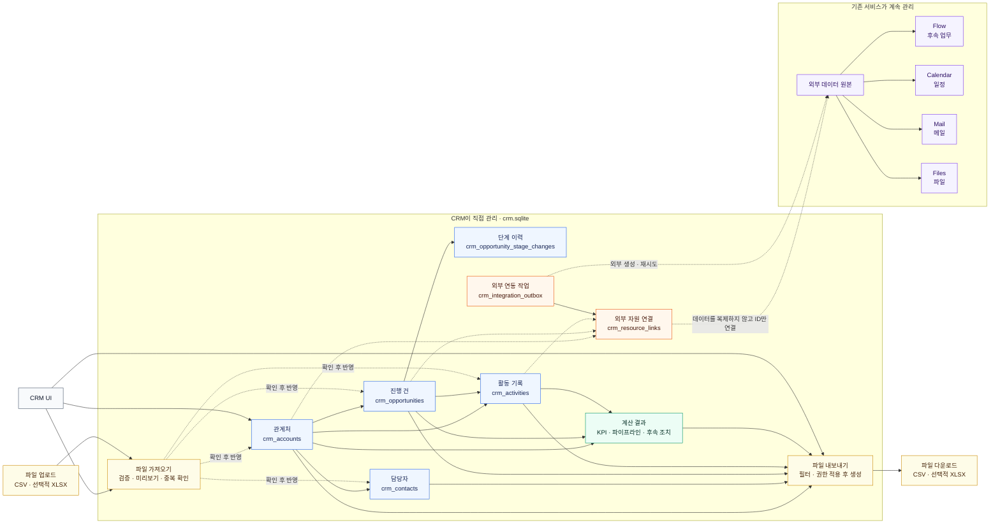

# CRM 백엔드 구조 제안

CRM은 관계처·담당자·진행 건·활동을 직접 관리한다. Flow·Calendar·Mail·Files는
기존 서비스를 원본으로 유지하고 CRM에는 외부 자원 ID와 연결 관계만 저장한다.

## 핵심 방향

- CRM 전용 데이터는 별도 `crm.sqlite`에 저장한다.
- 후속 업무와 일정은 각각 Flow와 Calendar가 원본을 유지한다.
- 외부 서비스 생성과 재시도는 outbox가 관리한다.
- KPI와 리포트는 CRM 원본 데이터에서 계산하며 집계값을 원본으로 저장하지 않는다.

## 기능 요건

| 영역 | 필요한 기능 |
|---|---|
| 관계 관리 | 관계처와 담당자를 등록·수정·보관한다. |
| 파이프라인 | 진행 건을 생성하고 단계 이동 이력을 보존한다. |
| 활동 | 미팅, 메일, 통화, 메모, 파일 관련 활동을 기록한다. |
| 외부 연결 | Flow 후속 업무와 Calendar 일정 등을 외부 ID로 연결한다. |
| 리포트 | KPI, 파이프라인, 담당자별 현황과 후속 조치 현황을 계산한다. |
| 파일 입출력 | CSV 등의 데이터를 가져오고 CRM 목록과 리포트를 내보낸다. |

## 외부 연동

| 구분 | 역할 |
|---|---|
| 외부 연동 작업 | Flow 업무나 Calendar 일정을 생성해야 한다는 실행 요청이다. 실패 상태와 재시도를 관리한다. |
| 외부 자원 연결 | 외부 생성이 끝난 뒤 CRM 레코드와 실제 외부 ID의 관계를 보존한다. |

외부 서비스 호출이 실패해도 CRM 원본 데이터는 유지한다. 실제 외부 자원이
생성되지 않았다면 외부 자원 연결은 만들지 않고 연동 작업에서 재시도한다.

## 파일 가져오기

- CSV를 기본 형식으로 지원한다.
- 파일 형식, 필수 값, 컬럼 매핑을 검증한다.
- 중복 관계처와 담당자 후보를 표시한다.
- 저장 예정 결과를 미리 보여준다.
- 오류가 있는 행을 포함한 파일의 전체 반영 여부는 정책으로 결정한다.

## 파일 내보내기

- 현재 필터 결과 또는 전체 데이터를 선택할 수 있다.
- 관계처, 담당자, 진행 건, 활동, 리포트를 구분해 내보낸다.
- 현재 사용자의 조회 권한이 적용된 데이터만 포함한다.

## CRM v1 범위

### 포함

- 관계처·담당자 관리.
- 진행 건과 파이프라인 단계 관리.
- 활동 기록.
- Flow 후속 업무와 Calendar 일정 연결.
- 기본 KPI와 리포트.
- CSV 가져오기와 내보내기.

### 제외

- 외부 고객용 포털.
- CRM 자체 업무 시스템.
- 외부 서비스 데이터 복제.
- 복잡한 팀별·레코드별 접근 제어.
- Mail·Files 자동 수집.
- AI 기반 무검토 자동 저장.
