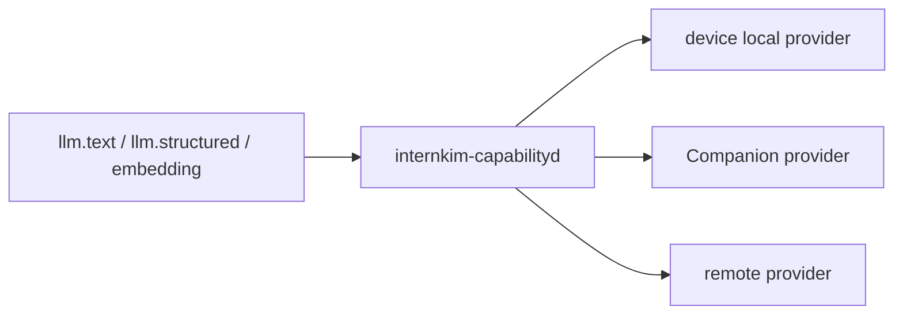

# 김인턴 현재 기술적 장점

김인턴의 강점은 단순히 LLM을 붙인 자동화가 아니라, 여러 사용자가 실제 업무 데이터를 맡겨도 사고 범위를 작게 유지하도록 런타임 경계를 분리한 데 있다. 현재 구조는 데이터 무결성, 사용자 격리, 비밀값 격리, 로컬 자원 보호, 감사 가능한 실행 흐름을 각각 별도 계층에서 처리한다.

또한 김인턴은 기술 사용자가 직접 tool과 workflow를 조립해야 하는 agent라기보다, 일반 직원과 AI가 함께 쓰는 first-party 업무 도구를 appliance 안에 묶는 방향이다. 현재 진입점은 Mattermost이고, 근태, 메일, 일정, 업무 관리는 같은 권한/승인/기록 구조 위에 올라가는 업무 운영 capability로 설계되어 있다.

## 보안 경계 요약

| 경계 | LLM/agent가 직접 보지 않는 것 | 실제 담당 계층 |
|---|---|---|
| 사용자 권한 경계 | 다른 사람의 private workspace, service-owned internal path | requester POSIX identity와 Blueclaw workspace actor |
| 비밀값 경계 | provider token, platform token, Google credential, local model path | `internkim-capabilityd`, `internkim-admind`, Google helper |
| 로컬 컴퓨터 경계 | local absolute path, browser cookie, local profile path, sensitive login step | `internkim-companion` |
| 산출물 경계 | 임시 파일이나 내부 path를 완료 증거로 사용 | `file_deliver` 기반 artifact flow |
| LLM 운영 연속성 경계 | remote provider만 유일한 실행 경로로 고정 | `internkim-capabilityd` local/companion/remote provider routing |
| 업무 운영 경계 | 근태, 메일, 일정, 업무 관리를 각기 다른 SaaS 권한 모델에 흩어두기 | Mattermost와 Blueclaw task/capability/event model |

## 1. Fleet scale-up으로 데이터 무결성, 처리 성능, 안정성을 함께 높임

김인턴은 단일 기기 appliance로 시작할 수 있지만, `internal/fleet`에는 3대 이상 기기 구성을 위한 무결성 모델이 들어 있다. 핵심은 활성 노드 수를 홀수 투표군으로 유지하고, ledger commit에는 과반 quorum을 요구하는 것이다.

기술적으로 이 구조는 단순히 "기기를 여러 대 붙일 수 있다"가 아니다. 기기를 늘릴수록 더 많은 요청을 처리할 여지를 만들고, 특정 기기 장애 시 서비스 중단 위험을 낮추며, 작업 상태를 일관되게 확정하기 위한 기반을 제공한다. 제품 관점에서는 고객사의 사용량과 중요도가 커질수록 appliance 공급을 늘릴 수 있는 scale-up 모델과도 연결된다.

정확히 말하면 이 부분은 현재 `internal/fleet`에 코드화된 topology, ledger, workspace bundle 모델과 단위 테스트 기준의 보장이다. 완성된 Raft/Paxos 계열 consensus store나 운영 중인 multi-master replication engine이라고 표현하면 과장이다.

현재 구현된 보장은 다음과 같다.

- 첫 번째 기기는 active 상태로 시작한다.
- 두 번째 기기는 바로 active로 올리지 않고 pending으로 둔다.
- 세 번째 기기가 들어오면 pending 두 대를 함께 active로 승격해 3대 active fleet을 만든다.
- 네 번째 기기도 pending으로 유지하고, 다섯 번째 기기가 들어와야 5대 active fleet으로 승격한다.
- active 노드 과반이 확인되지 않으면 ledger entry를 commit하지 않는다.
- active 노드를 그냥 제거해 짝수 투표군으로 만드는 동작은 막고, standalone reset 같은 명시적 복구 경로를 요구한다.
- 작업 소유자는 rendezvous hashing으로 결정해 같은 key는 안정적으로 같은 active node에 배정된다.

이 구조의 장점은 split-brain과 중복 실행 위험을 초기에 줄인다는 점이다. 특히 `job.reserved`, `outbox.reserved`, `outbox.sent`, `workspace.published` 같은 ledger entry는 과반이 없으면 기록되지 않으므로, 네트워크가 갈라졌을 때 소수 파티션이 독자적으로 작업을 확정하기 어렵다. 즉 fleet은 데이터 무결성과 서비스 안정성을 높이는 장치이며, 향후 처리 성능 확장과 appliance 공급 확장까지 염두에 둔 기반이다.

Workspace 변경도 내용 기반 bundle로 다룬다. 변경 목록은 path 정규화와 정렬을 거쳐 content hash를 만들고, bundle ID는 그 hash에서 나온다. 같은 변경은 같은 bundle ID가 되므로 재시도와 비교가 쉽고, workspace path는 성격에 따라 일반 content, append log, sealed snapshot, ephemeral, runtime cache로 분류된다. 즉 동기화할 데이터와 버릴 데이터를 런타임이 구분할 수 있다.

## 2. POSIX 권한 기반 사용자 분리

김인턴의 Blueclaw workspace 경계는 prompt 규칙이나 애플리케이션 레벨 체크에만 기대지 않는다. 최종 접근 제어는 Linux user, group, POSIX permission으로 닫는다.

구조는 다음과 같다.

- Blueclaw service는 `blueclaw` 사용자로 실행되며 orchestration, policy, task state, path validation, event logging을 맡는다.
- 사용자에게 보이는 파일 I/O와 process 실행은 service user가 직접 하지 않고 `WorkspaceActor`로 내려보낸다.
- `WorkspaceActor`는 `blueclaw-posix-helper`를 통해 requester 또는 task actor의 UID/GID/supplementary groups로 전환한다.
- 사람은 `bc_person_<shortID>` 사용자로, circle은 `bc_circle_<circleID>` 그룹으로 투영된다.
- 개인 workspace와 circle workspace는 Linux ownership과 mode가 최종 경계다.
- admin 사용자도 raw terminal에서는 기본 task actor 권한만 갖고, admin-only 접근은 built-in capability나 tool 경계에서만 처리한다.

이 설계의 실질적 장점은 LLM이 실수로 다른 사람의 파일 경로를 추측하거나, shell 명령이 넓은 권한으로 실행되는 문제를 운영체제 수준에서 막는다는 점이다. 애플리케이션 로직이 한 번 잘못 판단하더라도, requester identity로 전환된 뒤 POSIX가 최종 allow/deny를 결정한다.

Workspace 경로도 사용자에게 concrete POSIX path를 직접 노출하지 않는다. 모델은 `home/<path>`, `tmp/<slug>`, `artifacts/<slug>` 같은 virtual path를 사용하고, 내부의 `/workspace/private/people/<personID>` 구조는 런타임이 관리한다. 이 덕분에 파일 생성, 빌드, 승격, 첨부 흐름이 명확해지고 다른 사람의 private path를 직접 다루는 일이 줄어든다.

## 3. 비밀값을 격리하고 proxy/capability만 LLM에 노출

김인턴은 provider token, platform token, 브라우저 쿠키, 사용자 로컬 파일 경로, local model path를 Blueclaw와 LLM에 직접 넘기지 않는다. 비밀값은 `/root/.internkim/secrets`, `/root/.internkim/config`, `/root/.internkim/state`에 집중 보관하고, 해당 비밀값이 필요한 프로세스만 읽도록 나눈다.

대표적인 분리는 다음과 같다.

- OpenRouter API key는 `internkim-capabilityd`가 읽고, Blueclaw는 LLM 요청 capability만 호출한다.
- 현재 운영 채널인 Mattermost token은 `internkim-capabilityd`가 보유하고, Blueclaw는 platform reply/send 같은 typed capability를 호출한다. Slack Socket Mode와 Signal JSON-RPC sidecar도 같은 product-layer 경계로 붙는 선택 채널이다.
- Google service account와 Apps Script webhook은 `gws`, `gws-bot`, helper 경로가 사용하고, agent runtime은 Google 비밀값 자체를 보지 않는다.
- Companion signing private key는 device state JSON에 두지 않고 사용자 컴퓨터의 secure storage에 둔다.
- 사용자 로컬 파일 선택은 Companion이 처리하고, 김인턴에는 device-local temporary path와 TTL만 전달된다.
- 브라우저 자동화는 Companion browser를 우선 사용하며, snapshot 결과에는 URL, title, text, interactive ref만 담는다.

이 구조는 "LLM에게 도구를 주되, 비밀값은 주지 않는다"는 원칙을 구현한다. LLM은 `calendar`, `mail`, `browser`, `file_pick`, `reply.send` 같은 typed capability를 호출할 수 있지만, 실제 credential과 local resource는 capability provider가 들고 있다. 따라서 prompt injection이 있어도 모델이 token 문자열을 읽어 외부로 복사하는 경로가 크게 줄어든다.

## 4. Agent runtime과 제품 appliance 경계가 분리됨

Blueclaw는 정책, task, ACL, prompt, skill 선택, memory, scheduler 같은 agent runtime을 담당하고, InternKim product layer는 device provisioning, Cloudflare, Mattermost, Google, OpenRouter, admin UI, fleet, packaging을 담당한다. Slack과 Signal 같은 외부 채널은 선택 connector로 같은 product layer 경계에 붙는다.

이 분리는 기술적으로 중요하다.

- Blueclaw는 provider-neutral capability protocol을 보고 무엇이 필요한지 결정한다.
- InternKim은 해당 capability를 어느 실행 위치에서 어떤 권한으로 수행할지 결정한다.
- Companion은 사용자 컴퓨터의 브라우저, 파일 선택, 입력, 승인, 향후 local-only model capability를 담당한다.
- 제품별 credential과 배포 코드는 Blueclaw OSS runtime에 들어가지 않는다.

결과적으로 김인턴은 appliance 제품으로는 깊게 통합되어 있으면서도, agent runtime 자체는 더 깨끗한 OSS 경계를 유지할 수 있다. 장기적으로 다른 capability provider나 local-only 실행 경로를 붙이기 쉽고, 특정 vendor나 platform credential이 runtime core에 섞이는 일을 줄인다.

## 5. LLM 운영 연속성과 provider 장애 fallback

김인턴은 remote LLM provider만 바라보는 구조가 아니다. `internkim-capabilityd`의 LLM routing은 execution mode와 provider 설정에 따라 device local, Companion, remote provider를 선택할 수 있게 설계되어 있다.

현재 기술적 의미는 다음과 같다.

- OpenRouter 같은 remote provider는 품질 좋은 모델을 빠르게 쓰기 위한 경로다.
- device local model 경로는 provider 장애, 크레딧 소진, 네트워크 제약, local-only 정책에 대응하기 위한 경로다.
- Companion LLM 경로는 사용자 컴퓨터나 사내 워크스테이션의 로컬 모델 capability를 같은 계약으로 붙이기 위한 확장 지점이다.
- embedding은 local, Companion, remote provider를 자동 provider 후보로 다룰 수 있다.
- local-only mode에서는 remote execution을 막고 로컬/Companion 경로만 사용하도록 제한할 수 있다.

따라서 크레딧이 떨어지거나 provider 장애가 생겼을 때 전체 제품이 외부 API에만 묶이는 구조를 피할 수 있다. 고품질 작업은 remote 모델을 쓰고, 운영 연속성이 중요하거나 민감도가 높은 작업은 local model로 보내는 식의 운영 전략을 세울 수 있다. 향후 고성능 Companion host를 로컬 모델 노드로 쓰면 외부 LLM provider 없이 내부망에서 동작하는 local-only 구성도 가능하다.

## 6. First-party 업무 운영 도구와 portable-first 실행

김인턴은 Google Workspace나 특정 SaaS를 기본 전제로 두지 않는다. 문서, 시트, 슬라이드, 일정, 이메일은 먼저 인증 없는 portable artifact로 만들고, 사용자가 원할 때만 Google import, publish, sync 같은 선택 단계를 실행한다.

이 방향은 first-party 업무 도구 패키지와도 연결된다. 기술 이해도가 높은 사용자가 원하는 외부 tool을 직접 조립하는 모델이 아니라, 일반 직원이 Mattermost에서 AI와 함께 근태, 메일, 일정, 업무 관리, 문서 작업을 바로 시작할 수 있는 기본 capability를 제공하는 방향이다.

기본 방향은 다음과 같다.

- 근태는 `attendance_event`와 quick clock-in/out capability로 분리한다.
- 업무 관리는 `task`, `task_assignee`, `task_event` 기반으로 상태와 담당자를 기록한다.
- 일정은 ICS/CalDAV first, Google Calendar는 optional sync target이다.
- 문서는 DOCX, PDF, HTML, Markdown first, Google Docs는 optional import target이다.
- 시트는 XLSX, CSV first, Google Sheets는 optional import target이다.
- 슬라이드는 `DESIGN.md`와 HTML/PPTX/PDF first, Google Slides는 optional import target이다.
- 이메일은 `.eml` 또는 draft text first, 실제 발송은 preview와 승인 후 provider bridge로 처리한다.

이 설계의 장점은 외부 계정 인증이 없어도 기본 업무를 시작할 수 있고, 외부 공유나 발송 같은 irreversible action은 capability 단위 승인 정책으로 묶을 수 있다는 점이다. 특히 이메일 발송, 외부 공유, Google import/publish, 파일 이동/삭제, 브라우저 제출, 터미널 write 명령은 승인 없이 실행하지 않는 방향으로 정리되어 있다.

따라서 김인턴의 업무 기능은 흩어진 SaaS를 단순히 대신 호출하는 것이 아니라, Mattermost, Blueclaw task/event model, capability provider를 같은 권한/승인/기록 구조로 묶는 방식에 가깝다. Slack과 Signal connector 경로도 같은 경계 위에 있으며, 고객 검증의 기본 surface는 Mattermost다.

## 7. 직원 PC를 통째로 열지 않고 연결하는 Companion 구조

Companion은 사용자의 로컬 컴퓨터를 trusted runtime으로 다루지만, 그 신뢰를 device나 LLM에 그대로 확장하지 않는다. 기술적 목적은 로컬 파일과 브라우저라는 강력한 업무 접점을 쓰면서도, 직원 PC 전체를 agent에게 열어주는 인상을 만들지 않는 것이다.

현재 Companion 경계의 강점은 다음과 같다.

- 사용자의 로컬 파일 경로를 김인턴과 Blueclaw에 넘기지 않는다.
- 선택된 파일은 signed broker upload를 통해 device temporary directory로 복사되고, 응답에는 device-local temporary path와 TTL만 들어간다.
- 연결된 Companion은 inbound port를 열지 않고 device broker를 long-poll한다.
- 로그인, MFA, captcha, 민감 입력은 Companion browser handoff에서 사용자가 직접 처리한다.
- screenshot은 Companion browser에서만 허용하고, device fallback에서는 제한한다.
- browser observe 응답은 cookie, local profile path, CDP URL, local screenshot path를 노출하지 않는 계약을 갖는다.

이 구조 덕분에 김인턴은 로컬 브라우저와 파일이라는 강력한 자동화 지점을 활용하면서도, 사용자의 컴퓨터 경로와 세션 비밀값을 agent runtime 밖에 둘 수 있다. 사용자는 자기 PC의 통제권을 유지하고, 김인턴은 승인된 파일과 브라우저 작업의 제한된 결과만 이어받는다.

## 8. 감사 가능하고 복구 가능한 실행 흐름

김인턴은 작업을 바로 "완료"로 처리하지 않고, artifact와 event를 남기는 방식으로 설계되어 있다.

- Required artifact task는 `file_deliver` completion evidence가 있어야 완료로 인정한다.
- `tmp/<slug>`의 중간 파일, local path 문자열, markdown 링크, 내부 `/workspace/...` 경로 노출은 완료 증거가 아니다.
- 생성물은 `file_write -> terminal_run -> file_deliver` 흐름을 탄다.
- reset 명령은 Blueclaw task, raw event, conversation, memory mirror, Kuzu memory files, Mattermost post/reaction/thread 기록을 구분해서 정리한다.
- secrets, policy, platform account link는 기본 reset 대상에서 제외해 운영 상태를 보존한다.

이 장점은 운영 중 장애가 났을 때 중요하다. 어떤 작업이 어떤 actor 권한으로 실행됐고, 어떤 artifact가 최종 산출물로 전달됐는지 추적할 수 있으며, 테스트와 복구 시 지워야 할 데이터와 보존해야 할 데이터를 분리할 수 있다.

## 한 문장 요약

김인턴의 현재 기술적 장점은 LLM 자동화를 제품 기능으로 감싼 것이 아니라, fleet quorum, POSIX actor boundary, secret-bearing capability proxy, Companion local boundary, local/remote LLM routing, first-party 업무 capability, portable artifact pipeline을 조합해 실제 업무 환경에서 데이터와 권한을 잃지 않도록 만든 점이다.

## 근거가 되는 주요 위치

- `internal/fleet/topology.go`
- `internal/fleet/ledger.go`
- `internal/fleet/workspace_bundle.go`
- `internal/fleet/workspace_policy.go`
- `docs/architecture.md`
- `docs/blueclaw-oss-boundary.md`
- `docs/capability-expansion-design.md`
- `docs/skill-orchestration-design.md`
- `docs/schema/task.md`
- `docs/schema/task-assignee.md`
- `docs/schema/task-event.md`
- `docs/flows/user/track-attendance.md`
- `docs/flows/user/draft-email.md`
- `docs/flows/user/send-email-with-approval.md`
- `README.md`
- `assets/blueclaw-workspace/AGENTS.md`
