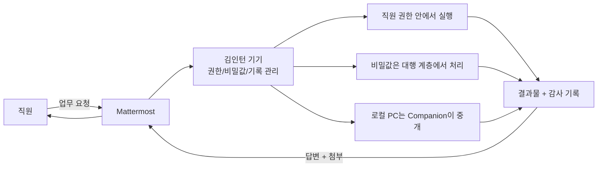
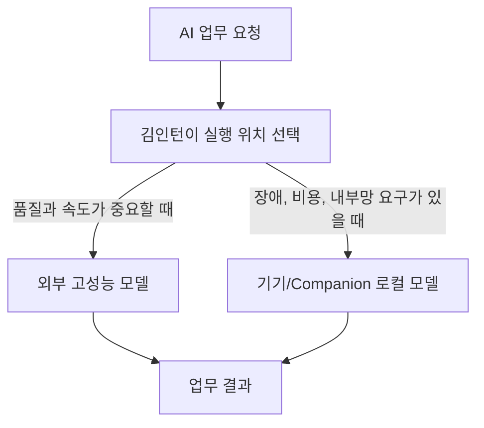

# 김인턴 투자자용 기술 포지셔닝

작성 기준일: 2026-06-25

## 핵심 메시지

김인턴은 “또 하나의 AI 챗봇”이 아니라, 회사 안에서 AI 직원이 일할 수 있는 안전한 업무 기기다.

지금은 Mattermost 기반 사내 업무 채널을 1차 진입점으로 잡고 있다. Mattermost를 고른 이유는 셀프호스팅이 가능하면서도 Slack에 가까운 범용성과 확장성을 갖고 있기 때문이다. 김인턴을 도입하면 AI agent뿐 아니라 추가 SaaS 비용 없이 사내 메신저 도입까지 함께 진행할 수 있다.

더 크게 보면 김인턴은 AI agent 단품이 아니라, 사내 메신저를 중심으로 근태, 메일, 일정, 업무 관리 같은 사내 운영 기능을 함께 묶는 업무 운영 패키지로 확장될 수 있다. 투자자에게는 이 점이 중요하다. 김인턴은 “AI 기능 하나”를 파는 것이 아니라, 회사가 매일 쓰는 업무 운영면을 appliance 안으로 가져오는 제품이다.

Slack, Signal connector 경로도 같은 구조 위에 있지만, 지금 단계에서 중요한 것은 채널 수를 많이 늘리는 것보다 회사 업무 데이터를 안전하게 맡길 수 있는 시작점을 증명하는 것이다.

OpenClaw와 Hermes Agent 같은 오픈소스 agent들은 이미 agent 시장의 방향을 잘 보여준다. 김인턴은 그 흐름과 경쟁만 하는 것이 아니라, 좋은 아이디어는 흡수하면서도 “기업이 실제로 agent를 도입할 때 제일 불안해하는 지점”을 먼저 푸는 제품이다.

그 불안은 단순하다.

- 이 AI가 우리 회사 파일을 어디까지 볼 수 있나?
- 직원별 권한은 어떻게 나뉘나?
- 비밀번호나 API 키를 AI가 직접 보게 되는 건 아닌가?
- LLM provider에 장애가 나거나 크레딧이 떨어져도 업무가 계속되는가?
- 누가 어떤 일을 시켰고 어떤 결과물이 남았는지 확인할 수 있나?
- 나중에 Slack이나 다른 채널을 붙여도 같은 안전장치를 유지할 수 있나?

김인턴의 시작점은 이 질문들에 답하는 것이다.

## 투자자에게 맞는 한 문장

김인턴은 사내 메신저에서 일을 시키면, 회사 기기 안에서 권한과 비밀값을 분리해 처리하고, 결과물과 기록을 남기는 업무용 AI appliance다.

## 현재 시작점

현재 김인턴은 Mattermost를 중심으로 시작한다. 이 선택은 좁아 보일 수 있지만, 초기 제품으로는 오히려 좋은 출발점이다.

Mattermost는 사내 설치형 협업 도구라서 다음을 검증하기 좋다.

- 셀프호스팅 가능한 사내 메신저 도입
- Slack과 유사한 채널, DM, 알림, 파일 첨부 경험
- 회사 내부 채널에서 AI에게 일을 맡기는 경험
- 사용자별 접근 권한과 초대 관리
- 업무 요청, 답변, 파일 첨부, 알림 흐름
- 근태, 메일, 일정, 업무 관리 같은 사내 운영 기능의 시작점
- 테스트 데이터와 운영 데이터를 구분해 정리하는 방식
- 사내 appliance와 메신저를 묶은 배포 모델

이 점은 초기 영업에서도 장점이다. 이미 Slack을 쓰는 회사에는 이후 채널 확장을 제시할 수 있고, 별도 사내 메신저가 없는 회사에는 김인턴 도입이 곧 사내 메신저, AI 직원, 기본 업무 운영 기능을 함께 도입하는 패키지가 된다.

Slack, Signal connector는 선택 경로로 붙어 있고, Google Chat 같은 채널은 이후 확장 대상이다. 중요한 것은 채널별 UI가 아니라, 채널이 늘어나도 같은 실행 경계와 감사 구조를 유지하는 것이다.

## 왜 OpenClaw나 Hermes Agent와 다르게 보아야 하나

OpenClaw는 많은 채널과 skill 생태계를 강점으로 한다. Hermes Agent는 기억, skill 학습, self-improvement 흐름을 강점으로 한다. 둘 다 agent 시장의 중요한 흐름이다.

김인턴은 지금 이 둘보다 더 많은 skill을 갖고 있다고 주장할 필요가 없다. 오히려 개발 중인 제품이기 때문에 OpenClaw와 Hermes Agent에서 흡수할 만한 장점은 적극적으로 흡수할 수 있다.

차별점은 다른 곳에 있다.

김인턴은 “AI agent를 회사 안에서 운영하려면 어떤 안전한 기본 구조가 필요한가”에서 출발한다. 즉 기능 경쟁보다 도입 장벽을 낮추는 운영 구조가 핵심이다.

또 하나의 차이는 사용자를 누구로 보느냐다. OpenClaw나 Hermes Agent 같은 agent는 기술 이해도가 높은 사용자가 원하는 tool, channel, workflow를 직접 붙여 강하게 커스터마이즈하는 쪽에 가깝다. 김인턴은 반대로 일반 직원과 AI가 함께 사용할 수 있는 first-party 업무 도구를 기본 패키지로 제공하는 쪽에 가깝다.

비유하면 Windows와 Mac의 차이에 가깝다. Windows는 사용자가 Office를 구독하거나 원하는 대체제를 직접 골라 설치하는 구조에 가깝고, Mac은 처음 열었을 때 기본 앱만으로도 문서, 메일, 일정 같은 일상 업무를 바로 시작할 수 있다는 기대가 있다. 김인턴은 후자에 가까운 제품 경험을 목표로 한다. 회사가 agent를 도입한 뒤 여러 외부 도구를 직접 조립하게 하는 것이 아니라, 사내 메신저, 근태, 메일, 일정, 업무 관리를 같은 권한과 기록 구조 안에서 바로 쓰게 만드는 방향이다.

| 질문 | OpenClaw/Hermes가 강한 지점 | 김인턴의 시작점 |
|---|---|---|
| 얼마나 많은 일을 할 수 있나 | 많은 skill, tool, channel, model 연결 | 초기에는 Mattermost 업무 흐름에 집중 |
| 얼마나 똑똑하게 발전하나 | memory, skill 학습, self-improvement | 좋은 패턴은 흡수 가능 |
| 누가 쉽게 쓸 수 있나 | 기술 이해도가 높은 사용자의 커스터마이즈 | 일반 직원과 AI가 함께 쓰는 first-party 업무 도구 |
| 회사가 안심하고 쓸 수 있나 | sandbox, approval, container 같은 일반 agent 보안 | 회사 기기, 사용자별 권한, 비밀값 분리, 감사 흐름을 제품 기본값으로 둠 |
| 어디서 실행되나 | 노트북, 서버, 클라우드 backend | 고객사 기기 appliance와 Companion |
| 첫 고객에게 줄 가치 | 범용 agent 사용성 | 사내 메신저, AI 직원, 기본 업무 운영 기능을 함께 도입 |

## 확실한 차별점

### 1. 회사 기기 안에서 운영된다

김인턴은 고객사 기기 안에 설치되는 appliance 구조다. AI 업무 실행 위치, 설정, 비밀값, 메신저 연결, 관리자 화면, 백업/복구를 한 경계 안에서 운영한다.

투자자에게 중요한 포인트는 “AI가 어디서 일하는지 알 수 있다”는 점이다. 기업은 막연한 cloud agent보다, 자기 조직 안의 관리 가능한 기기를 더 쉽게 이해하고 통제할 수 있다.

## 보안 경계를 쉽게 설명하면

김인턴의 보안 경계는 “AI를 믿는다”가 아니라 “AI가 직접 만질 수 있는 것을 줄인다”에 가깝다.

투자자에게는 아래 세 개의 문으로 설명하는 것이 가장 쉽다.

| 경계 | AI가 직접 하지 않는 것 | 대신 일어나는 일 | 고객 입장에서의 의미 |
|---|---|---|---|
| 직원 권한의 문 | 회사 전체 파일을 마음대로 읽고 쓰기 | 요청한 직원의 권한 안에서만 작업 | 직원별 자료 접근 범위를 유지 |
| 비밀값의 문 | API 키, 메신저 token, Google credential 직접 보기 | 별도 실행 계층이 credential을 들고 제한된 요청만 처리 | 비밀값 노출 위험 축소 |
| 로컬 컴퓨터의 문 | 사용자 PC 경로, 브라우저 쿠키, 로그인 세션 직접 보기 | Companion이 파일 선택과 로그인 단계를 중개 | 개인 컴퓨터를 통째로 agent에게 맡기지 않음 |

즉 김인턴은 AI에게 회사의 master key를 주는 구조가 아니다. AI는 “이 일을 해달라”고 요청하고, 실제 권한 확인과 실행은 회사 기기와 Companion 쪽의 더 좁은 경계에서 처리한다.

이 설명이 중요한 이유는 agent 보안이 단일 기능으로 해결되지 않기 때문이다. 샌드박스 하나, 승인 버튼 하나, 프롬프트 규칙 하나로는 부족하다. 김인턴은 직원 권한, 비밀값, 로컬 컴퓨터, 결과물 기록을 각각 다른 지점에서 나눠 막는다.

### 2. 운영 연속성과 비용 대응을 쉽게 설명하면

김인턴은 외부 LLM provider만 바라보는 구조로 설계하지 않았다. 평소에는 OpenRouter 같은 remote provider를 써서 좋은 모델을 빠르게 활용할 수 있지만, provider 장애, 크레딧 소진, 네트워크 문제, 비용 증가 상황에 대비해 기기 로컬 모델과 Companion 로컬 실행 경로로 내려갈 수 있는 구조를 둔다.

투자자에게는 이렇게 설명하면 된다.

| 상황 | 일반 cloud agent의 리스크 | 김인턴의 방향 |
|---|---|---|
| provider 장애 | 외부 provider 복구를 기다려야 함 | 고객 기기 안의 local inference 경로로 기본 업무 지속 |
| API 크레딧 소진 | 갑자기 업무가 멈추거나 모델 품질을 급히 낮춰야 함 | 기기 로컬 모델 또는 향후 Companion 로컬 모델로 fallback |
| 네트워크 제약 | 외부 API 호출이 느리거나 막힘 | appliance 내부 실행 경로로 최소 기능 유지 |
| 비용 증가 | 사용량이 늘수록 remote LLM 비용이 계속 증가 | 업무 성격에 따라 local/remote를 나눠 비용 제어 |
| 민감 업무 | 외부 모델 호출 자체가 부담 | local-only 모드와 로컬 모델 경로를 선택 가능 |

현재 기기 쪽에는 local model routing 경로가 있고, Companion은 브라우저/파일/승인 중심에서 출발해 향후 사용자 컴퓨터의 로컬 모델 실행까지 같은 capability 계약으로 확장하는 방향이다. 즉 김인턴은 “외부 provider가 흔들리면 같이 멈추는 agent”가 아니라, 안정성과 비용 조건에 따라 실행 위치를 고를 수 있는 agent appliance를 지향한다.

장기적으로는 완전 local-only 배포도 가능하다. Companion 앱이 설치되는 컴퓨터의 GPU, 메모리, NPU 같은 하드웨어 성능이 충분하면, 모델 품질 문제를 기기 단독 성능에만 묶지 않고 사용자 컴퓨터나 사내 워크스테이션으로 보완할 수 있다. 이 경우 Mattermost, 김인턴 기기, Companion 로컬 모델이 모두 내부망 안에서 동작하므로 외부 LLM provider 없이도 업무 agent를 운영하는 선택지가 생긴다.

### 3. 직원별 권한을 운영체제 수준에서 나눈다

김인턴은 “프롬프트로 조심하자” 수준이 아니라, 사용자별 작업 공간과 실행 권한을 Linux 사용자/그룹 권한으로 분리한다.

쉽게 말하면, AI가 A 직원의 요청을 처리할 때는 A 직원 권한으로 실행되고, B 직원의 개인 작업 공간은 함부로 볼 수 없게 만든다. 관리자가 모든 것을 raw terminal로 자동 접근하는 구조도 아니다.

투자자용 표현은 이렇게 충분하다.

“김인턴은 AI가 회사 파일을 다 보는 구조가 아니라, 요청한 사람의 권한 안에서 움직이도록 설계되어 있습니다.”

### 4. 비밀값은 AI에게 직접 주지 않는다

OpenRouter API 키, Mattermost token, Google credential 같은 비밀값은 agent runtime과 LLM에 직접 노출하지 않는다. 비밀값이 필요한 작업은 별도 실행 계층이 처리하고, AI는 “이메일 초안 만들기”, “파일 선택 받기”, “브라우저 화면 확인하기” 같은 제한된 요청만 보낸다.

투자자에게는 이 비유가 더 잘 맞는다.

“AI에게 회사 금고 비밀번호를 알려주는 것이 아니라, 허가된 창구에 업무 요청을 넣게 하는 구조입니다.”

### 5. 직원 PC를 안전하게 업무 agent에 연결한다

기업용 agent가 실제 업무를 하려면 결국 직원 PC에 있는 파일, 브라우저 로그인, 사내 도구와 연결되어야 한다. 문제는 이 연결을 너무 세게 열면 직원의 개인 컴퓨터 전체를 AI에게 맡기는 것처럼 보인다는 점이다.

김인턴은 이 지점을 Companion으로 나눈다. 파일 선택, 브라우저 로그인, MFA, captcha 같은 민감한 단계는 직원 PC에서 직접 처리하고, 김인턴에는 업무에 필요한 제한된 결과만 전달한다. 즉 직원은 자기 컴퓨터의 통제권을 유지하면서도, agent에게 필요한 작업만 안전하게 넘길 수 있다.

투자자에게는 이렇게 설명하는 편이 낫다.

“김인턴은 직원 PC를 통째로 AI에게 열어주는 제품이 아니라, 직원이 승인한 파일과 브라우저 작업만 안전하게 연결하는 구조입니다.”

### 6. 기기 증설이 안정성과 매출 확장으로 이어진다

김인턴은 단일 appliance로 시작할 수 있지만, 고객사의 사용량과 중요도가 커질수록 기기를 더 공급하는 구조로 확장할 수 있다. 이때 기기 증설은 단순히 “서버를 더 붙인다”가 아니라, 고객에게는 안정성과 처리 성능 향상으로, 회사에는 appliance 공급 매출 확장으로 이어진다.

3대 이상 구성에서는 작업 상태를 확정하고 장애 상황에서도 일관성을 지키기 위한 데이터 무결성 모델을 적용할 수 있다. 즉 요청이 늘어날수록 처리 여력을 높이고, 특정 기기에 문제가 생겨도 서비스가 쉽게 멈추지 않도록 만드는 방향이다.

다만 이것을 지금 단계에서 완성된 분산 데이터베이스라고 표현하면 안 된다. 투자자에게는 다음 정도가 정확하다.

“김인턴은 기기를 더 공급할수록 처리 성능과 서비스 안정성을 높일 수 있고, 3대 이상 구성에서는 작업 상태를 일관되게 확정하기 위한 기반을 준비하고 있습니다. 고객에게는 안정적인 AI 업무 인프라가 되고, 우리에게는 appliance 매출을 확장할 수 있는 구조입니다.”

## 투자자에게 너무 기술적으로 말하지 않는 버전

### 30초 설명

김인턴은 회사 Mattermost에서 바로 쓸 수 있는 AI 직원입니다. 단순 챗봇이 아니라, 사내 메신저와 근태, 메일, 일정, 업무 관리 같은 기본 운영 기능을 함께 묶는 업무 패키지입니다. 회사 기기 안에서 실행되고, 직원별 권한과 비밀값을 분리해서 업무를 처리합니다. 외부 LLM provider 장애나 크레딧 문제에도 기기 로컬 모델과 향후 Companion 로컬 모델로 fallback할 수 있고, 고성능 사내 PC를 쓰면 완전 내부망 local-only 운영까지 확장할 수 있습니다.

### 1분 설명

OpenClaw와 Hermes Agent는 AI agent가 얼마나 많은 일을 할 수 있는지 보여줬습니다. 김인턴은 그 다음 질문에서 시작합니다. 회사가 AI agent에게 파일, 일정, 브라우저, 메신저, 메일, 근태, 업무 관리를 맡기려면 권한, 비밀값, 감사 기록, 로컬 세션 보호가 먼저 해결되어야 합니다. 김인턴은 고객사 기기 안에서 실행되는 appliance로 이 문제를 풀고 있습니다. 현재는 Mattermost를 중심으로 사내 업무 요청과 운영 흐름을 검증하고, 이후 다른 채널과 더 많은 agent 기능은 흡수·확장할 수 있습니다.

## 지금 단계에서의 강한 포지션

김인턴은 완성된 범용 agent platform이라고 주장할 필요가 없다. 지금 단계의 강한 포지션은 다음이다.

- 첫 고객에게 바로 설명 가능한 진입점: Mattermost에서 AI 직원에게 업무 요청
- 추가 도입 가치: AI agent, 사내 메신저, 기본 업무 운영 기능을 한 번에 제공
- 기업이 중요하게 보는 기본값: 직원별 권한, 비밀값 분리, 결과물 기록
- 운영 연속성/비용 대응: remote LLM만 의존하지 않고 기기 로컬 모델과 고성능 Companion 로컬 실행 경로로 확장
- local-only 장기 옵션: 사내 고성능 PC/워크스테이션을 Companion 로컬 모델 노드로 써서 내부망 운영 가능
- appliance scale-up 모델: 기기 증설로 처리 성능과 안정성을 높이면서 공급 매출 확장 가능
- 개발 중인 제품의 장점: OpenClaw, Hermes Agent, 다른 agent framework의 좋은 기능을 빠르게 흡수 가능
- 장기 확장성: 채널은 Mattermost에서 Slack/Signal/Google Chat 등으로, 기능은 문서/일정/메일/근태/업무 관리/브라우저/파일/로컬 모델로 확장 가능
- 차별화된 배포 방식: cloud-only agent가 아니라 고객사 기기 기반 appliance

## 피해야 할 표현

- “OpenClaw나 Hermes보다 기능이 많다.”
- “Slack, Signal이 Mattermost와 같은 수준으로 고객 검증되어 있다.”
- “완성된 분산 consensus DB가 있다.”
- “AI가 절대 실수하지 않는다.”
- “보안 문제가 완전히 해결됐다.”
- “외부 LLM 장애와 비용 문제를 이미 완전히 해결했다.”

## 좋은 표현

- “현재는 Mattermost를 첫 채널로 검증 중이고, Slack/Signal connector는 같은 구조 위의 선택 경로로 붙어 있습니다.”
- “Mattermost를 선택한 이유는 셀프호스팅이 가능하면서도 Slack에 가까운 범용성과 확장성을 갖기 때문입니다.”
- “김인턴 도입은 AI 직원 도입이면서 동시에 추가 SaaS 비용 없는 사내 메신저와 기본 업무 운영 패키지 도입입니다.”
- “근태, 메일, 일정, 업무 관리는 각각 흩어진 SaaS가 아니라 Mattermost와 김인턴 기기 안에서 같은 권한/승인/기록 구조로 묶을 수 있습니다.”
- “다른 agent가 기술 사용자의 커스터마이즈를 전제로 한다면, 김인턴은 일반 직원과 AI가 바로 함께 쓸 수 있는 first-party 업무 도구를 제공합니다.”
- “Windows가 사용자가 원하는 도구를 직접 조립하는 경험에 가깝다면, 김인턴은 Mac처럼 처음부터 필요한 기본 업무 도구가 함께 제공되는 경험을 지향합니다.”
- “외부 LLM provider를 활용하되, 장애나 크레딧 문제 때도 로컬 실행 경로로 최소 업무를 이어갈 수 있는 구조를 설계하고 있습니다.”
- “장기적으로는 고성능 사내 PC의 Companion 로컬 모델을 활용해 외부 LLM provider 없이 내부망에서 동작하는 구성을 열 수 있습니다.”
- “OpenClaw와 Hermes Agent의 장점은 흡수하되, 김인턴은 기업 도입에 필요한 운영 경계를 먼저 잡습니다.”
- “AI가 회사 전체 파일과 비밀값을 직접 들고 다니는 구조가 아닙니다.”
- “직원별 권한, 비밀값 분리, 로컬 브라우저 handoff, 결과물 기록이 초기 제품 구조에 들어 있습니다.”
- “김인턴의 시작점은 범용 agent보다 사내 업무에 안전하게 들어가는 AI 직원입니다.”

## 실사 때 보여줄 데모

1. Mattermost에서 김인턴에게 업무 요청
2. 김인턴이 사용자 권한 안에서 파일 또는 산출물 생성
3. 결과물이 임시 파일이 아니라 최종 첨부 파일로 남는 흐름
4. Companion으로 로컬 파일을 선택하되 local path가 노출되지 않는 흐름
5. 브라우저 로그인/MFA는 사용자가 직접 처리하고, 김인턴은 이후 화면 상태만 이어받는 흐름
6. 관리자 화면에서 연결 상태, 사용자, 백업/복구, Companion 상태를 확인하는 흐름

## 참고 근거

### 내부 근거

- `README.md`
- `docs/architecture.md`
- `docs/current-technical-advantages.md`
- `docs/blueclaw-oss-boundary.md`
- `docs/skill-orchestration-design.md`
- `assets/blueclaw-workspace/AGENTS.md`

### 외부 비교 근거

- [OpenClaw documentation](https://openclawdoc.com/)
- [OpenClaw security overview](https://openclawdoc.com/docs/security/overview/)
- [Hermes Agent documentation](https://hermes-agent.nousresearch.com/docs/)
- [Hermes Agent security documentation](https://hermes-agent.nousresearch.com/docs/user-guide/security)
