김인턴이 하는 모든 일은 도구 호출로 일어납니다. 메신저에서 평소 말투로
부탁하면, 에이전트가 어떤 도구로 답할지 정하고 요청자의 신원으로 호출합니다.
외워야 할 명령 문법은 없습니다.

## 실제로 부탁하는 법 [#asking]

| 이렇게 쓰면 | 이것이 돌고 | 이것이 돌아옵니다 |
|---|---|---|
| "박예시한테 분기 보고서 초안 업무 하나 잡아줘, 금요일까지" | `task_add` | 담당자와 마감일이 잡힌 업무 |
| "이번 주에 내가 뭐 해야 하지?" | `task_list` | 이번 주의 미완료 항목 |
| "내 연차 며칠 남았어?" | `leave_balance` | 올해 남은 연차 일수 |
| "목요일 디자인 리뷰 4시로 옮겨줘" | `event_list` 후 `event_update` | 옮겨진 일정 |
| "이샘플한테 덱 다 됐다고 DM 보내줘" | `message_send` | 승인 후 발송되는 초안 |
| "지난주에 올린 공지에서 날짜만 고쳐줘" | `message_search` 후 `message_update` | 기존 메시지에서 그 부분만 고쳐진 결과 |
| "새 세법 개정안 뭐가 바뀌었는지 찾아줘" | `web_search` | 공개 웹 검색 결과 요약 |

수정·삭제 도구는 *힌트*(`taskHint`, `eventHint`, `personHint`)를 받습니다.
사람이 아는 제목, 이름, ID를 서버가 정본 레코드 하나로 해석합니다. 조각이면
충분합니다 — "예시씨"는 아무도 먼저 조회하지 않고 박예시에 닿습니다. 모호한
힌트는 짐작하지 않고 후보 목록과 함께 실패하며, 그중 하나를 고르는 것이
`person_list`가 있는 이유입니다.

## 두 무리 [#families]

**능력 도구**는 공용 기록과 바깥 세계를 건드립니다. 업무, 캘린더, 메시지,
채널, 공개 웹, 게시된 사이트, 브라우저. 카탈로그에는 프로토콜
<ToolProtocolVersion />로 <ToolCount />개가 들어 있습니다. 에이전트는 전부
`internkim-capabilityd`를 거쳐 닿고, [HTTP API](/ko/docs/api/tools)에서는
업무·캘린더·사람·연차·근태 도구가 중앙 평면에서 돌며 나머지는 회사의
컴퓨터로 실려 갑니다. 전체 목록은 [카탈로그](/ko/docs/tools/catalog)에
있습니다.

**워크스페이스 도구**는 요청자의 파일과 터미널을 다룹니다. 읽기, 쓰기,
편집, 명령 실행, 완성물 전달. 에이전트 호스트(blueclaw)에 내장되어 있고
요청자 본인의 리눅스 사용자로 실행되므로, 닿을 수 있는 범위를 POSIX 권한이
정합니다. [파일과 터미널](/ko/docs/tools/workspace)에서 다룹니다.

## 부작용 등급이 뜻하는 것 [#side-effects]

모든 도구 디스크립터에는 `sideEffectClass`가 붙어 있습니다. 실행이 어떤
흔적을 남기는지를 말하고, 승인 게이트는 도구 이름이 아니라 이것을 읽습니다.

| 등급 | 남는 흔적 | 예 |
|---|---|---|
| `read` | 없음 | `task_list`, `message_search`, `leave_balance` |
| `workspace_write` | 회사 기록이 생기거나 바뀜 | `task_add`, `event_update`, `file_write` |
| `external_write` | 메신저 쪽 상태가 바뀜 | `message_update`, `channel_update` |
| `external_send` | 메시지가 사람에게 나감 | `message_send` |
| `site_publish` | URL이 살아남 | `site_serve` |
| `connect` | 무언가로의 세션이 열림 | `browser_open` |
| `destructive` | 되돌릴 수 없는 것 | `task_delete`, `message_delete`, `site_unserve` |

## 언제 멈춰서 물어보나 [#approval]

호출이 승인을 기다리는지는 디스크립터 메타데이터(`requiresApproval`)이고,
실행 전에 `.dependency/blueclaw/internal/approvalgate`의 승인 게이트가
검사합니다. 이 플래그가 켜진 도구는
[카탈로그](/ko/docs/tools/catalog)가 전부 표시하므로, 손으로 적은 목록 대신
거기서 읽으십시오. 워크스페이스 도구 중에는 `file_delete`가 게이트되고,
`shell`은 호출 단위로 스스로 게이트를 겁니다: 에이전트가 무게 있다고 판단한
명령에 `approvalRequired`를 켭니다.

예외가 하나 있습니다. `targetType`이 `currentThread`나 `currentChannel`인
`message_send`는 질문받은 대화에 답하는 것이라 두 번째 허락이 필요 없습니다.

<Callout>
붙잡힌 호출은 태스크 원장에 `approval.pending_call`로 영속되므로 승인은
데몬 재시작을 견딥니다. 승인하면 기록된 호출이 그대로 재생되고, 거절하면
모델은 멈추라는 안내를 받으며 거절된 호출을 다시 시도하지 않도록
지시받습니다.
</Callout>

## 나타났다 사라지는 도구 [#availability]

디스크립터마다 가용성 상태(`ok`, `not_connected`, `not_ready`,
`not_allowed`)가 있습니다. 브라우저 도구는
[컴패니언](/ko/docs/introduction)이 연결되어 있을 때 사용자 자기 컴퓨터로
라우팅되고, `browser_open`은 사람이 자리에 있어야 합니다. 설정된
[MCP](https://modelcontextprotocol.io) 서버의 도구도 같은 레지스트리에
올라와 같은 게이트를 받습니다. 이 토큰이 닿는 기본 집합은
`GET /api/v1/tools`가 답하고, 지금 무엇을 실행할 수 있는지는 `?live=true`로
회사 컴퓨터에 묻습니다.

## 어디에 구현되어 있나 [#implementation]

```mermaid
flowchart LR
  TS["protocol/src/capability_tools.ts<br/>(blueclaw, 단일 정본)"] -->|make generate-protocol| JSON["pkg/capabilityprotocol/generated/<br/>capability-tools.json"]
  JSON -->|임베드, 해시 검증| Go["pkg/capabilityprotocol"]
  Go -->|admind가 runtime.json에 스탬프| Blueclaw["blueclaw<br/>capability_tool_provider"]
  Blueclaw -->|approvalgate| Socket["/run/internkim/capability.sock<br/>(Firecracker에서는 vsock)"]
  Socket --> Capabilityd["internkim-capabilityd<br/>조작을 실행"]
```

| 층 | 위치 | 담당 |
|---|---|---|
| 디스크립터 소스 | `.dependency/blueclaw/protocol/src/capability_tools.ts` | 모든 능력 도구의 모든 필드 |
| 생성된 카탈로그 | `pkg/capabilityprotocol/generated/capability-tools.json` | Go 코드가 읽는 임베드·해시 검증 사본 |
| 디스크립터 묶음 | `internal/capabilities/protocol.go` | 어떤 제공자가 어떤 디스크립터를 등록하는지 |
| 설정 스탬프 | `internal/admind/blueclaw_updates.go` | blueclaw `runtime.json`에 `capabilities.toolDescriptors`를 씀 |
| 에이전트 바인딩 | `.dependency/blueclaw/internal/agentruntime/capability_tool_provider.go` | 디스크립터를 검증해 모델의 도구 셋에 바인딩 |
| 승인 게이트 | `.dependency/blueclaw/internal/approvalgate/turn_gate.go` | 게이트된 호출을 사람 앞에 세움 |
| 실행 | `internal/capabilityd/*_tool.go` | 네임스페이스별 실제 조작 |

도구를 바꾼다는 것은 TypeScript 디스크립터를 고치고 `make generate-protocol`을
돌린 뒤 `capabilityd`와 blueclaw 페이로드를 같은 릴리스로 내보내는 일입니다.
blueclaw는 프로토콜 신원 해시가 자기 것과 다른 디스크립터 셋을 거부하고,
돌고 있는 장비는 설정 재스탬프(`setup --only blueclaw-config`)로 새 셋을
받습니다.

<Cards>
  <Card title="도구 카탈로그" href="/ko/docs/tools/catalog" description="정본 카탈로그에서 생성되는 네임스페이스별 전체 목록" />
  <Card title="파일과 터미널" href="/ko/docs/tools/workspace" description="워크스페이스 도구, POSIX 경계, 스킬" />
  <Card title="HTTP로 도구 부르기" href="/ko/docs/api/tools" description="메신저 밖에서 같은 도구를 부르는 법" />
</Cards>
