Everything internkim does happens through a tool call. You ask in plain
language in the messenger; the agent decides which tools answer it and calls
them under your identity. There is no command syntax to learn.

## Asking in practice [#asking]

| You write | What runs | What you get back |
|---|---|---|
| "give Example Park a task to draft the quarterly report, due Friday" | `task_add` | the created task, with owner and due date |
| "what am I supposed to do this week?" | `task_list` | your open items this week |
| "move Thursday's design review to four" | `calendar_list`, then `calendar_update` | the moved event |
| "DM Sample Lee that the deck is finished" | `message_send` | a draft, sent after you approve it |
| "in last week's announcement, fix the date and nothing else" | `message_search`, then `message_update` | the corrected span in your earlier message |
| "find out what changed in the new tax bill" | `web_search` | ranked public-web results, summarized |

When a request names a person by a fragment ("Park"), the agent calls
`person_list` first and passes the exact name. Mutating tools take *hints*
(`taskHint`, `eventHint`, `personHint`): the exact current title, name, or ID
you actually know, resolved server-side to one canonical record. An ambiguous
hint never guesses: the call fails with a candidate list to choose from.

## Two families [#families]

**Capability tools** touch shared records and the world outside: tasks, the
calendar, messages, channels, the public web, served sites, the browser.
`internkim-capabilityd` serves <ToolCount /> of them under protocol
<ToolProtocolVersion />. The [catalog](/docs/tools/catalog) lists every one,
and the same tools answer over the [HTTP API](/docs/api/tools).

**Workspace tools** touch your files and the terminal: read, write, edit,
run a command, deliver a finished file. They are built into the agent host
(blueclaw) and execute as your own Linux user, so POSIX permissions bound
what they can reach. See [Files and the terminal](/docs/tools/workspace).

## What a side-effect class means [#side-effects]

Every tool descriptor carries a `sideEffectClass`. It states what kind of
mark running the tool leaves, and the approval gate reads it instead of the
tool's name.

| Class | The mark it leaves | Examples |
|---|---|---|
| `read` | none | `task_list`, `message_search`, `document_read` |
| `workspace_write` | a company record created or changed | `task_add`, `calendar_update`, `file_write` |
| `external_write` | state on the messenger changed | `message_update`, `channel_update` |
| `external_send` | a message reaches people | `message_send` |
| `site_publish` | a URL goes live | `site_serve` |
| `connect` | a session to something opens | `browser_open` |
| `destructive` | something irreversible | `task_delete`, `message_delete`, `site_unserve` |

## When the agent stops and asks [#approval]

Whether a call pauses for your approval is descriptor metadata
(`requiresApproval`), checked by the approval gate in
`.dependency/blueclaw/internal/approvalgate` before the call executes. In the
current catalog that flag is set on `task_delete`, `calendar_delete`,
`message_send`, `message_delete`, `channel_update`, and `site_unserve`; the
generated catalog is authoritative when they diverge. Among workspace tools,
`file_delete` is gated, and `terminal_run` gates itself per call: the agent
sets `approvalRequired` on a command it judges consequential.

One exemption: a `message_send` whose `targetType` is `currentThread` or
`currentChannel` is the agent answering the conversation it was asked in, and
that reply does not need a second yes.

<Callout>
A held call is persisted to the task ledger as `approval.pending_call`, so an
approval survives a daemon restart. Approving replays the recorded call
verbatim; declining tells the model to stop, and it is instructed never to
retry a declined call.
</Callout>

## Tools that come and go [#availability]

Each descriptor carries an availability state (`ok`, `not_connected`,
`not_ready`, `not_allowed`). Browser tools route to the
[companion](/docs/introduction) on your own computer when it is connected,
and `browser_open` requires you to be present. Tools from configured
[MCP](https://modelcontextprotocol.io) servers join the same registry and
meet the same gate. `GET /api/v1/tools` answers the base set your token
reaches; `?live=true` asks the company's computer what it can run right now.

## Where this is implemented [#implementation]

```mermaid
flowchart LR
  TS["protocol/src/capability_tools.ts<br/>(blueclaw, source of truth)"] -->|make generate-protocol| JSON["pkg/capabilityprotocol/generated/<br/>capability-tools.json"]
  JSON -->|embedded, hash-checked| Go["pkg/capabilityprotocol"]
  Go -->|admind stamps runtime.json| Blueclaw["blueclaw<br/>capability_tool_provider"]
  Blueclaw -->|approvalgate| Socket["/run/internkim/capability.sock<br/>(vsock in Firecracker)"]
  Socket --> Capabilityd["internkim-capabilityd<br/>executes the operation"]
```

| Layer | Where | What it owns |
|---|---|---|
| descriptor source | `.dependency/blueclaw/protocol/src/capability_tools.ts` | every field of every capability tool |
| generated catalog | `pkg/capabilityprotocol/generated/capability-tools.json` | the embedded, hash-validated copy Go code reads |
| descriptor grouping | `internal/capabilities/protocol.go` | which descriptors each provider registers |
| config stamping | `internal/admind/blueclaw_updates.go` | writes `capabilities.toolDescriptors` into blueclaw's `runtime.json` |
| agent binding | `.dependency/blueclaw/internal/agentruntime/capability_tool_provider.go` | validates descriptors, binds them into the model's tool set |
| approval gate | `.dependency/blueclaw/internal/approvalgate/turn_gate.go` | holds gated calls for a human |
| execution | `internal/capabilityd/*_tool.go` | the operation behind each namespace |

Changing a tool means editing the TypeScript descriptor, running
`make generate-protocol`, and shipping `capabilityd` and the blueclaw payload
in the same release; blueclaw refuses a descriptor set whose protocol
identity hash does not match its own, and a running device picks up the new
set through a config restamp (`setup --only blueclaw-config`).

<Cards>
  <Card title="Tool catalog" href="/docs/tools/catalog" description="All capability tools, by namespace, generated from the canonical catalog" />
  <Card title="Files and the terminal" href="/docs/tools/workspace" description="Workspace tools, the POSIX boundary, and skills" />
  <Card title="Calling tools over HTTP" href="/docs/api/tools" description="The same tools from outside the messenger" />
</Cards>
