Everything internkim does happens through a tool call. You ask in plain
language in the messenger; the agent decides which tools answer it and calls
them under your identity. There is no command syntax to learn.

## Asking in practice [#asking]

| You write | What runs | What you get back |
|---|---|---|
| "give Example Park a task to draft the quarterly report, due Friday" | `task_add` | the created task, with owner and due date |
| "what am I supposed to do this week?" | `task_list` | your open items this week |
| "how many days of leave have I got left?" | `leave_balance` | your remaining days for this year |
| "move Thursday's design review to four" | `event_list`, then `event_update` | the moved event |
| "DM Sample Lee that the deck is finished" | `message_send` | a draft, sent after you approve it |
| "in last week's announcement, fix the date and nothing else" | `message_search`, then `message_update` | the corrected span in your earlier message |
| "find out what changed in the new tax bill" | `web_search` | ranked public-web results, summarized |

Mutating tools take *hints* (`taskHint`, `eventHint`, `personHint`): the
title, name, or ID you actually know, resolved server-side to one canonical
record. A fragment is enough — "Park" reaches Example Park without the agent
looking anybody up first. An ambiguous hint never guesses: the call fails with
a candidate list to choose from, and choosing is what `person_list` is for.

## Two families [#families]

Capability tools touch shared records and the world outside: tasks, the
calendar, messages, channels, the public web, served sites, the browser.
The catalog holds <ToolCount /> of them under protocol
<ToolProtocolVersion />. Each one names who answers it: the task, calendar,
people, leave and attendance tools run on the central plane against the
record, the browser and model tools run only beside the agent, and the rest
are carried to the company's computer. On the host the agent calls them over
MCP through the relay, the same catalog the [HTTP API](/docs/api/tools)
serves; on the device path it reaches them through `internkim-capabilityd`.
The [catalog](/docs/tools/catalog) lists every one.

Workspace tools touch your files and the terminal: read, write, edit,
run a command, deliver a finished file. They are built into the agent host
(blueclaw) and execute as your own Linux user, so POSIX permissions bound
what they can reach ([Boundaries](/docs/boundaries#files-and-execution)).
See [Files and the terminal](/docs/tools/workspace).

## What a side-effect class means [#side-effects]

Every tool descriptor carries a `sideEffectClass`. It states what kind of
mark running the tool leaves, and the approval gate reads it. The tool's name
never decides.

| Class | The mark it leaves | Examples |
|---|---|---|
| `read` | none | `task_list`, `message_search`, `leave_balance` |
| `workspace_write` | a company record created or changed | `task_add`, `event_update`, `write` |
| `external_write` | state on the messenger changed | `message_update` |
| `external_send` | a message reaches people | `message_send` |
| `site_publish` | a URL goes live | `site_serve` |
| `connect` | a session to something opens | `browser_open` |
| `destructive` | something irreversible | `task_delete`, `message_delete`, `site_unserve` |

## When the agent stops and asks [#approval]

Whether a call pauses for your approval is descriptor metadata
(`requiresApproval`), checked by the approval gate in
`.dependency/blueclaw/internal/approvalgate` before the call executes. The
[catalog](/docs/tools/catalog) marks every tool the flag is set on, so read it
there rather than from a list written by hand. Among workspace tools,
`file_delete` is gated, and `bash` gates itself per call: the agent sets
`approvalRequired` on a command it judges consequential.

One exemption: a `message_send` whose `targetType` is `currentThread` or
`currentChannel` is the agent answering the conversation it was asked in, and
that reply does not need a second yes.

<Callout>
A held call is persisted to the task ledger as `approval.pending_call`, so an
approval survives a daemon restart. Approving replays the recorded call
verbatim; declining tells the model to stop, and it is instructed never to
retry a declined call.
</Callout>

## Tools that come and go [#availability]

Each descriptor carries an availability state (`ok`, `not_connected`,
`not_ready`, `not_allowed`). Browser tools run in a browser on the company's
computer, one per requester with its own profile. Tools from configured
[MCP](https://modelcontextprotocol.io) servers join the same registry and
meet the same gate. `GET /api/v1/tools` answers the base set your token
reaches; `?live=true` asks the company's computer what it can run right now.

## How tools are named [#naming]

A tool's name is the only part of it a model sees before deciding to call it,
so the tools internkim owns follow one shape, and `tools/verify-tool-naming`
fails a change that breaks it:

```
<namespace>_<subject>_<verb>        crm_opportunity_move
<namespace>_<verb>                  task_add
```

The namespace matches the descriptor's `namespace`. The subject is dropped when
the namespace already names it, which is why `event_add` and `crm_contact_add`
are both right. The verb comes last.

| Verb | Means | Instead of |
|---|---|---|
| `add` | bring a new record into being | create, register, save |
| `list` | several records, filtered | index, fetch |
| `get` | one record, or one settings block | read, show |
| `update` | change the named fields of a record | edit, modify, patch |
| `delete` | remove a record | remove, destroy |
| `search` | several records, ranked by a query | find, lookup |

Another verb is allowed only when the act is none of these and the domain has
its own word for it: `crm_opportunity_move` moves a deal between stages, and
`person_invite` sends an invitation. `set` is kept for a settings block written
whole, where `update` would suggest that unnamed fields survive.

Every word in a name appears in the tool's own description, so the word a model
learns from the description reaches the tool. Parameters are camelCase and
spelled out, and a few carry a fixed meaning everywhere: `<thing>Hint` is a
natural reference resolved server-side, `limit` caps the answer, `query` is
what a `search` ranks against, `scope` says whose records a call reads,
`startsAt` and `endsAt` are RFC 3339 instants, `date` is a `YYYY-MM-DD` day in
the company's zone, and `reason` is why a record was written by hand.

The agent's kernel tools (`bash`, `read`, `write`, `edit`, `plan`, `equip`) are
exempt. They carry the names other coding agents use, so a model recognizes
them on its first turn. Tools from outside MCP servers keep their own names.

## Where this is implemented [#implementation]

```mermaid
flowchart LR
  TS["web/src/lib/server/public-api/catalog/<br/>(source of truth)"] -->|make generate-protocol| JSON["pkg/capabilityprotocol/generated/<br/>capability-tools.json"]
  JSON -->|embedded, hash-checked| Go["pkg/capabilityprotocol"]
  Go -->|admind stamps runtime.json| Blueclaw["blueclaw<br/>capability_tool_provider"]
  Blueclaw -->|approvalgate| Socket["/run/internkim/capability.sock<br/>(vsock in the guest)"]
  Socket --> Capabilityd["internkim-capabilityd<br/>executes the operation"]
```



| Layer | Where | What it owns |
|---|---|---|
| descriptor source | `web/src/lib/server/public-api/catalog/` | every field of every capability tool |
| descriptor shape | `.dependency/blueclaw/protocol/src/capability.ts` | what a descriptor may say, and nothing about which tools exist |
| generated catalog | `pkg/capabilityprotocol/generated/capability-tools.json` | the embedded, hash-validated copy Go code reads |
| descriptor grouping | `internal/capabilities/protocol.go` | which descriptors each provider registers |
| config stamping | `internal/admind/blueclaw_updates.go` | writes `capabilities.toolDescriptors` into blueclaw's `runtime.json` |
| agent binding | `.dependency/blueclaw/internal/agentruntime/capability_tool_provider.go` | validates descriptors, binds them into the model's tool set |
| approval gate | `.dependency/blueclaw/internal/approvalgate/turn_gate.go` | holds gated calls for a human |
| execution | `internal/capabilityd/*_tool.go` | the operation behind each namespace |

Changing a tool means editing the TypeScript descriptor, running
`make generate-protocol`, and shipping `capabilityd` and the blueclaw payload
in the same release; blueclaw refuses a descriptor set whose protocol
identity hash does not match its own, and a running device picks up the new
set through a config restamp (`setup --only blueclaw-config`).

<Cards>
  <Card title="Tool catalog" href="/docs/tools/catalog" description="All capability tools, by namespace, generated from the canonical catalog" />
  <Card title="Files and the terminal" href="/docs/tools/workspace" description="Workspace tools, the POSIX boundary, and skills" />
  <Card title="Calling tools over HTTP" href="/docs/api/tools" description="The same tools from outside the messenger" />
</Cards>
